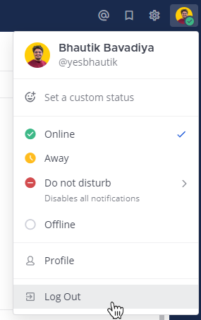
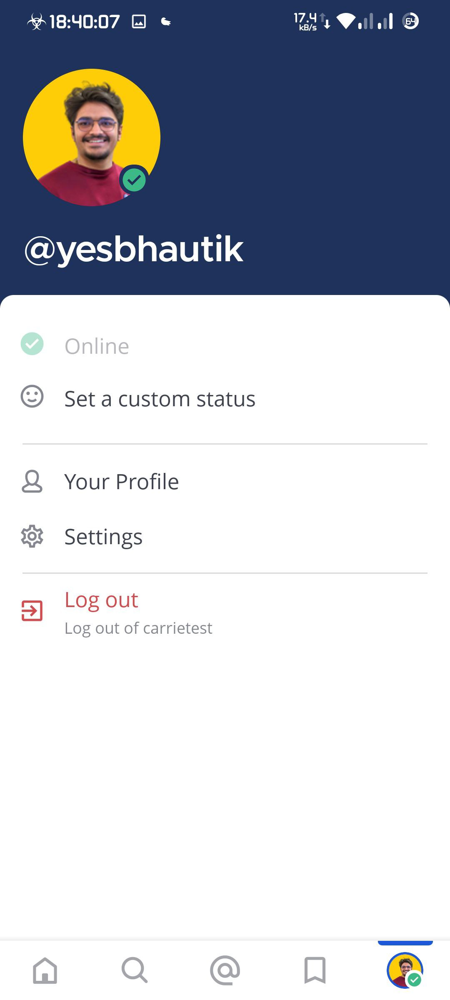

:::note
[\|plans-img-yellow\|](##SUBST##|plans-img-yellow|) متاح على خطط [Entry و Professional و Enterprise و Enterprise Advanced](https://mattermost.com/pricing/)
:::

يمكنك تسجيل الخروج من Mattermost من خلال صورة ملفك الشخصي. اختر **تسجيل الخروج (Log Out)** لتسجيل الخروج من جميع الفرق على الخادم.

الويب/سطح المكتب (Web/Desktop)

الهاتف المحمول (Mobile)

## الأسئلة الشائعة (FAQ)

### ماذا يحدث عند تسجيل الخروج من Mattermost؟

عند تسجيل الخروج من Mattermost، تُحذف جميع البيانات المتعلقة بجلسة العمل الخاصة بك، باستثناء سجل في قاعدة بيانات التطبيق بالخادم الذي قمت بالوصول إليه وبعض معلومات حالة النشاط العامة، مثل قائمة المهام للتشغيل الأولي. تُحذف بيانات المستخدم المخزّنة في قاعدة بيانات الخادم عند تسجيل الخروج. إذا قمت بحذف تطبيق Mattermost على الحاسوب والهاتف المحمول، فسيتم أيضًا حذف أحدث عنوان URL للخادم وبيانات الحالة.

عند تسجيل الخروج، يتم أيضًا حذف البيانات التالية:

- جميع إشعارات الدفع (push notifications) من ذلك الخادم.
- عملاء الـ websocket وعمليات الشبكة (network) وعمليات التحليلات المخزّنة محليًا في الذاكرة.
- جميع ملفات تعريف الارتباط (cookies) الخاصة بعنوان URL للخادم.
- ذاكرة التخزين المؤقت للصور لجميع الخوادم (ليس فقط الخادم الذي سجّلت الخروج منه).
- جميع الملفات المحفوظة في دليل التخزين المؤقت لذلك الخادم.
- جميع الصور المصغرة والبيانات المحفوظة في الحافظة (clipboard) لجميع الخوادم (ليس فقط الخادم الذي سجّلت الخروج منه).
- دليل `image_cache` (في تطبيق Android).

إذا كان لديك عدة حسابات Mattermost على نفس الخادم، فسيؤدي تسجيل الخروج من حساب واحد إلى عدم تسجيل الخروج من الحسابات الأخرى.

### ماذا يحدث إذا قمت بتسجيل الخروج بينما جهازك مسجل في Intune MAM؟

إذا كان جهازك مسجّلًا في Intune MAM (Mobile Application Management)، فسيؤدي تسجيل الخروج من Mattermost إلى إزالة جميع بيانات مساحة العمل وحماية Intune الخاصة بتلك المساحة من جهاز iOS الخاص بك. يمكنك تسجيل الدخول مرة أخرى باستخدام حساب Microsoft إذا احتجت إلى الوصول. لمزيد من المعلومات راجع [الوصول إلى مساحة العمل مع Intune MAM](/end-user-guide/access/access-your-workspace#mobile-via-microsoft-intune).
