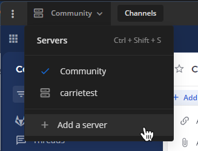
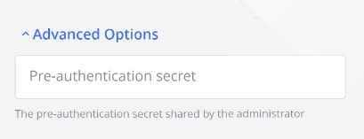
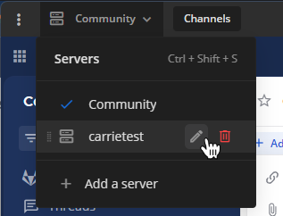
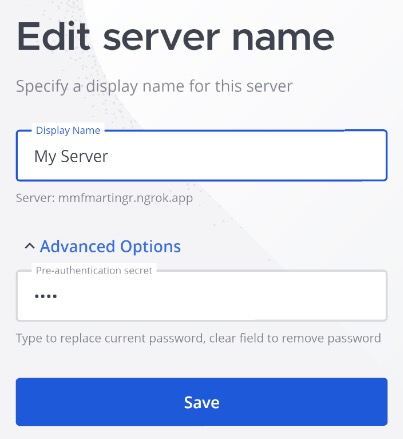
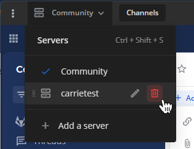
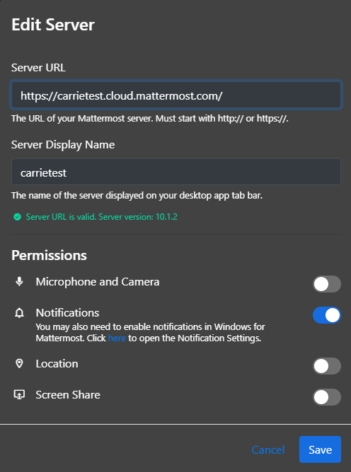

باستخدام تطبيق Mattermost لسطح المكتب أو الهاتف المحمول، يمكنك الاتصال بخوادم Mattermost المتعددة من واجهة واحدة، وإدارة أذونات النظام (system permissions).

## إضافة خادم (Add a server)

الويب/سطح المكتب (Web/Desktop)

توجد قائمة **الخوادم (Server)** في الزاوية العلوية اليسرى من النافذة وتعرض جميع الخوادم المتاحة. اسحب لإعادة ترتيب الخوادم في القائمة. يمكنك أيضًا التنقل في خيارات الخادم باستخدام [اختصارات لوحة المفاتيح (keyboard shortcuts)](/end-user-guide/collaborate/keyboard-shortcuts).

:::note
إذا كنت تستخدم تطبيق سطح المكتب قبل الإصدار v5.0، فإن الخوادم الفردية تظهر كعلامات تبويب منفصلة أعلى النافذة بدلاً من قائمة في الزاوية العلوية اليسرى، وتتم إدارة الخوادم بالانتقال إلى **... > ملف (File) > إعدادات (Settings)** في نظام Windows، وإلى **Mattermost > تفضيلات (Preferences)** في نظام Mac.
:::

1. حدد **إضافة خادم (Add a server)**.

> 

2. أدخل عنوان URL للخادم (server URL). يجب أن تبدأ عناوين URL للخادم بـ `http://` أو `https://`.

> > :::tip
> > لا يمكنك العثور على عنوان URL لخادم Mattermost الخاص بك؟ اطلب من قسم تقنية المعلومات في شركتك أو مسؤول النظام الحصول على **Mattermost Site URL** لمؤسستك. سيبدو كالتالي `https://example.com/company/mattermost`، أو `mattermost.yourcompanydomain.com`، أو `chat.yourcompanydomain.com`. يمكن أن تنتهي هذه العناوين أيضًا بـ `.net`.
> > :::

3. أدخل **اسم العرض (Display Name)** للخادم.
4. [سطح المكتب فقط] إذا كان الخادم الخاص بك يتطلب سر مصادقة (authentication secret)، فستُطالب بإدخاله عند الاتصال. أدخل السر الذي قدمه المسؤول وحدد **موافق (OK)**.
5. حدد **إضافة (Add)**.

الهاتف المحمول (Mobile)

اضغط على أيقونة **الخوادم (Servers)** [\|servers-icon\|](##SUBST##|servers-icon|) الموجودة في الزاوية العلوية اليسرى من النافذة للوصول إلى جميع الخوادم المتاحة وإضافة خوادم جديدة.

1. اضغط على **إضافة خادم (Add a server)**.
2. أدخل عنوان URL للخادم (server URL). يجب أن تبدأ عناوين URL للخادم بـ `http://` أو `https://`.

:::note
لا يمكنك العثور على عنوان URL لخادم Mattermost الخاص بك؟ اطلب من قسم تقنية المعلومات في شركتك أو مسؤول النظام الحصول على **Mattermost Site URL** لمؤسستك. سيبدو كالتالي `https://example.com/company/mattermost`، أو `mattermost.yourcompanydomain.com`، أو `chat.yourcompanydomain.com`. يمكن أن تنتهي هذه العناوين أيضًا بـ `.net`.
:::

3. أدخل **اسم العرض (Display Name)** للخادم.
4. (اختياري) قم بتفعيل قسم **خيارات متقدمة (Advanced Options)** لإدخال **سر المصادقة (Authentication secret)**. هذا إجراء أمني إضافي تستخدمه بعض المؤسسات. يمكن لمسؤول النظام توفير السر لك إذا لزم الأمر.

> 

5. اضغط على **تم (Done)**.

## تعديل الخادم (Edit a server)

الويب/سطح المكتب (Web/Desktop)

1. مرر مؤشر الماوس فوق أحد الخوادم وحدد أيقونة **تعديل (Edit)**.

    > 

2. قم بتعديل اسم العرض (display name) أو عنوان URL للخادم، ثم حدد **حفظ (Save)**.

> [سطح المكتب فقط] لتحديث سر المصادقة (authentication secret)، اتصل بالخادم. إذا تم تغيير السر، فستتم مطالبتك بإدخال السر الجديد الذي قدمه مسؤول النظام.

الهاتف المحمول (Mobile)

1. اسحب لليسار على إدخال خادم موجود للكشف عن خيارات إضافية. اضغط على **تعديل (Edit)**.

> 

2. قم بتعديل اسم العرض للخادم أو سر المصادقة، ثم اضغط على **حفظ (Save)**.

> 
>
> لعرض أو تحديث سر المصادقة، قم بتوسيع قسم **خيارات متقدمة (Advanced Options)**. إذا تم تكوين سر حاليًا، فسيتم تعبئته مسبقًا في الحقل.

## إزالة الخادم (Remove a server)

إزالة الخادم من تطبيق سطح المكتب الخاص بك لا يحذف بياناته. يمكنك إضافة الخادم مرة أخرى في أي وقت.

الويب/سطح المكتب (Web/Desktop)

1. مرر مؤشر الماوس فوق أحد الخوادم وحدد **إزالة (Remove)**.

    > 

2. حدد **إزالة (Remove)** عندما يُطلب منك التأكيد.

الهاتف المحمول (Mobile)

اضغط على أيقونة **الخوادم (Servers)** [\|servers-icon\|](##SUBST##|servers-icon|) الموجودة في الزاوية العلوية اليسرى من النافذة للوصول إلى جميع الخوادم المتاحة وإضافة خوادم جديدة.

اسحب لليسار على إدخال خادم موجود للكشف عن خيارات إضافية. اضغط على **إزالة (Remove)**.

## التبديل بين مساحات العمل (Switch between workspaces)

حدد مساحة عمل من قائمة **الخوادم (Servers)** في الجزء العلوي الأيسر من تطبيق سطح المكتب. راجع [اختصارات لوحة المفاتيح (keyboard shortcuts)](/end-user-guide/collaborate/keyboard-shortcuts) لمزيد من خيارات التنقل.

## إدارة أذونات النظام (Manage system permissions)

بدءًا من الإصدار v5.9 لتطبيق Mattermost لسطح المكتب، يمكنك إدارة أذونات النظام عند إنشاء أو إدارة اتصالات خوادم Mattermost الحالية، بما في ذلك: الوصول إلى الميكروفون (microphone access)، والوصول إلى الكاميرا (camera access)، والإشعارات (notifications)، والموقع (location).

يؤدي منح إذن نظام إلى تعيينه على **قبول (Accept)**، وإلغاؤه يعينه على **الرفض دائمًا (Always Deny)**.

:::note
- لا يمكنك إدارة أذونات النظام عند استخدام تطبيق Mattermost للهاتف المحمول.
- ستتم مطالبتك بقبول أو رفض الإشعارات بعد إضافة اتصال خادم جديد، وفي أي وقت تفتح فيه تطبيق سطح المكتب إذا لم تكن قد قبلت أو رفضت أذونات النظام صراحةً.
- قد تحتاج أيضًا إلى تمكين الإشعارات لتطبيق Mattermost ضمن تفضيلات نظام التشغيل الخاص بك.
:::

## فتح سياقات مساحات عمل متعددة (Open multiple workspace contexts)

بدءًا من إصدار سطح المكتب v6.0، يمكنك إبقاء مساحات عمل متعددة مفتوحة في نفس الوقت والعمل عبرها دون التبديل المستمر، لتحسين الوعي الظرفي (situational awareness) والكفاءة التشغيلية. تُعد هذه الإمكانية مفيدة بشكل خاص للمؤسسات التي تعمل في بيئات موزعة أو متعددة النطاقات، حيث تعمل على تعزيز إمكانية التشغيل البيني (interoperability) عبر الأنظمة والوعي الظرفي على مستوى القيادة.

حدد أيقونة **علامة تبويب جديدة (New tab)** [\|plus\|](##SUBST##|plus|) في أعلى تطبيق سطح المكتب لفتح علامة تبويب جديدة لمساحة العمل الحالية. يمكنك سحب وإسقاط علامات التبويب لإعادة ترتيبها في نافذة سطح المكتب الرئيسية.

افتح روابط Mattermost الداخلية في علامة تبويب جديدة أو نافذة جديدة عن طريق النقر بزر الماوس الأيمن على الرابط وتحديد **الفتح في علامة تبويب جديدة (Open in new tab)** أو **الفتح في نافذة جديدة (Open in new window)**.

- قم بتحويل علامات التبويب إلى نوافذ جديدة بالنقر بزر الماوس الأيمن على تسمية علامة التبويب وتحديد **نقل إلى نافذة جديدة (Move to new window)**.
- قم بتحويل النوافذ المنبثقة مرة أخرى إلى علامات تبويب في النافذة الرئيسية بالنقر بزر الماوس الأيمن على عنوان النافذة وتحديد **نقل إلى النافذة الرئيسية (Move to main window)**.
- أغلق النوافذ المنبثقة بالنقر بزر الماوس الأيمن على عنوان النافذة وتحديد **إغلاق النافذة (Close window)**.

:::note
يمكنك إدارة النوافذ وعلامات التبويب من قائمة **ملف (File)** في تطبيق سطح المكتب، ومراجعة جميع علامات التبويب المفتوحة من قائمة **نوافذ (Windows)**.
:::
