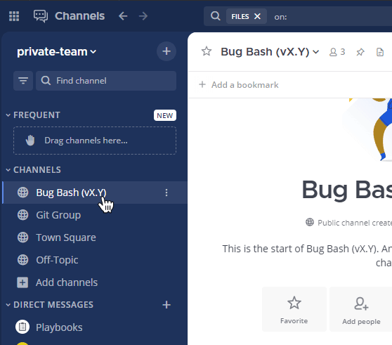
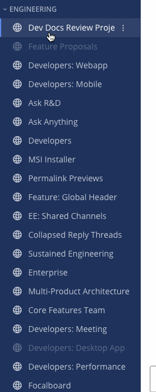
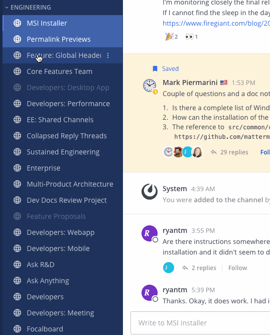
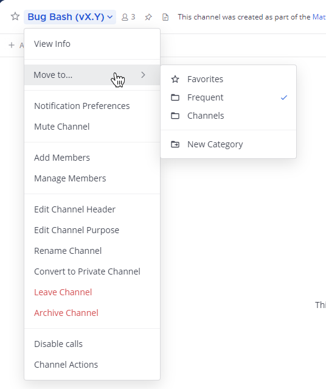
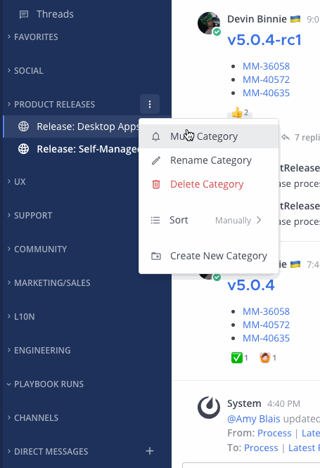
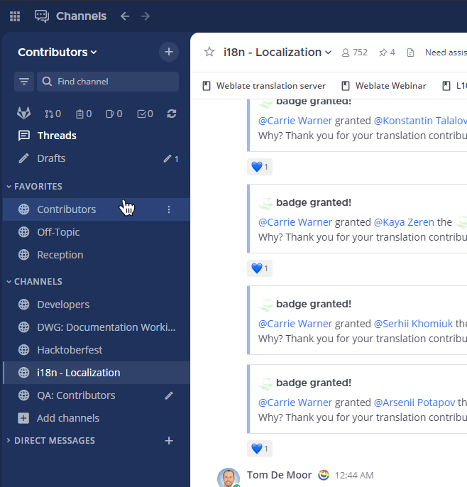
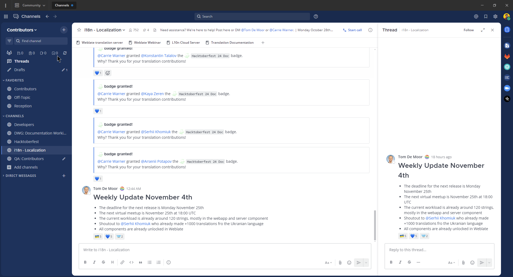
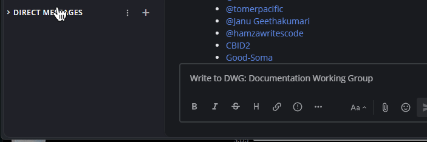

تعتبر المحادثات في Mattermost ضرورية لإنتاجية الشركة ونجاحها. الحفاظ على تنظيم المحادثات في الشريط الجانبي (sidebar) يخلق مكان عمل فعال. باستخدام متصفح الويب أو تطبيق سطح المكتب، يمكنك تخصيص الشريط الجانبي للقناة الخاص بك بناءً على الطريقة التي تفضلها في استخدام Mattermost. التخصيصات التي تجريها مرئية لك فقط، ومرئية عند استخدام تطبيق الهاتف المحمول، ولن تؤثر على ما يراه زملاؤك في أشرطتهم الجانبية.

إليك كيفية إعداد الشريط الجانبي الخاص بك افتراضيًا:

- يتم سرد جميع القنوات العامة والخاصة التي انضممت إليها في فئة **القنوات (Channels)**، مرتبة أبجديًا.
- يتم سرد جميع رسائلك المباشرة (direct messages) ورسائل المجموعة (group messages) في فئة **الرسائل المباشرة (Direct Messages)**، مرتبة حسب النشاط الأخير.

## ماذا يمكنك أن تخصص؟

باستخدام Mattermost في متصفح الويب أو تطبيق سطح المكتب، يمكنك تخصيص الشريط الجانبي الخاص بك بالطرق التالية:

- [إنشاء فئات مخصصة (Create custom categories)](#إنشاء-فئات-مخصصة-create-custom-categories)
- [تجميع وترتيب القنوات في فئاتك (Group and order channels into your categories)](#تنظيم-القنوات-في-فئات-organize-channels-in-categories)
- [كتم وإلغاء كتم فئات بأكملها (Mute and unmute entire categories)](#كتم-وإلغاء-كتم-الفئات-mute-and-unmute-categories)
- [تحديد فئات القنوات كمقروءة (Mark entire categories as read)](#تحديد-فئات-القنوات-كمقروءة-mark-channel-categories-as-read)
- [فرز القنوات في كل فئة (Sort channels in each category)](#فرز-القنوات-في-الفئات-sort-channels-in-categories) يدويًا، أو أبجديًا، أو حسب النشاط الأخير.
- [تصفية الشريط الجانبي لعرض القنوات غير المقروءة فقط (Filter your sidebar to view unread channels only)](#تجميع-القنوات-غير-المقروءة-بشكل-منفصل-group-unread-channels-separately)، أو اختيار تجميع الرسائل غير المقروءة في فئة **غير المقروءة (Unreads)**.
- [إدارة رسائلك المباشرة (Manage your direct messages)](#إدارة-الرسائل-المباشرة-manage-direct-messages) من خلال فرزها أبجديًا أو حسب النشاط الأخير، وتحديد عدد الرسائل التي يتم عرضها في الشريط الجانبي الخاص بك.
- [جعل فئات القنوات تعمل لصالحك (Make channel categories work for you)](#جعل-الفئات-تعمل-لصالحك-make-categories-work-for-you) عن طريق بادئة أسماء الفئات برموز تعبيرية (emojis)، طي الفئات وتوسيعها، إعادة ترتيب الفئات، وإضافة محادثات الرسائل المباشرة إلى الفئات.

## إنشاء فئات مخصصة (Create custom categories)

قم بإنشاء فئات مخصصة (custom categories) لتجميع القنوات معًا لتنقل أسرع وأسهل. على سبيل المثال، يمكنك إنشاء فئة تسمى "التصميم (Design)" أو "التسويق (Marketing)".

لإنشاء فئات، حدد الرمز **+** في أعلى الشريط الجانبي. أو، حدد أيقونة **خيارات إضافية (More options)** [\|more-icon\|](##SUBST##|more-icon|) في الشريط الجانبي على عنوان أي فئة، ثم حدد **إنشاء فئة جديدة (Create New Category)**.

:::note
إذا قام مسؤول النظام الخاص بك بتمكين [فرز فئات القناة](/administration-guide/configure/experimental-configuration-settings)، فيمكنك تعيين القنوات لفئات قنوات جديدة أو موجودة عند [إنشاء القنوات](/end-user-guide/collaborate/create-channels) و [إعادة تسمية القنوات](/end-user-guide/collaborate/rename-channels).
:::

بعد ذلك، اكتب اسم الفئة، وحدد **إنشاء (Create)**، ثم اسحب أي قنوات أو رسائل مباشرة إلى هذه الفئة الجديدة. يمكنك أيضًا التحديد المتعدد للقنوات والرسائل المباشرة لسحبها معًا كمجموعة بالضغط على `Ctrl` أو `Shift` والتحديد في نظام التشغيل Windows أو Linux، أو `⌘` أو `⇧` والتحديد في نظام Mac. راجع قسم [تحديدات السحب والإفلات (drag and drop selections)](#تحديدات-السحب-والإفلات-drag-and-drop-selections) أدناه للحصول على التفاصيل.

لا يمكن مشاركة فئاتك المخصصة مع مستخدمي Mattermost الآخرين.

## إعادة تسمية الفئات (Rename categories)

1. حدد أيقونة **خيارات الفئة (Category options)** في الشريط الجانبي، ثم حدد **إعادة تسمية الفئة (Rename Category)**.
2. اكتب اسم الفئة الجديد، ثم حدد **إعادة تسمية (Rename)**.

## حذف الفئات (Delete categories)

1. حدد أيقونة **خيارات الفئة (Category options)** في الشريط الجانبي، ثم حدد **حذف الفئة (Delete Category)**.
2. حدد **حذف (Delete)** للتأكيد أو حدد **X** للإلغاء.

تعود جميع القنوات ومحادثات الرسائل المباشرة في الفئة المحذوفة إلى فئاتها الافتراضية **القنوات (Channels)** و **الرسائل المباشرة (Direct Messages)**. حذف الفئة لا يزيلك أبدًا من القنوات التي انضممت إليها.

## تنظيم القنوات في فئات (Organize channels in categories)

بمجرد إنشاء الفئات، يمكنك نقل القنوات لتنظيم الشريط الجانبي الخاص بك عن طريق السحب والإفلات، أو عن طريق النقل.

### تحديدات السحب والإفلات (Drag and drop selections)

لتحديد قنوات متعددة:

- حدد القنوات المتتالية و/أو الرسائل المباشرة بالضغط على `Shift` أثناء التحديد في نظام Windows أو Linux، أو `⇧` أثناء التحديد في Mac.
- حدد القنوات غير المتتالية و/أو الرسائل المباشرة بالضغط على `Ctrl` أثناء التحديد في نظام Windows أو Linux، أو `⌘` أثناء التحديد في Mac.
- اضغط على `ESC` لمسح تحديدات القنوات أو الرسائل المباشرة.

باستخدام تطبيق الويب أو سطح المكتب لـ Mattermost، اسحب القنوات المحددة و/أو الرسائل المباشرة بين الفئات أو داخلها.

:::note
تتحرك القنوات المحددة المتعددة والرسائل المباشرة معًا كمجموعة بالترتيب الذي ظهرت به في الأصل.
:::

### تحريك التحديدات (Move selections)

بالإضافة إلى التحديد والسحب، يمكنك تحديد وجهة فئة للقنوات المحددة و/أو الرسائل المباشرة. للقيام بذلك، حدد أيقونة **خيارات القناة (Channel options)** في الشريط الجانبي ثم حدد **نقل إلى (Move to)**.

يمكنك أيضًا تحديد وجهة فئة للقناة الحالية أو المحادثة الحالية باستخدام خيار **نقل إلى (Move to)** مباشرة من عنوان القناة. القنوات التي تم نقلها إلى فئة ستعرض علامة اختيار (checkmark) بجوار اسم الفئة.

## كتم وإلغاء كتم الفئات (Mute and unmute categories)

عندما تكتم أو تلغي كتم فئة، يتم أيضًا كتم أو إلغاء كتم جميع القنوات ضمن هذه الفئة. يمكنك إلغاء كتم قنوات محددة بشكل انتقائي داخل فئة مكتومة.

حدد أيقونة **خيارات الفئة (Category options)** في الشريط الجانبي، ثم حدد **كتم الفئة (Mute Category)**.

بمجرد كتم الفئة:

- يتم تعطيل إشعارات البريد الإلكتروني، وإشعارات سطح المكتب، وإشعارات الدفع لجميع القنوات في الفئة.
- تظهر أيقونة كتم (mute icon) بجوار كل اسم قناة في الفئة.
- تظهر الفئة وجميع قنواتها بشفافية مخفضة في الشريط الجانبي الأيسر. لا يتم وضع علامة على القنوات في الفئة على أنها غير مقروءة (unread) إلا إذا تمت الإشارة إليك بشكل مباشر.

لإلغاء كتم الفئة، حدد أيقونة **خيارات الفئة (Category options)** في الشريط الجانبي، ثم حدد **إلغاء كتم الفئة (Unmute Category)**.

## تحديد فئات القنوات كمقروءة (Mark channel categories as read)

عندما تحدد فئة قناة كمقروءة، يتم تحديد جميع القنوات داخل تلك الفئة كمقروءة. يمكنك تحديد قنوات معينة بشكل انتقائي كغير مقروءة عند التفضيل.

حدد أيقونة **خيارات الفئة (Category options)** في الشريط الجانبي، ثم حدد **تحديد الفئة كمقروءة (Mark category as read)**.

## فرز القنوات في الفئات (Sort channels in categories)

حدد أيقونة **خيارات الفئة (Category options)** في الشريط الجانبي، ثم حدد **فرز (Sort)** واختر من **أبجديًا (Alphabetically)**، أو **النشاط الأخير (Recent Activity)**، أو **يدويًا (Manually)**.

## تجميع القنوات غير المقروءة بشكل منفصل (Group unread channels separately)

بشكل افتراضي، يوفر Mattermost فلتر بنقرة واحدة **غير المقروءة (Unreads)** لإظهار القنوات التي تحتوي على نشاط غير مقروء فقط. بدلاً من ذلك، يمكنك اختيار تجميع القنوات غير المقروءة تلقائيًا في فئتها الخاصة في الجزء العلوي من الشريط الجانبي الخاص بك.

انتقل إلى **الإعدادات (Settings) > الشريط الجانبي (Sidebar)**، واضبط **تجميع القنوات غير المقروءة بشكل منفصل (Group unread channels separately)** على **تشغيل (On)**، ثم حدد **حفظ (Save)**.

- عند تمكين هذا الإعداد، تظهر جميع الرسائل غير المقروءة فقط في فئة **غير المقروءة (Unreads)**، مرتبة مع وضع الإشارات (mentions) أولاً.
- عند تعطيل هذا الإعداد، تظهر جميع الرسائل غير المقروءة ضمن فئاتها وقنواتها الخاصة. يمكنك استخدام **فلتر غير المقروءة (Unread filter)** للتركيز فقط على القنوات غير المقروءة في الشريط الجانبي.

عند التمكين، سيتم فرز القنوات غير المقروءة التي تحتوي على إشارات إلى أعلى الفئة.

:::note
إذا كنت تفضل رؤية القنوات غير المقروءة فقط في فئاتها الخاصة، فنوصي بطي فئاتك المخصصة وتعطيل **تجميع القنوات غير المقروءة بشكل منفصل** ضمن **الإعدادات (Settings) > الشريط الجانبي (Sidebar)**.
:::

## إدارة الرسائل المباشرة (Manage direct messages)

لفرز رسائلك المباشرة، حدد أيقونة **خيارات القناة (Channel options)** في الشريط الجانبي، ثم حدد **فرز (Sort)** واختر من **أبجديًا (Alphabetically)** أو **النشاط الأخير (Recent Activity)**.

### كم عدد الرسائل المباشرة المراد عرضها؟

تحكم في عدد محادثات الرسائل المباشرة التي يتم عرضها في فئة **الرسائل المباشرة (Direct Messages)** لإبقاء محادثاتك قابلة للإدارة. يمكنك اختيار إظهار جميع الرسائل أو عدد ثابت من الرسائل.

لتكوين عدد الرسائل المباشرة المراد عرضها، انتقل إلى **الإعدادات (Settings) > الشريط الجانبي (Sidebar)**، ثم قم بتعيين **عدد الرسائل المباشرة المراد عرضها (Number of direct messages to show)**. أو حدد أيقونة **خيارات القناة (Channel options)** في الشريط الجانبي، ثم حدد **عرض (Show)**.

اختر إظهار **10** أو **15** أو **20** أو **40** رسالة. بمجرد تجاوز عدد الرسائل المباشرة التي تم تكوينها، يتم إخفاء الرسائل الأقدم من فئة **الرسائل المباشرة**. يمكنك دائمًا زيادة عدد المحادثات المعروضة لرؤية الرسائل المباشرة الأقدم.

:::note
لا تُحتسب محادثات الرسائل المباشرة التي تضيفها إلى الفئات المخصصة ضمن الحد الأقصى لعدد المحادثات المعروضة في فئة **الرسائل المباشرة**.
:::

## جعل الفئات تعمل لصالحك (Make categories work for you)

### بادئة أسماء فئات القناة برموز تعبيرية (Prefix channel category names with emojis)

يمكن أن تتضمن أسماء فئات القنوات رموزًا تعبيرية (emojis). حدد الرمز التعبيري باسمه بالتنسيق `:smile:`. نوصي بوضع رموز تعبيرية كبادئة لأسماء فئات القنوات للأسباب التالية:

- يمكن للرموز التعبيرية أن تسهّل على المستخدمين التعرف بسرعة على القنوات وفئات القنوات وإدارتها، خاصة في مساحات العمل الكبيرة التي تحتوي على العديد من القنوات.
- تساعد مشاركة نفس الرمز التعبيري عبر القنوات والفئات المتعلقة بفئة أو وظيفة معينة في الحفاظ على التنظيم والاتساق عبر مساحة العمل.
- جعل فئات القنوات أكثر تميزًا بصريًا باستخدام الرموز التعبيرية يساعد المستخدمين في العثور على ما يحتاجون إليه بسرعة وسهولة أكبر في لمحة، مما يقلل الوقت الذي يقضونه في البحث عن المكان المناسب لاتخاذ الإجراء.
- يمكن للمستخدمين الجدد فهم الغرض من القنوات وفئات القنوات المختلفة بسرعة استنادًا إلى البادئات التعبيرية الخاصة بهم دون الحاجة إلى تفسيرات شاملة.
- نظرًا لأن المستخدمين يدركون بنية القناة من خلال الرموز التعبيرية، يتم تقليل الوقت والجهد اللازمين لتدريب الأعضاء الجدد على التنقل في مساحة العمل.
- يمكن لمساحة العمل جيدة التنظيم والجذابة بصريًا أن تشجع المستخدمين على المشاركة بشكل أكثر نشاطًا، مما قد يؤدي إلى تواصل وتعاون أكثر فعالية.

### الفئات قابلة للطي (Categories are collapsible)

عندما تقوم بطي فئة قناة، تُعرض القنوات غير المقروءة فقط لتقليل التمرير غير الضروري. عندما تقوم بتوسيع فئة قناة، يتم عرض جميع القنوات الموجودة في الفئة، بما في ذلك القنوات التي تحتوي على رسائل غير مقروءة.

### إعادة ترتيب الفئات (Reorder categories)

اسحب لإعادة ترتيب الفئات بأكملها لتحديد أولويات المحادثات المهمة.

### يمكن أن تحتوي الفئات على محادثات رسائل مباشرة (Categories can contain direct message conversations)

حدد واسحب الرسائل المباشرة إلى أي فئة. يمكنك أيضًا تحديد رسائل مباشرة متعددة لسحبها معًا كمجموعة.
