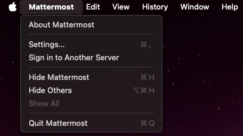
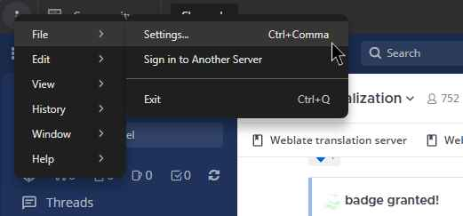

يمكنك تخصيص تطبيق سطح المكتب (desktop app) الخاص بك بشكل أكبر باستخدام إعدادات إضافية. حدد علامة التبويب أدناه التي تتوافق مع نظام التشغيل الخاص بك لمعرفة المزيد حول ما هو متاح.

macOS

عندما يكون تطبيق Mattermost لسطح المكتب في وضع التركيز (in focus)، حدد **Mattermost > الإعدادات... (Settings...)**

## عام (General)

- **موقع التنزيل (Download Location)**: حدد المكان الذي تريد تنزيل الملفات إليه على جهازك من تطبيق سطح المكتب.
- **إظهار الأيقونة في منطقة الإشعارات (Show icon in the notification area)**: تُعرض أيقونة Mattermost في منطقة الإشعارات. يمكنك إخفاء هذه الأيقونة إذا كنت تفضل ذلك. أعد تشغيل تطبيق سطح المكتب لتطبيق التغييرات على هذا الإعداد.
- **مزامنة سمة تطبيق سطح المكتب مع الخادم (Synchronize Desktop App theme with server)**: تتطابق سمة تطبيق سطح المكتب تلقائيًا مع السمة (theme) المعينة على خادم Mattermost الأساسي الخاص بك. قم بتعطيل هذا الإعداد لإدارة سمات تطبيق سطح المكتب بشكل مستقل.
- **فتح التطبيق في وضع ملء الشاشة (Open app in full screen)**: تكوين تطبيق سطح المكتب ليفتح في وضع ملء الشاشة. قم بتعطيل هذا الإعداد لفتح التطبيق في عرض النافذة.
- **الحد الأقصى لعدد العروض المفتوحة (Maximum number of open views)**: بدءًا من إصدار سطح المكتب v6.0، قم بتعيين الحد الأقصى لعدد علامات التبويب والنوافذ المفتوحة لكل مساحة عمل. عند تعيين حد، يطالبك Mattermost بإغلاق علامات التبويب أو النوافذ عند تجاوز الحد. اترك هذا الحقل فارغًا لعدم وجود حد أقصى.

## الإشعارات (Notifications)

- **إظهار شارة حمراء على أيقونة شريط المهام (Dock) للإشارة إلى الرسائل غير المقروءة (Show red badge on Dock icon to indicate unread messages)**: تعرض الشارة الحمراء على أيقونة Dock عدد الرسائل غير المقروءة والإشارات (mentions). يمكنك تكوين تطبيق سطح المكتب لعرض عدد الإشارات فقط، إذا كنت تفضل ذلك.
- **ارتداد أيقونة شريط المهام (Bounce the Dock icon)**: عند تلقي رسالة جديدة على أي من فرقك وخوادمك النشطة، ترتد أيقونة Dock مرة واحدة أو ترتد حتى تفتح تطبيق سطح المكتب. يمكنك تكوين أيقونة تطبيق Mattermost لسطح المكتب في Dock لترتد أكثر أو أقل أو لا ترتد على الإطلاق.

## اللغة (Language)

- **لغة التطبيق (App Language)**: حدد لغتك المفضلة لتطبيق سطح المكتب.
- **التحقق من الإملاء (Check spelling)**: يتم تمييز الكلمات التي بها أخطاء إملائية والمكتشفة في رسائلك بناءً على تفضيل لغة تطبيقك. يمكنك تعطيل التدقيق الإملائي إذا كنت تفضل ذلك.
- **لغات المدقق الإملائي (Spell Checker Languages)**: حدد لغات تدقيق إملائي إضافية إذا لزم الأمر. أعد تشغيل تطبيق سطح المكتب لتغيير هذا الإعداد. عند تكوين لغات متعددة:
  - تظهر جميع اللغات المحددة على أنها مكتوبة بشكل صحيح عندما تتطابق الكلمة مع لغة واحدة محددة على الأقل.
  - تظهر جميع اللغات المحددة على أنها مكتوبة بشكل غير صحيح عندما لا تتطابق الكلمة مع أي من اللغات المحددة.
- **استخدام عنوان URL لقاموس بديل (Use an alternative dictionary URL)**: حدد قاموسًا بديلاً للتدقيق الإملائي كعنوان URL للموقع.

## الخوادم (Servers)

- **إضافة وإدارة اتصالات الخادم (Add and manage server connections)**: تعرف على المزيد حول [توصيل تطبيق سطح المكتب الخاص بك بمساحات عمل Mattermost متعددة](/end-user-guide/preferences/connect-multiple-workspaces).

## خيارات متقدمة (Advanced)

- **مستوى التسجيل (Logging level)**: اضبط مستويات التسجيل لعزل المشكلات واستكشاف الأخطاء وإصلاحها. تؤدي زيادة مستوى السجل إلى زيادة استخدام مساحة القرص ويمكن أن تؤثر على الأداء.
- **إرسال بيانات استخدام مجهولة إلى خوادمك المكوّنة (Send anonymous usage data to your configured servers)**: أرسل بيانات الاستخدام والأداء الخاصة بتطبيق سطح المكتب إلى خوادم Mattermost المكوّنة والمهيأة لقبولها.
- **إرسال تقارير الأخطاء للمساعدة في تحسين التطبيق (Send error reports to help improve the app)**: بدءًا من الإصدار v6.1.0 لتطبيق Mattermost لسطح المكتب، يتم إرسال تقارير الأخطاء ومعلومات التعطل تلقائيًا إلى Sentry (خدمة تتبع أخطاء تابعة لجهة خارجية) للمساعدة في تحديد المشكلات وإصلاحها. يتم تمكين هذا الإعداد افتراضيًا. تتضمن تقارير الأخطاء معلومات التعطل، وإصدار التطبيق، وتفاصيل النظام الأساسي (نظام التشغيل، والبنية، وإحصائيات الذاكرة)، ولكن لا يتم تضمين أي معلومات تعريف شخصية (PII). يمكنك تعطيل الإبلاغ عن الأخطاء إذا كنت تفضل ذلك. أعد تشغيل تطبيق سطح المكتب لتطبيق التغييرات على هذا الإعداد.
- **استخدام تسريع أجهزة وحدة معالجة الرسومات (Use GPU hardware acceleration)**: يعمل تسريع أجهزة GPU على تقديم واجهة تطبيق سطح المكتب بكفاءة أكبر. إذا واجهت انخفاضًا في الاستقرار، فقم بتعطيل تسريع أجهزة GPU. أعد تشغيل تطبيق سطح المكتب لتطبيق التغييرات على هذا الإعداد.

Windows/Linux

عندما يكون تطبيق Mattermost لسطح المكتب في وضع التركيز (in focus)، حدد أيقونة **المزيد (More)** [\|more-icon-vertical\|](##SUBST##|more-icon-vertical|) في الجزء العلوي الأيسر من شريط القائمة وحدد **ملف (File) > الإعدادات... (Settings...)**

## عام (General)

- **موقع التنزيل (Download Location)**: حدد المكان الذي تريد تنزيل الملفات إليه على جهازك من تطبيق سطح المكتب.
- **بدء التطبيق عند تسجيل الدخول (Start app on login)**: يبدأ تشغيل تطبيق سطح المكتب تلقائيًا عند تسجيل الدخول إلى جهازك. يمكنك تعطيل هذا إذا كنت تفضل ذلك.
- **تشغيل التطبيق مصغرًا (Launch app minimized)**: قم بتكوين تطبيق سطح المكتب ليتم تشغيله مصغرًا في علبة النظام (system tray).
- **لون الأيقونة (Icon color)**: عرض أيقونة Mattermost الفاتحة أو الداكنة أو التي يحركها النظام افتراضيًا.
- **ترك التطبيق قيد التشغيل في منطقة الإشعارات عند إغلاق نافذة التطبيق (Leave app running in notification area when application window is closed)**: عند إغلاق تطبيق سطح المكتب، يُطلب منك تأكيد ما إذا كنت تريد إغلاق التطبيق نهائيًا. قم بتعطيل هذا التأكيد عن طريق تحديد **عدم السؤال مرة أخرى (Don’t ask again)**. قم بإسكات هذه الإشعارات بتحديد **عدم الإظهار مرة أخرى (Don’t show again)**. أعد تشغيل تطبيق سطح المكتب لتطبيق التغييرات على هذا الإعداد.
- **فتح التطبيق في وضع ملء الشاشة (Open app in full screen)**: تكوين تطبيق سطح المكتب ليفتح في وضع ملء الشاشة. قم بتعطيل هذا الإعداد لفتح التطبيق في عرض النافذة.
- **مزامنة سمة تطبيق سطح المكتب مع الخادم (Synchronize Desktop App theme with server)**: تتطابق سمة تطبيق سطح المكتب تلقائيًا مع السمة المعينة على خادم Mattermost الأساسي الخاص بك. قم بتعطيل هذا الإعداد لإدارة سمات تطبيق سطح المكتب بشكل مستقل.
- **الحد الأقصى لعدد العروض المفتوحة (Maximum number of open views)**: بدءًا من إصدار سطح المكتب v6.0، قم بتعيين الحد الأقصى لعدد علامات التبويب والنوافذ المفتوحة لكل مساحة عمل. عند تعيين حد، يطالبك Mattermost بإغلاق علامات التبويب أو النوافذ عند تجاوز الحد. اترك هذا الحقل فارغًا لعدم وجود حد أقصى.

## الإشعارات (Notifications)

- **إظهار شارة حمراء على أيقونة شريط المهام للإشارة إلى الرسائل غير المقروءة (Show red badge on taskbar icon to indicate unread messages)**
- **وميض أيقونة شريط المهام عند استلام رسالة جديدة (Flash taskbar icon when a new message is received)**: تومض أيقونة تطبيق سطح المكتب في شريط المهام عند تلقي رسالة جديدة على أي من فرقك وخوادمك النشطة. يمكنك تعطيل وميض أيقونة شريط المهام إذا كنت تفضل ذلك.

## اللغة (Language)

- **لغة التطبيق (App Language)**: حدد لغتك المفضلة لتطبيق سطح المكتب.
- **التحقق من الإملاء (Check spelling)**: يتم تمييز الكلمات التي بها أخطاء إملائية والمكتشفة في رسائلك بناءً على تفضيل لغة تطبيقك. يمكنك تعطيل التدقيق الإملائي إذا كنت تفضل ذلك.
- **لغات المدقق الإملائي (Spell Checker Languages)**: حدد لغات تدقيق إملائي إضافية إذا لزم الأمر. أعد تشغيل تطبيق سطح المكتب لتطبيق التغييرات على هذا الإعداد. عند تكوين لغات متعددة:
  - تظهر جميع اللغات المحددة على أنها مكتوبة بشكل صحيح عندما تتطابق الكلمة مع لغة واحدة محددة على الأقل.
  - تظهر جميع اللغات المحددة على أنها مكتوبة بشكل غير صحيح عندما لا تتطابق الكلمة مع أي من اللغات المحددة.
- **استخدام عنوان URL لقاموس بديل (Use an alternative dictionary URL)**: حدد قاموسًا بديلاً للتدقيق الإملائي كعنوان URL للموقع.

## الخوادم (Servers)

- **إضافة وإدارة اتصالات الخادم (Add and manage server connections)**: تعرف على المزيد حول [توصيل تطبيق سطح المكتب الخاص بك بمساحات عمل Mattermost متعددة](/end-user-guide/preferences/connect-multiple-workspaces).

## خيارات متقدمة (Advanced)

- **مستوى التسجيل (Logging level)**: اضبط مستويات التسجيل لعزل المشكلات واستكشاف الأخطاء وإصلاحها. تؤدي زيادة مستوى السجل إلى زيادة استخدام مساحة القرص ويمكن أن تؤثر على الأداء.
- **إرسال بيانات استخدام مجهولة إلى خوادمك المكوّنة (Send anonymous usage data to your configured servers)**: أرسل بيانات الاستخدام والأداء الخاصة بتطبيق سطح المكتب إلى خوادم Mattermost المكوّنة والمهيأة لقبولها.
- **إرسال تقارير الأخطاء للمساعدة في تحسين التطبيق (Send error reports to help improve the app)**: بدءًا من الإصدار v6.1.0 لتطبيق Mattermost لسطح المكتب، يتم إرسال تقارير الأخطاء ومعلومات التعطل تلقائيًا إلى Sentry (خدمة تتبع أخطاء تابعة لجهة خارجية) للمساعدة في تحديد المشكلات وإصلاحها. يتم تمكين هذا الإعداد افتراضيًا. تتضمن تقارير الأخطاء معلومات التعطل، وإصدار التطبيق، وتفاصيل النظام الأساسي (نظام التشغيل، والبنية، وإحصائيات الذاكرة)، ولكن لا يتم تضمين أي معلومات تعريف شخصية (PII). يمكنك تعطيل الإبلاغ عن الأخطاء إذا كنت تفضل ذلك. أعد تشغيل تطبيق سطح المكتب لتطبيق التغييرات على هذا الإعداد.
- **استخدام تسريع أجهزة وحدة معالجة الرسومات (Use GPU hardware acceleration)**: يعمل تسريع أجهزة GPU على تقديم واجهة تطبيق سطح المكتب بكفاءة أكبر. إذا واجهت انخفاضًا في الاستقرار، فقم بتعطيل تسريع أجهزة GPU. أعد تشغيل تطبيق سطح المكتب لتطبيق التغييرات على هذا الإعداد.

