ألوان واجهة مستخدم Mattermost قابلة للتخصيص. يمكنك الاختيار من بين [خمس سمات قياسية (standard themes)](#السمات-القياسية) صممها فريق Mattermost، أو تصميم السمة المخصصة الخاصة بك. تُطبق تغييرات السمة الخاصة بك على جميع الفرق التي تنتمي إليها، وتكون مرئية عبر جميع عملاء Mattermost. يمكن لعملاء Mattermost Enterprise تكوين سمة مختلفة لكل فريق هم أعضاء فيه.

<div class="tab">

الويب/سطح المكتب (Web/desktop)

حدد أيقونة **الإعدادات (Settings)** [\|gear\|](##SUBST##|gear|)، ثم انتقل إلى **العرض (Display) > السمة (Theme)**. حدد **ألوان السمة (Theme Colors)** للاختيار من بين خمس سمات قياسية صممها فريق Mattermost.

يمكنك تخصيص سمة قياسية بشكل أكبر لجعلها حقًا خاصة بك. بعد تحديد سمة قياسية، حدد **سمة مخصصة (Custom Theme)** وقم بتعديل اختياراتك للألوان بناءً على تفضيلاتك. راجع وثائق [السمات المخصصة (custom themes)](#السمات-المخصصة-custom-themes) لمعرفة ما يمكن تكوينه، وراجع وثائق [أمثلة السمات المخصصة (custom theme examples)](#أمثلة-على-السمات-المخصصة-custom-theme-examples) للحصول على الإلهام.

</div>

<div class="tab">

الهاتف المحمول (Mobile)

اضغط على **السمة (Theme)** لتحديد واحدة من 5 سمات قياسية في Mattermost.

:::note
يمكنك تحديد سمة مخصصة (custom theme) باستخدام Mattermost في متصفح الويب أو تطبيق سطح المكتب.
:::

</div>

## السمات المخصصة (Custom themes)

حدد **سمة مخصصة (Custom Theme)**، ثم قم بتوسيع خيارات [أنماط الشريط الجانبي (Sidebar Styles)](#أنماط-الشريط-الجانبي-sidebar-styles)، و [أنماط القناة المركزية (Center Channel Styles)](#أنماط-القناة-المركزية-center-channel-styles)، و [أنماط الروابط والأزرار (Link and Button Styles)](#أنماط-الروابط-والأزرار-link-and-button-styles) لتخصيص ألوان الواجهة الفردية، مثل الخلفيات، والروابط، والنصوص، والحدود.

يتم تطبيق تغييرات السمة المخصصة الخاصة بك في Mattermost أثناء إجرائك لها. حدد **حفظ (Save)** لتأكيد تغييرات السمة الخاصة بك. يمكنك تجاهل تغييراتك بالخروج من نافذة **إعدادات العرض (Display Settings)** وتحديد **نعم، تجاهل (Yes, Discard)**.

### أمثلة على السمات المخصصة (Custom theme examples)

قم بتخصيص ألوان السمة الخاصة بك وشاركها مع الآخرين عن طريق نسخ قيم السمة ولصقها في مربع الإدخال. فيما يلي بعض الأمثلة على السمات مع قيم السمات المقابلة لها.

#### Mattermost

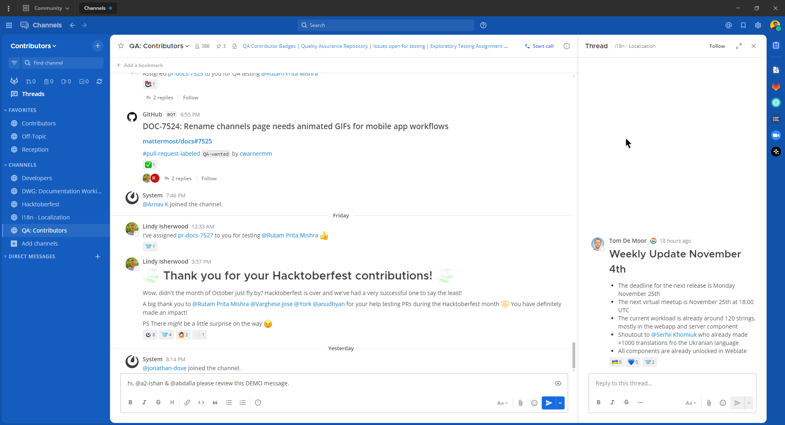

هل تريد هذه السمة؟ انسخ والصق الكود التالي في Mattermost:

```json
{"sidebarBg":"#145dbf","sidebarText":"#ffffff","sidebarUnreadText":"#ffffff","sidebarTextHoverBg":"#4578bf","sidebarTextActiveBorder":"#579eff","sidebarTextActiveColor":"#ffffff","sidebarHeaderBg":"#1153ab","sidebarTeamBarBg":"#0b428c","sidebarHeaderTextColor":"#ffffff","onlineIndicator":"#06d6a0","awayIndicator":"#ffbc42","dndIndicator":"#f74343","mentionBg":"#ffffff","mentionBj":"#ffffff","mentionColor":"#145dbf","centerChannelBg":"#ffffff","centerChannelColor":"#3d3c40","newMessageSeparator":"#ff8800","linkColor":"#2389d7","buttonBg":"#166de0","buttonColor":"#ffffff","errorTextColor":"#fd5960","mentionHighlightBg":"#ffe577","mentionHighlightLink":"#166de0","codeTheme":"github"}
```

#### المؤسسة (Organization)

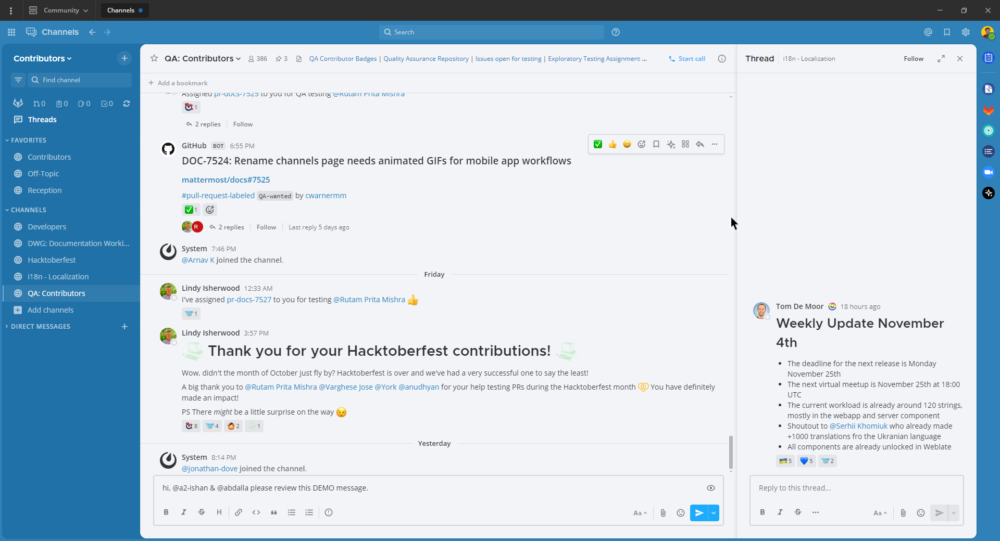

هل تريد هذه السمة؟ انسخ والصق الكود التالي في Mattermost:

```json
{"sidebarBg":"#2071a7","sidebarText":"#ffffff","sidebarUnreadText":"#ffffff","sidebarTextHoverBg":"#136197","sidebarTextActiveBorder":"#7ab0d6","sidebarTextActiveColor":"#ffffff","sidebarHeaderBg":"#2f81b7","sidebarTeamBarBg":"#256996","sidebarHeaderTextColor":"#ffffff","onlineIndicator":"#7dbe00","awayIndicator":"#dcbd4e","dndIndicator":"#ff6a6a","mentionBg":"#fbfbfb","mentionColor":"#2071f7","centerChannelBg":"#f2f4f8","centerChannelColor":"#333333","newMessageSeparator":"#ff8800","linkColor":"#2f81b7","buttonBg":"#1dacfc","buttonColor":"#ffffff","errorTextColor":"#a94442","mentionHighlightBg":"#f3e197","mentionHighlightLink":"#2f81b7","codeTheme":"github"}
```

#### Mattermost داكن (Mattermost Dark)


هل تريد هذه السمة؟ انسخ والصق الكود التالي في Mattermost:

```json
{"sidebarBg":"#1b2c3e","sidebarText":"#ffffff","sidebarUnreadText":"#ffffff","sidebarTextHoverBg":"#4a5664","sidebarTextActiveBorder":"#66b9a7","sidebarTextActiveColor":"#ffffff","sidebarHeaderBg":"#1b2c3e","sidebarTeamBarBg":"#152231","sidebarHeaderTextColor":"#ffffff","onlineIndicator":"#65dcc8","awayIndicator":"#c1b966","dndIndicator":"#e81023","mentionBg":"#b74a4a","mentionColor":"#ffffff","centerChannelBg":"#2f3e4e","centerChannelColor":"#dddddd","newMessageSeparator":"#5de5da","linkColor":"#a4ffeb","buttonBg":"#4cbba4","buttonColor":"#ffffff","errorTextColor":"#ff6461","mentionHighlightBg":"#984063","mentionHighlightLink":"#a4ffeb","codeTheme":"solarized-dark"}
```

#### Windows داكن (Windows Dark)

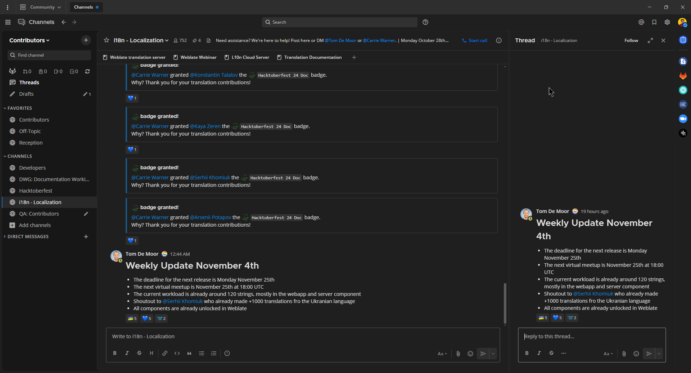

هل تريد هذه السمة؟ انسخ والصق الكود التالي في Mattermost:

```json
{"sidebarBg":"#171717","sidebarText":"#ffffff","sidebarUnreadText":"#ffffff","sidebarTextHoverBg":"#302e30","sidebarTextActiveBorder":"#196caf","sidebarTextActiveColor":"#ffffff","sidebarHeaderBg":"#1f1f1f","sidebarTeamBarBg":"#181818","sidebarHeaderTextColor":"#ffffff","onlineIndicator":"#399fff","awayIndicator":"#c1b966","dndIndicator":"#e81023","mentionBg":"#0177e7","mentionColor":"#ffffff","centerChannelBg":"#1f1f1f","centerChannelColor":"#dddddd","newMessageSeparator":"#cc992d","linkColor":"#0d93ff","buttonBg":"#0177e7","buttonColor":"#ffffff","errorTextColor":"#ff6461","mentionHighlightBg":"#784098","mentionHighlightLink":"#a4ffeb","codeTheme":"monokai"}
```

#### سمة GitHub

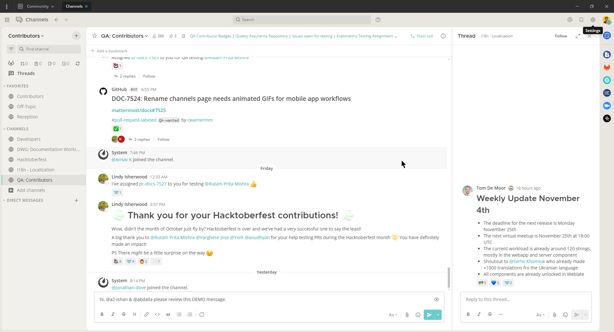

هل تريد هذه السمة؟ انسخ والصق الكود التالي في Mattermost:

```json
{"awayIndicator":"#D4B579","buttonBg":"#66CCCC","buttonColor":"#FFFFFF","centerChannelBg":"#FFFFFF","centerChannelColor":"#444444","codeTheme":"github","linkColor":"#3DADAD","mentionBg":"#66CCCC","mentionColor":"#FFFFFF","mentionHighlightBg":"#3DADAD","mentionHighlightLink":"#FFFFFF","newMessageSeparator":"#F2777A","onlineIndicator":"#52ADAD","sidebarBg":"#F2F0EC","sidebarHeaderBg":"#E8E6DF","sidebarHeaderTextColor":"#424242","sidebarText":"#2E2E2E","sidebarTextActiveBorder":"#66CCCC","sidebarTextActiveColor":"#594545","sidebarTextHoverBg":"#E0E0E0","sidebarUnreadText":"#515151"}
```

#### سمة Monokai

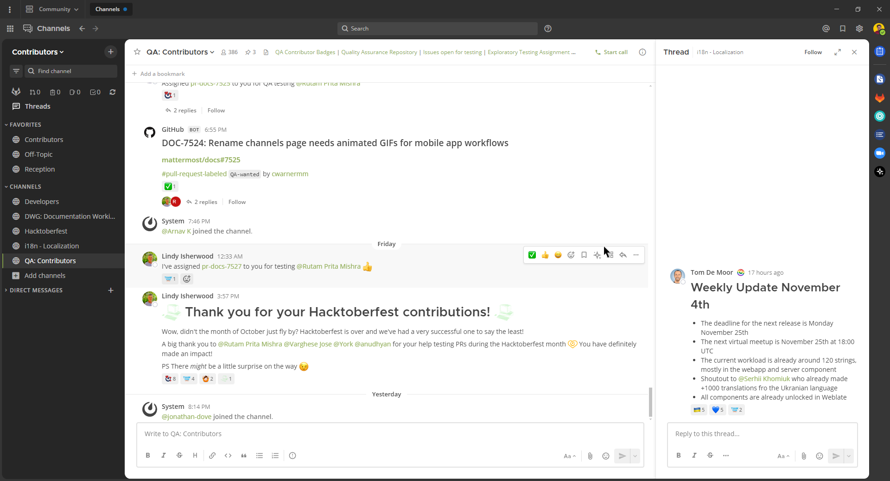

هل تريد هذه السمة؟ انسخ والصق الكود التالي في Mattermost:

```json
{"awayIndicator":"#B8B884","buttonBg":"#90AD58","buttonColor":"#FFFFFF","centerChannelBg":"#FFFFFF","centerChannelColor":"#444444","codeTheme":"monokai","linkColor":"#90AD58","mentionBg":"#7E9949","mentionColor":"#FFFFFF","mentionHighlightBg":"#54850C","mentionHighlightLink":"#FFFFFF","newMessageSeparator":"#90AD58","onlineIndicator":"#99CB3F","sidebarBg":"#262626","sidebarHeaderBg":"#363636","sidebarHeaderTextColor":"#FFFFFF","sidebarText":"#FFFFFF","sidebarTextActiveBorder":"#7E9949","sidebarTextActiveColor":"#FFFFFF","sidebarTextHoverBg":"#525252","sidebarUnreadText":"#CCCCCC"}
```

#### سمة Solarized Dark

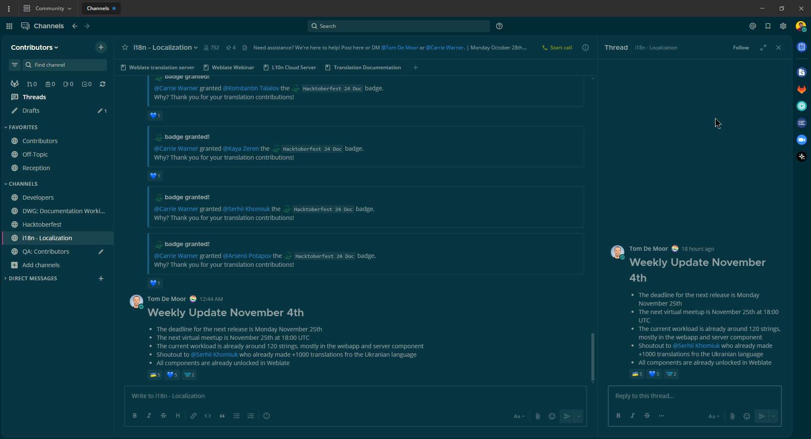

هل تريد هذه السمة؟ انسخ والصق الكود التالي في Mattermost:

```json
{"awayIndicator":"#E0B333","buttonBg":"#859900","buttonColor":"#fdf6e3","centerChannelBg":"#073642","centerChannelColor":"#93a1a1","codeTheme":"solarized-dark","linkColor":"#268bd2","mentionBg":"#dc322f","mentionColor":"#ffffff","mentionHighlightBg":"#d33682","mentionHighlightLink":"#268bd2","newMessageSeparator":"#cb4b16","onlineIndicator":"#2AA198","sidebarBg":"#073642","sidebarHeaderBg":"#002B36","sidebarHeaderTextColor":"#FDF6E3","sidebarText":"#FDF6E3","sidebarTextActiveBorder":"#d33682","sidebarTextActiveColor":"#FDF6E3","sidebarTextHoverBg":"#CB4B16","sidebarUnreadText":"#FDF6E3","errorTextColor":"#dc322f"}
```

#### سمة Gruvbox Dark

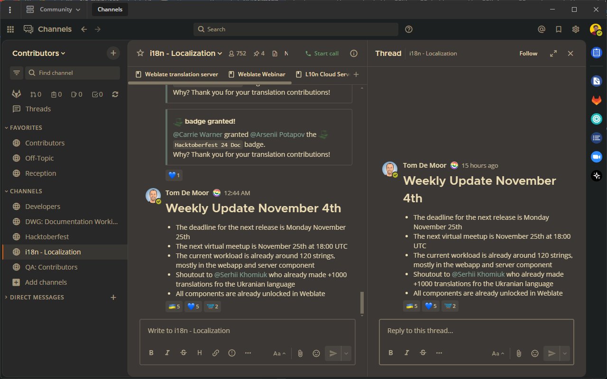

هل تريد هذه السمة؟ انسخ والصق الكود التالي في Mattermost:

```json
{"awayIndicator":"#fabd2f","buttonBg":"#689d6a","buttonColor":"#ebdbb2","centerChannelBg":"#3c3836","centerChannelColor":"#ebdbb2","codeTheme":"monokai","errorTextColor":"#fb4934","linkColor":"#83a598","mentionBg":"#b16286","mentionColor":"#fbf1c7","mentionHighlightBg":"#d65d0e","mentionHighlightLink":"#fbf1c7","newMessageSeparator":"#d65d0e","onlineIndicator":"#b8bb26","sidebarBg":"#282828","sidebarHeaderBg":"#1d2021","sidebarHeaderTextColor":"#ebdbb2","sidebarText":"#ebdbb2","sidebarTextActiveBorder":"#d65d0e","sidebarTextActiveColor":"#fbf1c7","sidebarTextHoverBg":"#d65d0e","sidebarUnreadText":"#fe8019"}
```

#### سمة One Dark

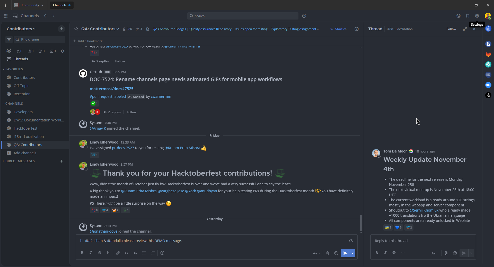

[قم بزيارة مستودع GitHub الخاص بـ one-dark-mattermost عبر الإنترنت:](https://github.com/georgewitteman/one-dark-mattermost)

هل تريد هذه السمة؟ انسخ والصق الكود التالي في Mattermost:

```json
{"sidebarBg":"#21252b","sidebarText":"#abb2bf","sidebarUnreadText":"#abb2bf","sidebarTextHoverBg":"#3a3f4b","sidebarTextActiveBorder":"#4d78cc","sidebarTextActiveColor":"#d7dae0","sidebarHeaderBg":"#282c34","sidebarHeaderTextColor":"#abb2bf","onlineIndicator":"#98c379","awayIndicator":"#d19a66","dndIndicator":"#be5046","mentionBg":"#98c379","mentionColor":"#ffffff","centerChannelBg":"#282c34","centerChannelColor":"#abb2bf","newMessageSeparator":"#c67add","linkColor":"#61afef","buttonBg":"#4d78cc","buttonColor":"#ffffff","errorTextColor":"#f44747","mentionHighlightBg":"#525a69","mentionHighlightLink":"#61afef","codeTheme":"monokai","mentionBg":"#98c379"}
```

#### سمة Discord الداكنة (الجديدة)

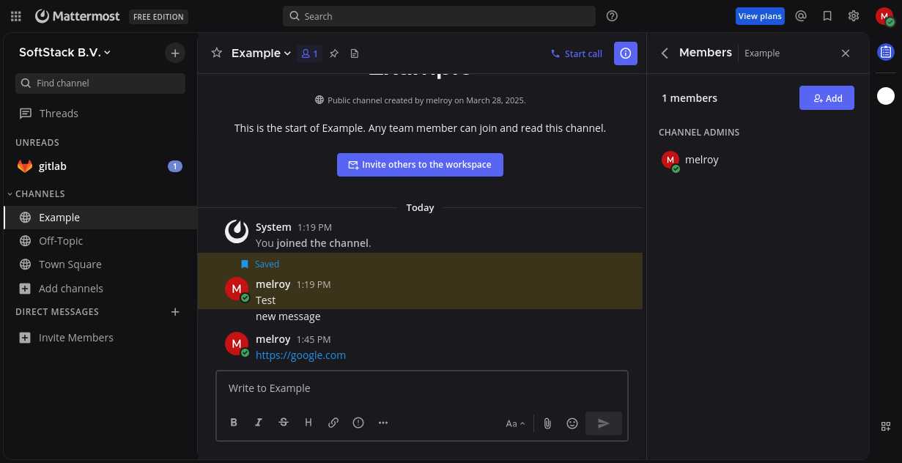

[قم بزيارة مستودع GitHub الخاص بـ mattermost-discord-dark عبر الإنترنت:](https://github.com/melroy89/mattermost-discord-dark)

هل تريد هذه السمة؟ انسخ والصق الكود التالي في Mattermost:

```json
{"sidebarBg": "#121214", "sidebarText": "#ffffff", "sidebarUnreadText": "#ffffff", "sidebarTextHoverBg": "#1d1d1e", "sidebarTextActiveBorder": "#ffffff", "sidebarTextActiveColor": "#ffffff", "sidebarHeaderBg": "#121214", "sidebarHeaderTextColor": "#ffffff", "sidebarTeamBarBg": "#121214", "onlineIndicator": "#43a25a", "awayIndicator": "#ca9654", "dndIndicator": "#d83a42", "mentionBg": "#6e84d2", "mentionBj": "#6e84d2", "mentionColor": "#ffffff", "centerChannelBg": "#1a1a1e", "centerChannelColor": "#efeff0", "newMessageSeparator": "#ff4d4d", "linkColor": "#2095e8", "buttonBg": "#5865f2", "buttonColor": "#ffffff", "errorTextColor": "#ff6461", "mentionHighlightBg": "#a4850f", "mentionHighlightLink": "#a4850f", "codeTheme": "monokai"}
```

#### سمة Discord الداكنة (القديمة)

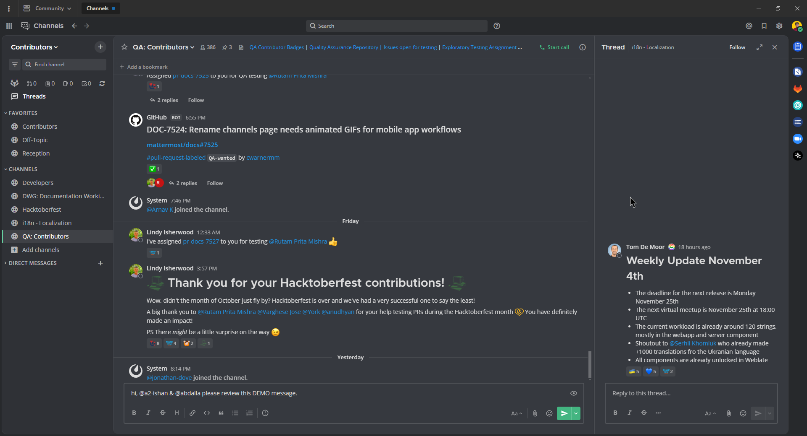

[قم بزيارة مستودع GitHub الخاص بـ mattermost-discord-dark-old عبر الإنترنت:](https://github.com/melroy89/mattermost-discord-dark)

هل تريد هذه السمة؟ انسخ والصق الكود التالي في Mattermost:

```json
{"sidebarBg":"#2f3136","sidebarText":"#ffffff","sidebarUnreadText":"#ffffff","sidebarTextHoverBg":"#33363c","sidebarTextActiveBorder":"#66cfa0","sidebarTextActiveColor":"#ffffff","sidebarHeaderBg":"#27292c","sidebarHeaderTextColor":"#ffffff","onlineIndicator":"#43b581","awayIndicator":"#faa61a","dndIndicator":"#f04747","mentionBg":"#6e84d2","mentionBg":"#6e84d2","mentionColor":"#ffffff","centerChannelBg":"#36393f","centerChannelColor":"#dddddd","newMessageSeparator":"#6e84d2","linkColor":"#2095e8","buttonBg":"#43b581","buttonColor":"#ffffff","errorTextColor":"#ff6461","mentionHighlightBg":"#3d414f","mentionHighlightLink":"#6e84d2","codeTheme":"monokai"}
```

#### سمة Night Owl الداكنة

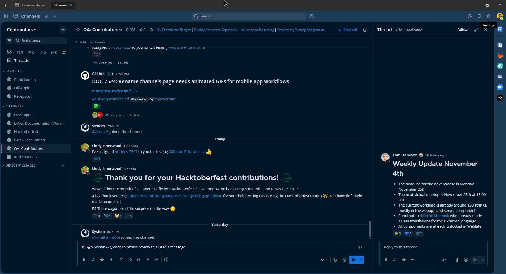

هل تريد هذه السمة؟ انسخ والصق الكود التالي في Mattermost:

```json
{"sidebarBg":"#011627","sidebarText":"#d6deeb","sidebarUnreadText":"#d6deeb","sidebarTextHoverBg":"#1d3b53","sidebarTextActiveBorder":"#ff2c83","sidebarTextActiveColor":"#82aaff","sidebarHeaderBg":"#1d3b53","sidebarHeaderTextColor":"#d6deeb","onlineIndicator":"#addb67","awayIndicator":"#ffbc42","dndIndicator":"#f74343","mentionBg":"#d6deeb","mentionBg":"#d6deeb","mentionColor":"#145dbf","centerChannelBg":"#011627","centerChannelColor":"#d6deeb","newMessageSeparator":"#ff8800","linkColor":"#2389d7","buttonBg":"#166de0","buttonColor":"#011627","errorTextColor":"#fd5960","mentionHighlightBg":"#0b2942","mentionHighlightLink":"#82aaff","codeTheme":"solarized-dark"}
```

#### السمة الداكنة (تطبيق سطح المكتب فقط) (Dark Theme (desktop app only))

في نظامي Windows و macOS، يتم أيضًا تطبيق تفضيلات عرض النظام التي قمت بتعيينها على جهاز الكمبيوتر الخاص بك (مثل الوضع الفاتح Light Mode أو الوضع الداكن Dark Mode) على تطبيق Mattermost لسطح المكتب. في نظام Linux، قم بإدارة ذلك يدويًا عبر قائمة **عرض (View)**.

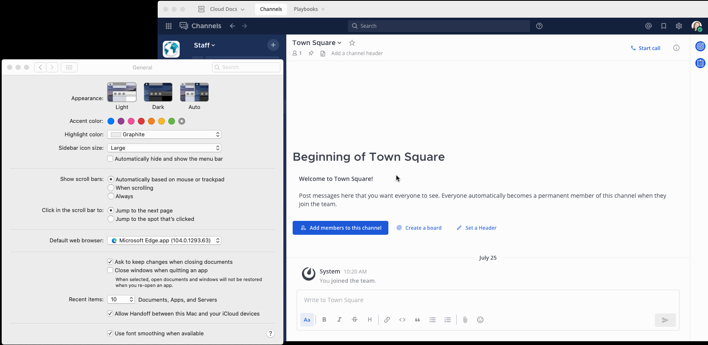

## تصدير السمة المخصصة الخاصة بك (Export your custom theme)

قم بتصدير سمة من Mattermost عن طريق نسخ قيم السمة من قائمة السمة المخصصة (Custom Theme).

## استيراد سمة مخصصة (Import a custom theme)

قم باستيراد سمة إلى Mattermost عن طريق لصق قيم السمة في قائمة السمة المخصصة (Custom Theme). انسخ قيم السمة الحالية، ثم ألصق قيم السمة في حقل **نسخ ولصق لمشاركة ألوان السمة (Copy and paste to share theme colors)**. حدد **حفظ (Save)** لتأكيد تغييرات السمة الخاصة بك.

## أنماط الشريط الجانبي (Sidebar styles)

يمكنك تخصيص كل جانب من جوانب سمة Mattermost الخاصة بك، كما هو موضح أدناه:

خلفية الشريط الجانبي (Sidebar BG)  
لون خلفية لوحة القنوات (Channels pane)، وأشرطة التنقل الجانبية لإعدادات الحساب والفريق.

نص الشريط الجانبي (Sidebar Text)  
لون نص القنوات المقروءة في لوحة القنوات، وعلامات التبويب في الشريط الجانبي لتنقل إعدادات الحساب والفريق.

خلفية رأس الشريط الجانبي (Sidebar Header BG)  
لون خلفية الرأس أعلى لوحة القنوات وجميع رؤوس نوافذ الحوار.

خلفية شريط الفريق الجانبي (Team Sidebar BG)  
لون خلفية الرأس العام (Global Header).

نص رأس الشريط الجانبي (Sidebar Header Text)  
لون نص الرأس أعلى لوحة القنوات وجميع رؤوس نوافذ الحوار.

نص غير مقروء في الشريط الجانبي (Sidebar Unread Text)  
لون نص القنوات غير المقروءة في لوحة القنوات.

خلفية مرور الماوس على نص الشريط الجانبي (Sidebar Text Hover BG)  
لون الخلفية خلف أسماء القنوات وعلامات تبويب الإعدادات أثناء تمرير الماوس فوقها.

الحد النشط لنص الشريط الجانبي (Sidebar Text Active Border)  
لون العلامة المستطيلة على الجانب الأيسر من لوحة القنوات أو الشريط الجانبي للإعدادات والتي تشير إلى القناة أو علامة التبويب النشطة.

اللون النشط لنص الشريط الجانبي (Sidebar Text Active Color)  
لون نص القناة أو علامة التبويب النشطة في لوحة القنوات أو الشريط الجانبي للإعدادات.

مؤشر متصل (Online Indicator)  
لون المؤشر المتصل الذي يظهر بجوار أسماء أعضاء الفريق في قائمة الرسائل المباشرة.

مؤشر غائب (Away Indicator)  
لون المؤشر الغائب الذي يظهر بجوار أسماء أعضاء الفريق في قائمة الرسائل المباشرة عندما لا يكون لديهم نشاط على المتصفح لمدة 5 دقائق.

مؤشر عدم الإزعاج (Do Not Disturb Indicator)  
لون مؤشر عدم الإزعاج الذي يظهر بجوار أسماء أعضاء الفريق في قائمة الرسائل المباشرة.

خلفية جوهرة الإشارة (Mention Jewel BG)  
لون خلفية الجوهرة التي تشير إلى الإشارات غير المقروءة والتي تظهر على يمين اسم القناة. هذا هو أيضًا لون خلفية مؤشر "المنشورات غير المقروءة أدناه/أعلاه (Unread Posts Below/Above)" الذي يظهر أعلى أو أسفل لوحة القنوات على نوافذ المتصفح الأقصر.

نص جوهرة الإشارة (Mention Jewel Text)  
لون النص الموجود على جوهرة الإشارة والذي يشير إلى عدد الإشارات غير المقروءة. هذا هو أيضًا لون النص الموجود على مؤشر "المنشورات غير المقروءة أدناه/أعلاه".

## أنماط القناة المركزية (Center channel styles)

يمكنك تخصيص كل جانب من جوانب سمة Mattermost الخاصة بك، كما هو موضح أدناه:

خلفية القناة المركزية (Center Channel BG)  
لون اللوحة المركزية (center pane)، والشريط الجانبي الأيمن (right-hand sidebar)، وجميع خلفيات نوافذ الحوار.

نص القناة المركزية (Center Channel Text)  
لون جميع النصوص - باستثناء الإشارات والروابط وعلامات التصنيف (hashtags) وكتل الأكواد (code blocks) - في اللوحة المركزية والشريط الجانبي الأيمن ومربعات الحوار.

فاصل الرسائل الجديدة (New Message Separator)  
يظهر فاصل الرسائل الجديدة أسفل آخر رسالة مقروءة عند الانتقال إلى قناة بها رسائل غير مقروءة.

لون نص الخطأ (Error Text Color)  
لون كل نص الأخطاء.

خلفية تمييز الإشارة (Mention Highlight BG)  
لون التمييز (highlight color) خلف كلماتك التي تؤدي إلى الإشارات في اللوحة المركزية والشريط الجانبي الأيمن.

رابط تمييز الإشارة (Mention Highlight Link)  
لون نص كلماتك التي تؤدي إلى الإشارات في اللوحة المركزية والشريط الجانبي الأيمن.

سمة الكود (Code Theme)  
الخلفية وألوان بناء الجملة (syntax colors) لجميع كتل الأكواد (code blocks).

## أنماط الروابط والأزرار (Link and button styles)

يمكنك تخصيص كل جانب من جوانب سمة Mattermost الخاصة بك، كما هو موضح أدناه:

لون الرابط (Link Color)  
لون نص جميع الروابط وعلامات التصنيف وإشارات زملاء الفريق وأزرار واجهة المستخدم (UI) ذات الأولوية المنخفضة.

خلفية الزر (Button BG)  
لون الخلفية المستطيلة خلف جميع أزرار واجهة المستخدم (UI) ذات الأولوية العالية.

نص الزر (Button Text)  
لون النص الذي يظهر على الخلفية المستطيلة لجميع أزرار واجهة المستخدم ذات الأولوية العالية.
