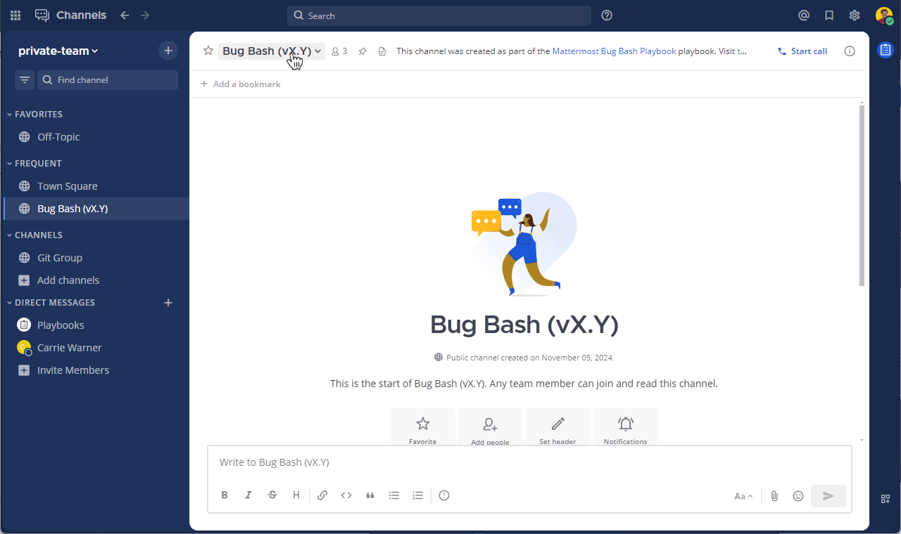

بشكل افتراضي، تنطبق تفضيلات إشعارات الويب وسطح المكتب على جميع القنوات التي أنت عضو فيها. يمكنك تخصيص تفضيلات الإشعارات لكل قناة لأي قناة أنت عضو فيها للإجراءات التالية:

- [كتم القنوات (Mute channels)](#كتم-القنوات-mute-channels)
- [تجاهل الإشارات (@mentions) على مستوى القناة (Ignore channel-wide @mentions)](#تجاهل-الإشارات-mentions-على-مستوى-القناة-ignore-channel-wide-mentions)
- [أصوات إشعارات الرسائل (Message notification sounds)](#أصوات-إشعارات-الرسائل-message-notification-sounds)
- [المتابعة التلقائية لجميع السلاسل الجديدة (Auto-follow all new threads)](#متابعة-جميع-سلاسل-القناة-الجديدة-follow-all-new-channel-threads)

الويب/سطح المكتب (Web/Desktop)

لديك طريقتان لإدارة تفضيلات الإشعارات لكل قناة:

1. حدد اسم القناة، ثم حدد **تفضيلات الإشعارات (Notification Preferences)** من القائمة المنسدلة.

2. بدلاً من ذلك، حدد أيقونة **عرض المعلومات (View Info)** [\|channel-info\|](##SUBST##|channel-info|) الخاصة بالقناة، ثم حدد **تفضيلات الإشعارات (Notification Preferences)** في الجزء الأيمن.

الهاتف المحمول (Mobile)

اضغط على اسم القناة، ثم اضغط على **إشعارات الهاتف المحمول (Mobile Notifications)**.

## كتم القنوات (Mute channels)

يتم إلغاء كتم جميع القنوات بشكل افتراضي، بما في ذلك الرسائل المباشرة والجماعية، بالإضافة إلى القنوات الخاصة والعامة.

يمكنك اختيار كتم أو إلغاء كتم قناة في أي وقت على النحو التالي:

- حدد **كتم المحادثة (Mute Conversation)** أو **إلغاء كتم المحادثة (Unmute Conversation)** للرسائل المباشرة والجماعية.
- حدد **كتم القناة (Mute Channel)** أو **إلغاء كتم القناة (Unmute Channel)** للقنوات الخاصة والعامة.

بمجرد كتم القناة:

- يتم تعطيل جميع الإشعارات لهذه القناة، بما في ذلك البريد الإلكتروني وسطح المكتب ونغمات رنين المكالمات الواردة والإشعارات المنبثقة.
- تعرض القناة المكتومة أيقونة كتم بجوار اسم القناة.
- يتم تظليل القناة في الشريط الجانبي للقناة باللون الرمادي، ولا تظهر بخط عريض للإشارة إلى الرسائل غير المقروءة ما لم يتم [ذكرك (@mentioned)](/end-user-guide/collaborate/mention-people) في تلك القناة مباشرةً.

## تجاهل الإشارات (@mentions) على مستوى القناة (Ignore channel-wide @mentions)

بشكل افتراضي، يتم إخطارك في كل مرة يستخدم فيها شخص ما [إشارات (@mentions)](/end-user-guide/collaborate/mention-people) على مستوى القناة بما في ذلك [@channel و @all](/end-user-guide/collaborate/mention-people)، بالإضافة إلى [@here](/end-user-guide/collaborate/mention-people).

عندما تختار تجاهل الإشارات (@mentions) على مستوى القناة في القنوات، يتم تمييز اسم القناة بخط عريض في الشريط الجانبي للقناة للرسائل غير المقروءة الجديدة ما لم تكن مكتومة.

## أصوات إشعارات الرسائل (Message notification sounds)

بدءًا من الإصدار v10.1 من Mattermost، عندما تقوم بتكوين Mattermost لإعلامك بجميع الرسائل الجديدة، أو الإشارات والرسائل المباشرة والكلمات الرئيسية فقط، على أساس كل قناة على حدة، يمكنك أيضًا تحديد صوت إشعار رسالة مسموع ليتم تشغيله لتلك الإشعارات.

## متابعة جميع سلاسل القناة الجديدة (Follow all new channel threads)

بشكل افتراضي، لا تتابع تلقائيًا سلاسل المحادثات الجديدة في أي قناة ما لم تبدأ سلسلة رسائل أو ترد عليها، أو تتابع سلسلة رسائل، أو تتم الإشارة إليك (@mentioned) في سلسلة رسائل.

عند استخدام Mattermost على جهازك المحمول، يمكنك تكوين Mattermost لمتابعة كل سلسلة رسائل في القناة تلقائيًا.

1. في القناة، اضغط على أيقونة **المزيد (More)** [\|more-icon\|](##SUBST##|more-icon|) الموجودة على يمين اسم القناة.
2. اضغط على **عرض المعلومات (View info)**.
3. اضغط على **متابعة جميع السلاسل (Follow all threads)**.

اضغط على **السلاسل (Threads)** في قائمة القنوات للوصول إلى جميع السلاسل التي تتابعها، ولإلغاء متابعة السلاسل التي لم تعد ترغب في متابعتها.
