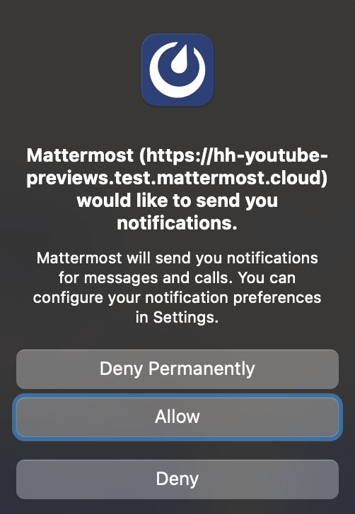
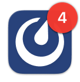

## تمكين الإشعارات (Enable notifications)

بدءًا من الإصدار v9.9 من Mattermost وتطبيق سطح المكتب v5.5، يطالبك Mattermost بتمكين الإشعارات في تطبيق سطح المكتب في المرة الأولى التي تتصل فيها بخادم Mattermost.

- عند تحديد **سماح (Allow)**، لن يتم سؤالك مرة أخرى. ستبدأ في تلقي الإشعارات في تطبيق سطح المكتب لجميع أنشطة Mattermost باستخدام [الشارات (#إشعارات-مبنية-على-الشارات)](#إشعارات-مبنية-على-الشارات-badge-based-notifications)، و [تنبيهات البانر (#تنبيهات-البانر)](#تنبيهات-البانر-banner-alerts)، و [الأصوات (#أصوات-الإشعارات)](#أصوات-الإشعارات-notification-sounds). راجع القسم أدناه حول [تخصيص إشعاراتك](#تخصيص-إشعاراتك-customize-your-notifications) بناءً على الكيفية التي تفضل بها أن يتم إعلامك بنشاط Mattermost في تطبيق سطح المكتب.
- إذا قمت بتجاهل هذه المطالبة، فلن تتلقى إشعارات Mattermost في تطبيق سطح المكتب، وسيتم مطالبتك مرة أخرى في المرة القادمة التي تفتح فيها Mattermost في تطبيق سطح المكتب، أو تذهب إلى **الإعدادات (Settings) > الإشعارات (Notifications) > إشعارات سطح المكتب والهاتف المحمول (Desktop and mobile notifications)**.
- إذا حددت **رفض (Deny)** أو **رفض نهائيًا (Deny Permanently)**، فلن يتم سؤالك مرة أخرى. لن تتلقى إشعارات Mattermost في تطبيق سطح المكتب. يمكنك تغيير هذا التفضيل من خلال [تعديل اتصال الخادم](/end-user-guide/preferences/connect-multiple-workspaces) لـ [إدارة أذونات النظام](/end-user-guide/preferences/connect-multiple-workspaces).

:::note
قد تحتاج أيضًا إلى تمكين الإشعارات في نظام التشغيل Windows أو macOS أو Linux لـ Mattermost عن طريق تغيير تفضيلات النظام الخاصة بك.
:::

## إشعارات مبنية على الشارات (Badge-based notifications)

تعرض أيقونات تطبيق Mattermost لسطح المكتب الأنواع التالية من الشارات (badges):

- شارة مرقمة للرسائل [المباشرة](/end-user-guide/collaborate/channel-types) و [الجماعية](/end-user-guide/collaborate/channel-types) غير المقروءة، و [الإشارات (@mentions)](/end-user-guide/preferences/manage-your-mentions-keywords-notifications)، و [الكلمات الرئيسية (keywords)](/end-user-guide/preferences/manage-your-mentions-keywords-notifications) التي تتابعها بنشاط.   
- شارة نقطية للنشاط غير المقروء.   

## تنبيهات البانر (Banner alerts)

تنبيهات البانر في تطبيق سطح المكتب هي نوافذ منبثقة تظهر لفترة محدودة في الزاوية العلوية اليمنى من شاشتك تلخص النشاط الجديد.

## أصوات الإشعارات (Notification sounds)

بشكل افتراضي، تتضمن إشعارات تطبيق سطح المكتب أصواتًا مسموعة.

## تخصيص إشعاراتك (Customize your notifications)

بشكل افتراضي، يتم إخطارك عندما تتم الإشارة إليك (@mentioned)، أو عندما تتلقى رسالة مباشرة أو جماعية، أو عند مطابقة الكلمات الرئيسية التي تتابعها.

هل تريد تلقي إشعارات حول الردود على السلاسل التي تتابعها؟ حدد **أعلمني بالردود على السلاسل التي أتابعها (Notify me about replies to threads I’m following)**.

هل تريد إشعارات لجميع الرسائل الجديدة؟ حدد **إشعارات سطح المكتب والهاتف المحمول (Desktop and mobile notifications) > جميع الرسائل الجديدة (All new messages)**.

يمكن لمستخدمي تطبيق سطح المكتب أيضًا [تخصيص تجربة تطبيق سطح المكتب الخاص بهم](/end-user-guide/preferences/customize-desktop-app-experience) بشكل أكبر بناءً على نظام تشغيل النظام الأساسي الخاص بهم.

### تغيير الأصوات أو تعطيلها (Change or disable sounds)

يمكنك تغيير أصوات الإشعارات أو تعطيلها بالانتقال إلى **أصوات إشعارات سطح المكتب (Desktop notification sounds) > صوت إشعار الرسالة (Message notification sound)**.

### إشعارات المكالمات الواردة (Incoming Call notifications)

هل تريد سماع صوت عند بدء مكالمة Mattermost؟ إذا قام مسؤول Mattermost الخاص بك بـ [تمكين هذه الميزة التجريبية (Beta feature)](/administration-guide/configure/plugins-configuration-settings)، فيمكنك اختيار الصوت الذي يتم تشغيله عند بدء مكالمة داخل رسالة مباشرة أو جماعية بالانتقال إلى **أصوات إشعارات سطح المكتب (Desktop notification sounds) > صوت المكالمة الواردة (Incoming call sound)**.

### تعطيل جميع إشعارات سطح المكتب (Disable all desktop notifications)

حدد **إشعارات سطح المكتب والهاتف المحمول (Desktop and mobile notifications) > لا شيء (Nothing)** لتعطيل جميع إشعارات سطح المكتب و [الويب](/end-user-guide/preferences/manage-your-web-notifications).

قم بإلغاء تحديد **استخدام إعدادات مختلفة لأجهزتي المحمولة (Use different settings for my mobile devices)** لتعطيل جميع إشعارات Mattermost للهاتف المحمول بشكل إضافي في كل مكان تستخدم فيه Mattermost.

بالإضافة إلى ذلك، يمكن لمستخدمي macOS تعطيل الإشعارات لجميع الأنشطة غير المقروءة في تطبيق سطح المكتب عن طريق [تخصيص تجربة تطبيق سطح المكتب الخاص بهم](/end-user-guide/preferences/customize-desktop-app-experience) لتعطيل خيار **إظهار شارة حمراء على أيقونة Dock للإشارة إلى الرسائل غير المقروءة (Show red badge on Dock icon to indicate unread messages)**.

## الأسئلة الشائعة (Frequently asked questions)

### ماذا تعني أيقونة Mattermost مع علامة تعجب؟ (What does a Mattermost icon with an exclamation point mean?)

تعني أيقونة Mattermost التي تحتوي على علامة تعجب أنك قمت بتسجيل الخروج من خادم Mattermost واحد على الأقل تتصل به باستخدام تطبيق سطح المكتب. قم بتسجيل الدخول مرة أخرى إلى أي خوادم حسب الحاجة. راجع وثائق [الاتصال بمساحات عمل متعددة](/end-user-guide/preferences/connect-multiple-workspaces) للحصول على التفاصيل.

إذا استمر عرض الأيقونة، فقم بتحديث علامتي تبويب **Playbooks** و/أو **Boards** الموجودتين في الجزء العلوي من نافذة تطبيق سطح المكتب.
