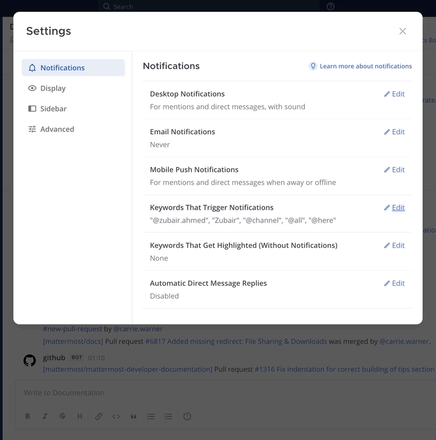
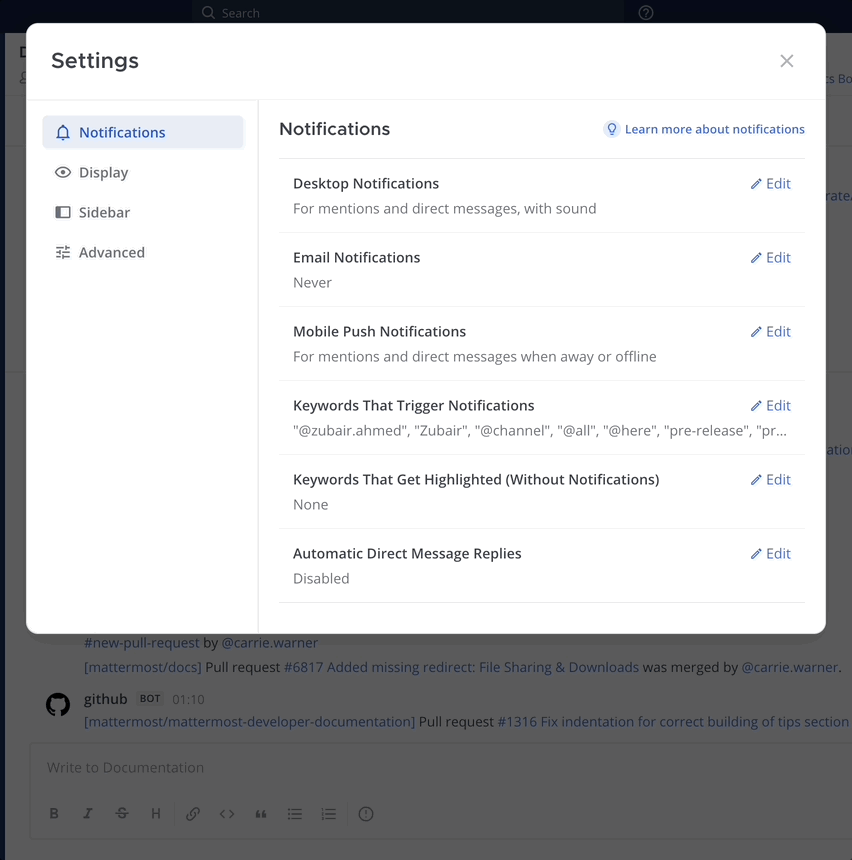

يتم [إعلامك](/end-user-guide/preferences/manage-your-notifications) في [متصفح الويب](/end-user-guide/preferences/manage-your-web-notifications)، و [تطبيق سطح المكتب](/end-user-guide/preferences/manage-your-desktop-notifications)، وعلى [جهازك المحمول](/end-user-guide/preferences/manage-your-mobile-notifications)، عندما تتم الإشارة إليك (@mentioned) باسم المستخدم أو اسمك الأول، وعندما تتم الإشارة إليك كجزء من مجموعة مستخدمين، وعند مطابقة الكلمات الرئيسية التي تتابعها.

يتم إعلامك أيضًا عندما يستخدم شخص ما [إشارات (@mentions)](/end-user-guide/collaborate/mention-people) على مستوى القناة بما في ذلك [@channel و @all](/end-user-guide/collaborate/mention-people)، بالإضافة إلى [@here](/end-user-guide/collaborate/mention-people).

بالنسبة لجميع الرسائل الأخرى، تظهر القنوات بخط عريض للإشارة إلى وجود نشاط غير مقروء.

## تخصيص كلمات إشعارات الكلمات الرئيسية (Customize notification keywords)

باستخدام متصفح الويب أو تطبيق سطح المكتب، يمكنك تخصيص الكلمات الرئيسية لتشغيل الإشعارات. الكلمات الرئيسية ليست حساسة لحالة الأحرف (case-sensitive).

على سبيل المثال، يمكنك تلقي إشعارات لجميع الرسائل والسلاسل المتعلقة بموضوع معين، أو اسم مشروع، أو عميل.

:::note
افصل بين الكلمات الرئيسية المتعددة باستخدام الفواصل أو بالضغط على مفتاح `Tab` واستخدم مفتاح `Backspace` لإدارة الكلمات الرئيسية.
:::

## تتبع الكلمات الرئيسية بشكل سلبي (بدون إشعار) (Passively track keywords (no notification))

بدءًا من الإصدار v9.3 من Mattermost، يمكن لعملاء Mattermost Enterprise و Professional المهتمين بجذب الانتباه إلى مواضيع محددة تهمهم عبر القنوات القيام بذلك دون إرسال إشعارات إلى عميل Mattermost.

باستخدام متصفح الويب أو تطبيق سطح المكتب، يمكنك تتبع المصطلحات الرئيسية بشكل سلبي عن طريق تحديد كلمات مفردة أو متعددة ليتم تمييزها في جميع القنوات التي أنت عضو فيها. يتم تمييز الكلمات والعبارات الرئيسية تلقائيًا باستخدام لون يعتمد على [سمة Mattermost](/end-user-guide/preferences/customize-your-theme) الخاصة بك.

