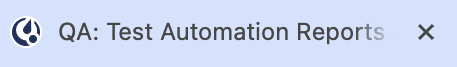

## تمكين الإشعارات (Enable notifications)

بدءًا من الإصدار v9.10 من Mattermost، يطالبك Mattermost بمنح الإذن لمتصفح الويب الخاص بك لإظهار الإشعارات.

- عند تحديد **تمكين الإشعارات (Enable notifications)**، لن يتم سؤالك مرة أخرى. ستبدأ في تلقي الإشعارات في متصفح الويب الخاص بك لجميع أنشطة Mattermost باستخدام [الشارات (#إشعارات-مبنية-على-الشارات)](#إشعارات-مبنية-على-الشارات-badge-based-notifications) و [الأصوات (#أصوات-الإشعارات)](#أصوات-الإشعارات-notification-sounds). راجع القسم أدناه حول [تخصيص إشعاراتك](#تخصيص-إشعاراتك-customize-your-notifications) بناءً على الكيفية التي تفضل بها أن يتم إعلامك بنشاط Mattermost في متصفح الويب.
- إذا قمت بتجاهل هذه المطالبة، فلن تتلقى إشعارات Mattermost في متصفح الويب، وسيتم مطالبتك مرة أخرى في المرة القادمة التي تفتح فيها Mattermost في متصفح ويب، أو تذهب إلى **الإعدادات (Settings) > الإشعارات (Notifications) > إشعارات سطح المكتب والهاتف المحمول (Desktop and mobile notifications)**.
- إذا حددت **رفض (Deny)** أو **رفض نهائيًا (Deny Permanently)**، فلن يتم سؤالك مرة أخرى. لن تتلقى إشعارات Mattermost في متصفح الويب. يمكنك تغيير هذا التفضيل عن طريق منح أذونات الإشعارات لـ Mattermost في متصفح الويب.

## إشعارات مبنية على الشارات (Badge-based notifications)

في متصفح الويب، تعرض أيقونات Mattermost الأنواع التالية من الشارات (badges):

- شارات مرقمة للرسائل [المباشرة](/end-user-guide/collaborate/channel-types) و [الجماعية](/end-user-guide/collaborate/channel-types) غير المقروءة، و [الإشارات (@mentions)](/end-user-guide/preferences/manage-your-mentions-keywords-notifications)، و [الكلمات الرئيسية (keywords)](/end-user-guide/preferences/manage-your-mentions-keywords-notifications) التي تتابعها بنشاط.

تعني الشارة ذات النقطة الحمراء أن لديك إشارات (@mentions) أو كلمات رئيسية أو رسائل مباشرة أو رسائل جماعية غير مقروءة.

تعني الشارة ذات النقطة السوداء أن لديك نشاطًا غير مقروء في القنوات التي أنت عضو فيها.

## أصوات الإشعارات (Notification sounds)

بشكل افتراضي، تتضمن إشعارات الويب أصواتًا مسموعة.

## تخصيص إشعاراتك (Customize your notifications)

:::note
تقوم إعدادات إشعارات Mattermost المسماة "سطح المكتب" (Desktop) أيضًا بتكوين إشعارات الويب الخاصة بك عند استخدام Mattermost في متصفح الويب.
:::

### تقليل إشعارات الويب (Reduce web notifications)

لتقليل عدد الإشعارات التي تتلقاها، حدد **إشعارات سطح المكتب والهاتف المحمول (Desktop and mobile notifications) > الإشارات والرسائل المباشرة والرسائل الجماعية (Mentions, direct messages, and group messages)**، واحفظ تغييراتك. يمكنك ضبط هذا التفضيل عبر جميع القنوات أو لقنوات محددة.

مع تمكين الإشعارات المحدودة، يمكنك أيضًا اختيار تلقي إشعارات حول الردود على السلاسل التي تتابعها عن طريق تحديد **أعلمني بالردود على السلاسل التي أتابعها (Notify me about replies to threads I'm following)**.

### تغيير الأصوات أو تعطيلها (Change or disable sounds)

يمكنك تغيير أصوات الإشعارات أو تعطيلها بالانتقال إلى **أصوات إشعارات سطح المكتب (Desktop notification sounds) > صوت إشعار الرسالة (Message notification sound)**.

### إشعارات المكالمات الواردة (Incoming Call notifications)

هل تريد سماع صوت عند بدء مكالمة Mattermost؟ إذا قام مسؤول Mattermost الخاص بك بـ [تمكين هذه الميزة التجريبية (Beta feature)](/administration-guide/configure/plugins-configuration-settings)، فيمكنك اختيار الصوت الذي يتم تشغيله عند بدء مكالمة داخل رسالة مباشرة أو جماعية بالانتقال إلى **أصوات إشعارات سطح المكتب (Desktop notification sounds) > صوت المكالمة الواردة (Incoming call sound)**.

### تعطيل جميع إشعارات الويب (Disable all web notifications)

حدد **إشعارات سطح المكتب والهاتف المحمول (Desktop and mobile notifications) > لا شيء (Nothing)** لتعطيل جميع إشعارات الويب وسطح المكتب.

قم بإلغاء تحديد **استخدام إعدادات مختلفة لأجهزتي المحمولة (Use different settings for my mobile devices)** لتعطيل جميع إشعارات Mattermost للهاتف المحمول بشكل إضافي في كل مكان تستخدم فيه Mattermost.

## الأسئلة الشائعة (Frequently asked questions)

### لماذا يتم مطالبتي مرارًا وتكرارًا بتمكين إشعارات لا أريدها؟ (Why am I prompted repeatedly enable notifications I don't want?)

سيستمر Mattermost في مطالبتك بمنح الإذن للمتصفح لإظهار الإشعارات حتى تستجيب للمطالبة. إذا كنت ترغب في تعطيل جميع إشعارات Mattermost، فحدد **تمكين الإشعارات (Enable notifications)** عند المطالبة، ثم [قم بتعطيل جميع إشعارات ويب Mattermost](#تعطيل-جميع-إشعارات-الويب-disable-all-web-notifications).
