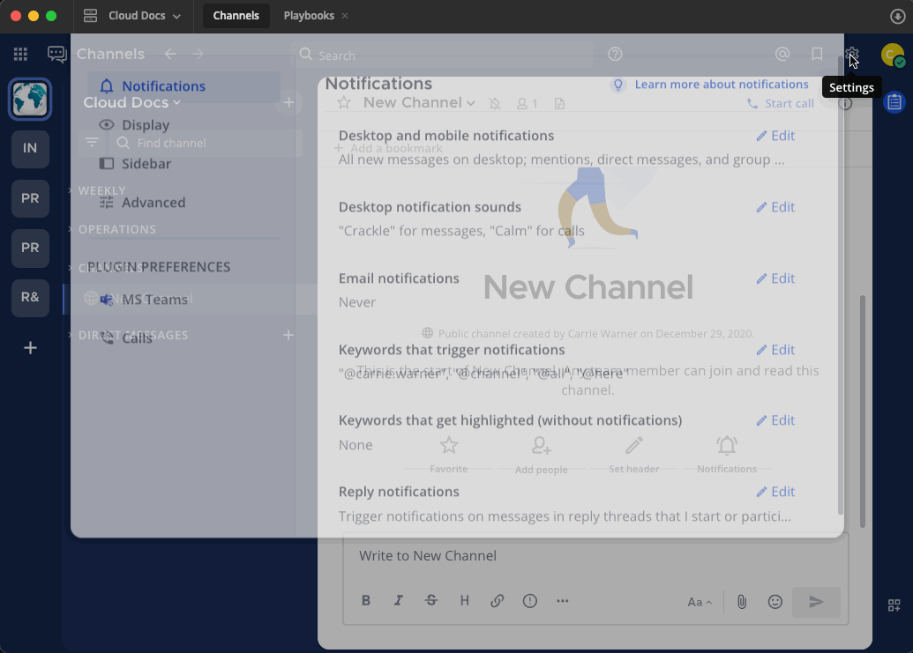
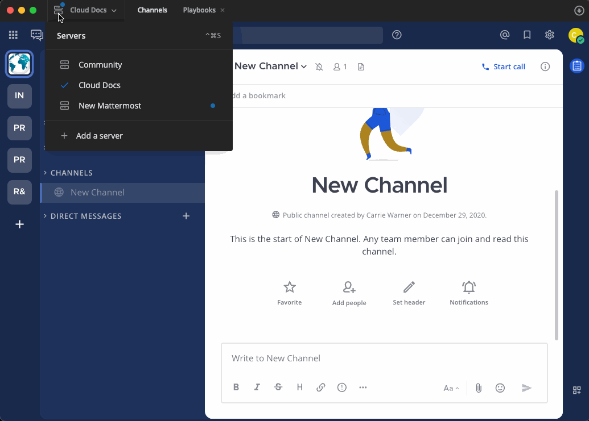
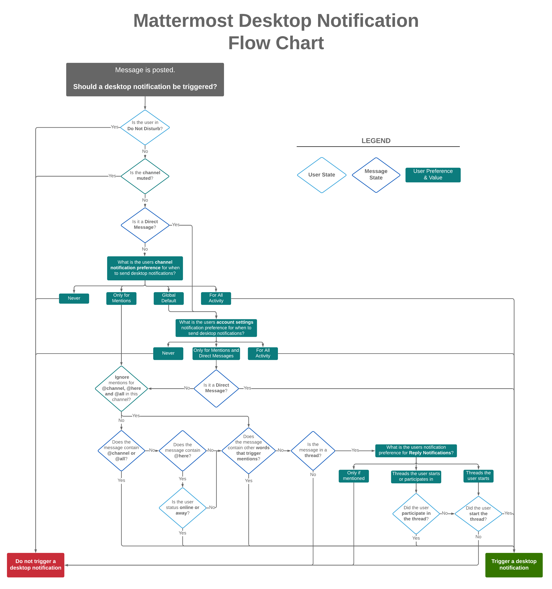
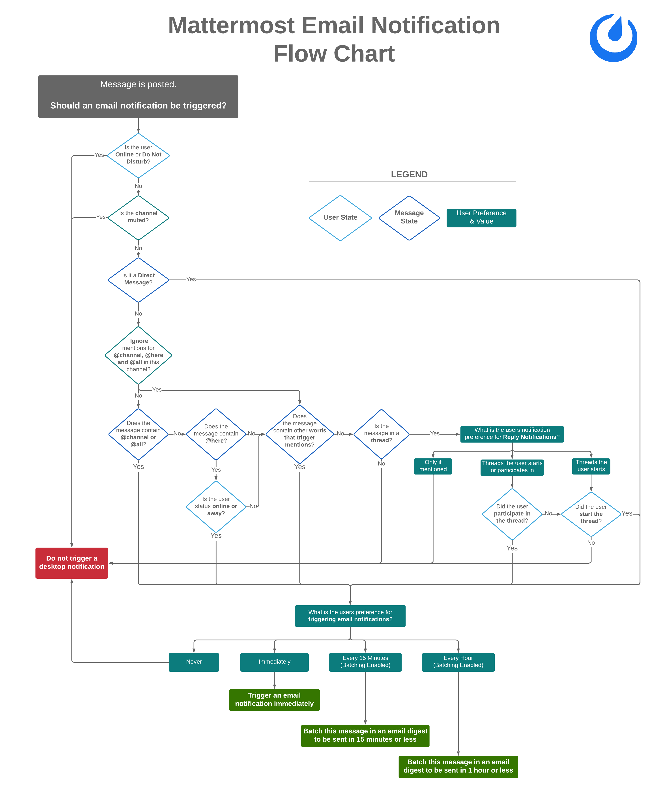
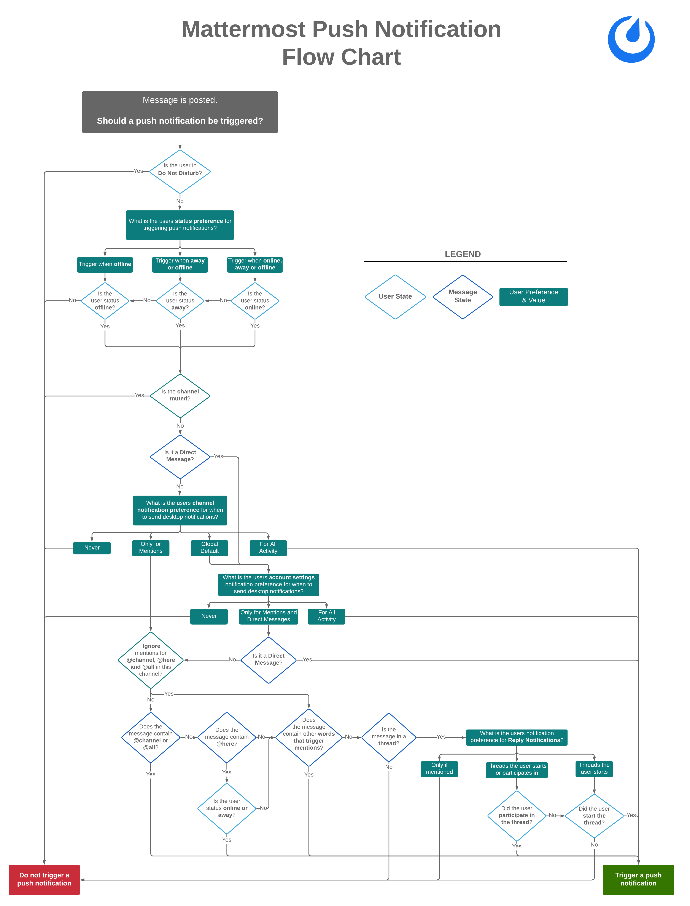

تعتمد إشعارات Mattermost التي تتلقاها على [تفضيلات Mattermost الخاصة بك](#تحقق-من-تفضيلات-mattermost-الخاصة-بك-check-your-mattermost-preferences)، و [عميل Mattermost](#تحقق-من-إعدادات-عميل-mattermost-الخاص-بك-check-your-mattermost-client-settings) الذي تستخدمه، و [نظام التشغيل (OS)](#تحقق-من-إعدادات-نظام-التشغيل-الخاص-بك-check-your-operating-system-settings) الذي تقوم بتشغيل Mattermost عليه.

## أرسل لنفسك إشعار اختبار (Send yourself a test notification)

بدءًا من الإصدار v10.3 من Mattermost، يمكنك إرسال إشعار اختبار لنفسك عن طريق تحديد **الإعدادات (Settings)** [\|gear\|](##SUBST##|gear|)، والانتقال إلى خيارات **الإشعارات (Notifications)**.

ضمن **استكشاف أخطاء الإشعارات وإصلاحها (Troubleshooting notifications)**، حدد خيار **إرسال إشعار اختبار (Send a test notification)**. إذا كانت الإشعارات تعمل، فستتلقى رسالة مباشرة من بوت النظام (system-bot) في Mattermost تؤكد أن الإشعارات تعمل.

إذا لم تتلق رسالة مباشرة من بوت النظام، فراجع الأقسام التالية للحصول على خطوات استكشاف الأخطاء وإصلاحها التي يمكنك اتباعها لضمان تلقي الإشعارات التي تريدها.

## تحقق من تفضيلات Mattermost الخاصة بك (Check your Mattermost preferences)

ابدأ بالتأكد من تمكين الإشعارات في تفضيلات Mattermost الخاصة بك.

سطح المكتب (Desktop)

1. حدد **الإعدادات (Settings)** [\|gear\|](##SUBST##|gear|) في الزاوية العلوية اليمنى من Mattermost.
2. حدد **إشعارات سطح المكتب والهاتف المحمول (Desktop and mobile notifications)**.

إذا تم ضبط **إرسال الإشعارات لـ (Send notifications for)** على **لا شيء (Nothing)**، فهذا يعني أن إشعارات Mattermost معطلة حاليًا. حدد خيار **جميع الرسائل الجديدة (All new messages)** أو **الإشارات والرسائل المباشرة والرسائل الجماعية (Mentions, direct messages, and group messages)** بدلاً من ذلك، واحفظ تغييراتك.

الويب (Web)

1. حدد **الإعدادات (Settings)** [\|gear\|](##SUBST##|gear|) في الزاوية العلوية اليمنى من Mattermost.
2. حدد **إشعارات سطح المكتب والهاتف المحمول (Desktop and mobile notifications)**.

إذا تم ضبط **إرسال الإشعارات لـ (Send notifications for)** على **لا شيء (Nothing)**، فهذا يعني أن إشعارات Mattermost معطلة حاليًا. حدد خيار **جميع الرسائل الجديدة (All new messages)** أو **الإشارات والرسائل المباشرة والرسائل الجماعية (Mentions, direct messages, and group messages)** بدلاً من ذلك.

الهاتف المحمول (Mobile)

1. اضغط على صورة ملفك الشخصي في الزاوية السفلية اليمنى من Mattermost.
2. اضغط على **الإعدادات (Settings)** [\|gear\|](##SUBST##|gear|).
3. اضغط على **الإشعارات (Notifications)**.
4. اضغط على **إشعارات الهاتف المحمول (Push Notifications)**.
5. تأكد من تحديد خيار **جميع الرسائل الجديدة (All new messages)** أو **الإشارات والرسائل المباشرة والرسائل الجماعية (Mentions, direct messages, and group messages)**.
6. ضمن **أطلق إشعارات الهاتف المحمول عندما... (Trigger push notifications when…)**، حدد **متصل أو غائب أو غير متصل (Online, away or offline)** لتلقي الإشعارات دائمًا.

نوصي بالتحقق من إعدادات عميل Mattermost بعد ذلك.

## تحقق من إعدادات عميل Mattermost الخاص بك (Check your Mattermost client settings)

سطح المكتب (Desktop)

تأكد من تمكين الإشعارات في اتصال خادم Mattermost الخاص بك.

1. حدد خيار خادم Mattermost في أعلى يسار تطبيق سطح المكتب، ثم قم بتعديل تفاصيل الخادم.
2. ضمن **الأذونات (Permissions)**، قم بتمكين **الإشعارات (Notifications)** واحفظ تغييراتك.

الويب (Web)

إذا كنت تفضل استخدام Mattermost في متصفح ويب، فيجب عليك منح أذونات الإشعارات لـ Mattermost في متصفح الويب. إذا لم تقم بذلك، يمكن لمتصفح الويب منعك من تلقي إشعارات Mattermost.

حدد علامة تبويب **Chrome**، أو **Edge**، أو **Firefox**، أو **Safari** أدناه بناءً على متصفح الويب المفضل لديك:

Chrome

امنح أذونات الإشعارات لـ Mattermost في متصفح ويب Chrome الخاص بك.

1. من قائمة Chrome، حدد **الإعدادات (Settings)**.
2. حدد **الخصوصية والأمان (Privacy and Security)** في الجزء الأيمن.
3. قم بتوسيع **إعدادات الموقع (Site settings)**.
4. ضمن **الأذونات (Permissions)**، قم بتوسيع **الإشعارات (Notifications)**.
5. قم بتمكين خيار **يمكن للمواقع طلب إرسال الإشعارات (Sites can ask to send notifications)**، وأضف عنوان URL الخاص بمساحة عمل Mattermost إلى قائمة **مسموح لها بإرسال الإشعارات (Allowed to send notifications)**.

Edge

امنح أذونات الإشعارات لـ Mattermost في متصفح ويب Edge الخاص بك.

1. من قائمة Edge، حدد خيار **الإعدادات والمزيد (...) (Settings and more)**.
2. حدد **ملفات تعريف الارتباط وأذونات الموقع (Cookies and Site Permissions)** في الجزء الأيمن.
3. ضمن **جميع الأذونات (All Permissions)**، حدد **الإشعارات (Notifications)**.
4. أضف عنوان URL لمساحة عمل Mattermost إلى قسم **السماح (Allow)**.

Firefox

امنح أذونات الإشعارات لـ Mattermost في متصفح ويب Firefox الخاص بك.

1. من قائمة Firefox، حدد **الإعدادات (Settings)**.
2. حدد **الخصوصية والأمان (Privacy and Security)** في الجزء الأيمن.
3. ضمن **الأذونات (Permissions)**، حدد خيار **الإعدادات (Settings)** الخاص بـ **الإشعارات (Notifications)**.
4. قم بتمكين الإشعارات لعنوان URL لمساحة عمل Mattermost في قائمة **الأذونات (Permissions)**.

Safari

امنح أذونات الإشعارات لـ Mattermost في متصفح ويب Safari الخاص بك.

1. من قائمة Safari، حدد **التفضيلات (Preferences)**.
2. حدد **مواقع الويب (Websites)** وحدد **الإشعارات (Notifications)** في الجزء الأيمن.
3. قم بتمكين الإشعارات لموقع Mattermost الخاص بك.

الهاتف المحمول (Mobile)

تأكد من أن جهازك المحمول لا يحظر إعدادات الجهاز. قم بزيارة علامة تبويب **Android** أو **iOS** أدناه بناءً على نوع جهازك المحمول.

:::note
بدءًا من الإصدار v2.34 من تطبيق Mattermost للهاتف المحمول، إذا كانت الإشعارات معطلة في جهازك، فسيظهر بانر في شاشة **الإعدادات (Settings) > الإشعارات (Notifications)** في تطبيق Mattermost للهاتف المحمول مع رابط سريع لمساعدتك في استعادة الإشعارات على مستوى الجهاز.
:::

Android

تأكد من أن جهاز Android الخاص بك لا يحظر إشعارات Mattermost عن طريق منح إذن الإشعارات لـ Mattermost في إعدادات الجهاز.

1. افتح تطبيق **الإعدادات (Settings)** في Android، واضغط على **مدير التطبيقات (Application Manager)**.
2. حدد موقع **Google Play Services** وقم بتمكين الإشعارات له.
3. حدد موقع **Mattermost** وقم بتمكين الإشعارات له.

تأكد أيضًا من أن جهاز Android الخاص بك ليس مضبوطًا على وضع **الرجاء عدم الإزعاج (Do Not Disturb)** المصمم لحظر الإشعارات. راجع وثائق [مساعدة Android](https://support.google.com/android/answer/9069335#zippy=%2Cturn-interruptions-back-on) لمعرفة المزيد.

iOS

تأكد من أن جهاز iOS الخاص بك لا يحظر إشعارات Mattermost عن طريق منح إذن الإشعارات لـ Mattermost في إعدادات الجهاز.

1. افتح تطبيق **الإعدادات (Settings)** في iOS واضغط على **الإشعارات (Notifications)**.
2. في قائمة التطبيقات، اضغط على **Mattermost**.
3. قم بتمكين تبديل **السماح بالإشعارات (Allow notifications)** واضبط **تسليم الإشعارات (Notification Delivery)** على **التسليم الفوري (Immediate Delivery)**.

تأكد أيضًا من أن جهاز iOS الخاص بك ليس مضبوطًا على وضع **الرجاء عدم الإزعاج (Do Not Disturb)** أو **وضع التركيز (Focus mode)** المصمم لحظر الإشعارات. راجع وثائق [دعم iOS](https://support.apple.com/en-ca/105112) لمعرفة المزيد.

نوصي بالتحقق من إعدادات نظام التشغيل الخاص بك بعد ذلك.

## تحقق من إعدادات نظام التشغيل الخاص بك (Check your Operating System settings)

يمكن لنظام التشغيل الذي تقوم بتشغيل Mattermost عليه أيضًا حظر إشعارات Mattermost. حدد علامة تبويب **Linux** أو **macOS** أو **Windows** بناءً على نظام التشغيل الخاص بك:

Windows

إذا كنت تستخدم Mattermost على جهاز يعمل بنظام Windows، فيجب عليك تمكين الإشعارات من Mattermost وإيقاف تشغيل كل من وضع "الرجاء عدم الإزعاج" و "مساعد التركيز" (Focus Assist). إذا لم تقم بذلك، يمكن لـ Windows منعك من تلقي إشعارات Mattermost.

1. افتح **إعدادات Windows (Windows Settings)** وانتقل إلى **النظام (System) > الإشعارات والإجراءات (Notifications & actions)**.
2. تأكد من تمكين **الحصول على إشعارات من التطبيقات والمرسلين الآخرين (Get notifications from apps and other senders)**.
3. ابحث عن Mattermost في القائمة وقم بتمكين الإشعارات.

تأكد أيضًا من إيقاف تشغيل وضع **الرجاء عدم الإزعاج (Do Not Disturb)** و **مساعد التركيز (Focus Assist)** في Windows. راجع وثائق دعم Windows حول [وضع الرجاء عدم الإزعاج](https://support.microsoft.com/en-us/windows/turn-off-notifications-in-windows-during-certain-times-81ed1b25-809b-741d-549c-7696474d15d3) و [مساعد التركيز](https://support.microsoft.com/en-us/windows/make-it-easier-to-focus-on-tasks-0d259fd9-e9d0-702c-c027-007f0e78eaf2) لمعرفة المزيد.

Linux

إذا كنت تستخدم Mattermost على جهاز يعمل بنظام Linux، فيجب عليك تمكين إشعارات النوافذ المنبثقة من Mattermost وإيقاف تشغيل وضع "الرجاء عدم الإزعاج". إذا لم تقم بذلك، يمكن لـ Linux منعك من تلقي إشعارات Mattermost.

1. افتح **الإعدادات (Settings)**، ثم انتقل إلى **الإشعارات (Notifications)**.
2. قم بتمكين خيار **إظهار إشعارات النوافذ المنبثقة (Show Pop-up Notifications)**.
3. قم بتمكين **إظهار مركز الإشعارات (Show Notification Center)** لمراجعة وإدارة إشعارات Mattermost الخاصة بك.

تأكد أيضًا من إيقاف تشغيل وضع **الرجاء عدم الإزعاج (Do Not Disturb)**.

macOS

إذا كنت تستخدم Mattermost على جهاز يعمل بنظام macOS، فيجب عليك تمكين إشعارات التطبيقات لـ Mattermost وإيقاف تشغيل وضع التركيز. إذا لم تقم بذلك، يمكن لـ macOS منعك من تلقي إشعارات Mattermost.

1. افتح **إعدادات النظام (System Settings)** وانتقل إلى **الإشعارات (Notifications)**.
2. ضمن **إشعارات التطبيقات (Application Notifications)**، تأكد من تمكين الإشعارات.

تأكد أيضًا من إيقاف تشغيل وضع **التركيز (Focus mode)** في macOS. راجع وثائق دعم Apple حول [وضع التركيز](https://support.apple.com/en-ca/guide/mac-help/mchl999b7c1a/mac) لمعرفة المزيد.

## الأسئلة الشائعة (Frequently Asked Questions)

### ما الذي يحدد ما إذا كان يجب تشغيل إشعار سطح المكتب؟ (What determines if a desktop notification should be triggered?)

يتم تشغيل إشعارات سطح المكتب في ظل الظروف التالية. انقر لتوسيع المخطط الانسيابي.

### ما الذي يحدد ما إذا كان يجب تشغيل إشعار البريد الإلكتروني؟ (What determines if an email notification should be triggered?)

يتم تشغيل إشعارات البريد الإلكتروني في ظل الظروف التالية. انقر لتوسيع المخطط الانسيابي.

### ما الذي يحدد ما إذا كان يجب تشغيل إشعار الهاتف المحمول؟ (What determines if a mobile push notification should be triggered?)

يتم تشغيل إشعارات الهاتف المحمول المنبثقة في ظل الظروف التالية. انقر لتوسيع المخطط الانسيابي.

### هل إشعارات الهاتف المحمول مجانية؟ (Are mobile push notifications free?)

نعم، الإشعارات المنبثقة مجانية إذا قمت بتجميع [خدمة push-proxy](https://github.com/mattermost/mattermost-push-proxy) الخاصة بك. الإشعارات المنبثقة مجانية أيضًا إذا كنت تستخدم خدمة إشعارات الاختبار المستضافة (TPNS) التي تقدمها شركة Mattermost, Inc.

توفر خدمة TPNS، المستضافة على <https://push-test.mattermost.com>، تشفيرًا على مستوى النقل، ولكن ليس اتفاقيات مستوى الخدمة (SLAs) على مستوى الإنتاج.

إذا كنت بحاجة إلى اتفاقيات مستوى خدمة على مستوى الإنتاج للإشعارات المنبثقة، فيمكنك إما تجميع خدمة push-proxy الخاصة بك، باستخدام مفتاحك الخاص، أو يمكنك استخدام خيار مدفوع وتصبح مشتركًا في Mattermost Professional [توافق على شروط الاستخدام الخاصة بنا](https://mattermost.com/terms-of-use/)، مما يتيح لك استخدام خدمة إشعارات منبثقة مستضافة على مستوى الإنتاج (HPNS) على `https://push.mattermost.com`.

تعرف على المزيد حول [خدمة الإشعارات المنبثقة الخاصة بنا](/administration-guide/configure/environment-configuration-settings).

[احجز عرضًا تجريبيًا حيًا](https://mattermost.com/request-demo/) أو [تحدث إلى خبير Mattermost](https://mattermost.com/contact-sales/) لاستكشاف الحلول المخصصة لاحتياجات التعاون الآمن لمؤسستك. أو جرب Mattermost بنفسك مع [معاينة لمدة ساعة واحدة](https://mattermost.com/sign-up/) للوصول الفوري إلى بيئة تجريبية حية.
