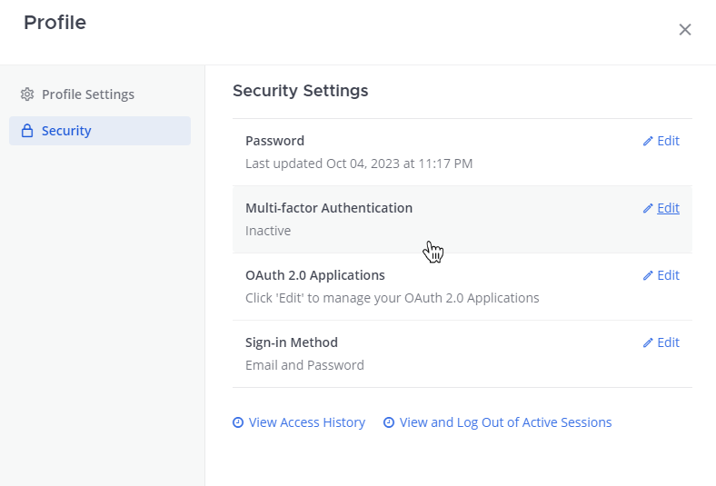
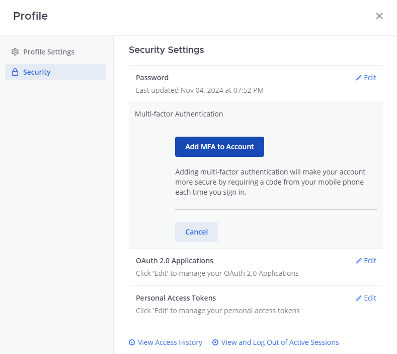

حدد صورة ملفك الشخصي، ثم حدد **الملف الشخصي (Profile)**، ثم حدد **الأمان (Security)** لتكوين كلمة المرور الخاصة بك، وعرض سجل الوصول، وعرض أو تسجيل الخروج من الجلسات النشطة.

| إعداد الأمان (Security setting) | الوصف (Description) |
| :--- | :--- |
| **كلمة المرور (Password)** | يمكنك تغيير كلمة المرور الخاصة بك إذا قمت بتسجيل الدخول عن طريق البريد الإلكتروني باستخدام Mattermost في متصفح الويب أو باستخدام تطبيق سطح المكتب.  :::caution[هام] <ul><li>إذا قمت بتسجيل الدخول إلى Mattermost باستخدام خدمة تسجيل الدخول الأحادي (single sign-on)، فيجب عليك تحديث كلمة المرور الخاصة بك من خلال حساب خدمة SSO الخاص بك.</li><li>**تحسين أمان كلمة المرور**: بدءًا من الإصدار v11.0، يستخدم Mattermost تجزئة كلمة المرور PBKDF2 لتحسين الأمان. عند تسجيل الدخول بعد ترقية الخادم الخاص بك إلى الإصدار v11.0+، سيتم ترحيل كلمة المرور الخاصة بك تلقائيًا إلى التنسيق الأكثر أمانًا. إذا تم تخفيض إصدار الخادم الخاص بك لاحقًا إلى إصدار سابق لـ v11.0، فقد لا تتمكن من تسجيل الدخول وستحتاج إلى الاتصال بمسؤول النظام لإعادة تعيين كلمة المرور.</li></ul> ::: |
| **المصادقة متعددة العوامل (Multi-factor authentication - MFA)** | إذا قام مسؤول النظام الخاص بك بـ [تمكين المصادقة متعددة العوامل (enable multi-factor authentication)](/administration-guide/configure/authentication-configuration-settings) (MFA)، فيمكنك طلب رمز مرور بالإضافة إلى كلمة المرور الخاصة بك لتسجيل الدخول إلى حساب Mattermost الخاص بك.  ستحتاج إلى تنزيل تطبيق لإنشاء رموز مرور MFA، مثل Google Authenticator أو تطبيق مشابه، ثم إعداد MFA في حساب Mattermost الخاص بك.  **تنزيل تطبيق لإنشاء رموز المرور** <ul><li>قم بتنزيل Google Authenticator لجهاز Apple من [iTunes](https://apps.apple.com/us/app/google-authenticator/id388497605)</li><li>قم بتنزيل Google Authenticator لجهاز Android من [Google Play](https://play.google.com/store/apps/details?id=com.google.android.apps.authenticator2&hl=en)</li></ul> **تمكين MFA في Mattermost** 1. افتح Mattermost في متصفح ويب أو تطبيق سطح المكتب. 2. في Mattermost، من صورة ملفك الشخصي، حدد **الملف الشخصي (Profile) > الأمان (Security)**. 3. ضمن **المصادقة متعددة العوامل (Multi-factor Authentication)**، حدد **تعديل (Edit)**.    4. حدد **إضافة MFA إلى الحساب (Add MFA to Account)**.    5. امسح رمز الاستجابة السريعة (QR code) ضوئيًا أو أدخل **السر (Secret)** الذي يوفره Mattermost في تطبيق المصادقة. 6. في Mattermost، أدخل **رمز MFA (MFA Code)** الذي تم إنشاؤه بواسطة تطبيق المصادقة. 7. حدد **حفظ (Save)**. |
| **طريقة تسجيل الدخول (Sign-in method)** | يسمح لك هذا الخيار بتبديل طريقة تسجيل الدخول الخاصة بك بين استخدام البريد الإلكتروني/اسم المستخدم وكلمة المرور وبين [بيانات اعتماد تسجيل الدخول الأحادي (single sign-on credentials)](/end-user-guide/access/access-your-workspace).  يمكنك تكوين هذا الإعداد باستخدام Mattermost في متصفح ويب أو باستخدام تطبيق سطح المكتب.  :::note بينما يمكنك اختيار تسجيل الدخول بأي من مجموعتي بيانات الاعتماد، لا يمكنك سوى تمكين طريقة تسجيل دخول واحدة في كل مرة. على سبيل المثال، إذا تم تمكين تسجيل الدخول الأحادي لـ AD/LDAP، فيمكنك تحديد **التبديل إلى استخدام AD/LDAP (Switch to using AD/LDAP)**، وإدخال بيانات اعتماد AD/LDAP الخاصة بك لتبديل تسجيل الدخول إلى AD/LDAP. ستحتاج إلى إدخال كلمة المرور لحساب البريد الإلكتروني الخاص بك للتحقق من بيانات الاعتماد الحالية الخاصة بك. بعد التغيير، ستتلقى رسالة بريد إلكتروني لتأكيد الإجراء. ::: |
| **عرض سجل الوصول (View access history)** | باستخدام Mattermost في المتصفح أو باستخدام تطبيق سطح المكتب، يمكنك الوصول إلى قائمة زمنية بآخر 20 محاولة تسجيل دخول وتسجيل خروج، وإنشاء القنوات وحذفها، وتغييرات إعدادات الحساب، أو تعديلات إعدادات القناة التي تم إجراؤها باستخدام حسابك.  يتم تسجيل تفاصيل معرّف الجلسة (Session ID)، وهو معرّف فريد لكل جلسة متصفح Mattermost، وعنوان IP الخاص بالإجراء لأغراض سجل التدقيق (audit log). |
| **عرض الجلسات النشطة وتسجيل الخروج منها (View and log out of active sessions)** | يتم إنشاء الجلسات عند تسجيل الدخول باستخدام بيانات الاعتماد الخاصة بك في متصفح جديد على جهاز. تتيح لك الجلسات استخدام Mattermost لمدة تصل إلى 30 يومًا دون الحاجة إلى تسجيل الدخول مرة أخرى.  باستخدام Mattermost في متصفح أو باستخدام تطبيق سطح المكتب: <ul><li>حدد **تسجيل الخروج (Logout)** أثناء جلسة نشطة إذا كنت ترغب في إلغاء امتيازات تسجيل الدخول التلقائي لمتصفح أو جهاز معين.</li><li>حدد **مزيد من المعلومات (More Info)** لعرض تفاصيل المتصفح والنظام.</li></ul> |
