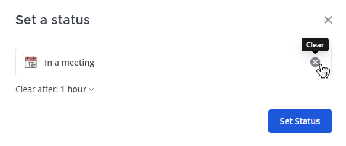
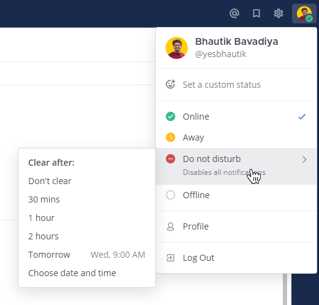

أخبر فريقك ما إذا كنت متاحًا من خلال تعيين [حالة مخصصة (custom status)](/end-user-guide/preferences/set-your-status-availability) و [توفرك (availability)](/end-user-guide/preferences/set-your-status-availability) في Mattermost.

## تعيين حالة مخصصة (Set a custom status)

قم بتعيين حالة مخصصة لعرض رسالة حالة وصفية ورمز تعبيري اختياري بجوار اسمك في Mattermost. يمكن للأعضاء الآخرين رؤية حالتك في أي مكان يمكنهم فيه رؤية اسمك، مثل الشريط الجانبي للقناة وفي المحادثات. لتعيين حالة مخصصة في Mattermost:

الويب/سطح المكتب (Web/Desktop)

1. حدد صورة ملفك الشخصي، ثم حدد **تعيين حالة مخصصة (Set a custom status)**.
2. اختر من قائمة الحالات المقترحة، أو أدخل رمزًا تعبيريًا وحالة جديدة. يتم استخدام رمز الفقاعة الكلامية 💬 بشكل افتراضي إذا لم تحدد رمزًا تعبيريًا. يمكن أن يكون طول الحالة المخصصة 100 حرف كحد أقصى.
3. حدد متى يتم مسح حالتك المخصصة.
4. حدد **تعيين الحالة (Set Status)**.

الهاتف المحمول (Mobile)

1. حدد صورة ملفك الشخصي، ثم حدد **تعيين حالة (Set a status)**.
2. اختر من قائمة الحالات المقترحة، أو أعد استخدام حالة حديثة، أو اضغط لإدخال حالة واختيار رمز تعبيري. يتم استخدام رمز الفقاعة الكلامية 💬 بشكل افتراضي إذا لم تحدد رمزًا تعبيريًا. يمكن أن يكون طول الحالة المخصصة 100 حرف كحد أقصى.
3. حدد متى يتم مسح حالتك المخصصة.
4. اضغط على **تم (Done)**.

:::note
- يتم تمكين الحالات المخصصة بشكل افتراضي في Mattermost. يمكن لمسؤولي النظام تعطيل هذه الميزة بالذهاب إلى **وحدة تحكم النظام (System Console) > تكوين الموقع (Site Configuration) > المستخدمون والفرق (Users and Teams) > تمكين الحالات المخصصة (Enable Custom Statuses)**. يؤدي تعطيل هذه الميزة أيضًا إلى إزالة مطالبات "تحديث حالتك" في Mattermost.
:::

### مسح حالة مخصصة (Clear a custom status)

لمسح حالة مخصصة، حدد صورة ملفك الشخصي، ثم حدد **مسح الحالة (Clear Status)**، أو حدد خيار **مسح (Clear)** بجوار حالتك الحالية.

## تعيين توفرك (Set your availability)

لتعيين توفرك، حدد صورة ملفك الشخصي، ثم حدد توفرك كـ **متصل (Online)**، أو **غائب (Away)**، أو **الرجاء عدم الإزعاج (Do Not Disturb)**، أو **غير متصل (Offline)**.

| التوفر (Availability) | الوصف (Description) |
| :--- | :--- |
| [\|online\|](##SUBST##|online|) | **متصل (Online):** <ul><li>يتم تعيينه تلقائيًا لك عندما تكون نشطًا على Mattermost باستخدام متصفح، أو تطبيق سطح المكتب، أو تطبيق الهاتف المحمول.</li><li>عند استخدام تطبيق سطح المكتب، فإن أي نشاط للماوس أو لوحة المفاتيح يبقي توفرك مضبوطًا على **متصل (Online)**.</li><li>بشكل افتراضي، يتم إرسال الإشعارات إلى المتصفح وتطبيق سطح المكتب وتطبيق الهاتف المحمول.</li></ul> |
| [\|away\|](##SUBST##|away|) | **غائب (Away):** <ul><li>يتم تعيينه تلقائيًا لك عندما تكون غير نشط لأكثر من 5 دقائق. يمكن لمسؤولي النظام تغيير هذه القيمة باستخدام إعداد تكوين تجريبي يسمى [مهلة غياب حالة المستخدم (user status away timeout)](/administration-guide/configure/experimental-configuration-settings).</li><li>تكون غير نشط في Mattermost عندما لا تقوم بـ: الكتابة في القنوات أو التنقل بينها، أو الانتقال إلى علامة تبويب متصفح أخرى، أو عندما تقوم بتصغير نافذة المتصفح أو نقلها إلى الخلفية.</li><li>يمكنك تعيين نفسك يدويًا كـ **غائب (Away)** في أي وقت.</li><li>بشكل افتراضي، يتم إرسال الإشعارات إلى تطبيق Mattermost للهاتف المحمول الخاص بك.</li></ul> |
| [\|dnd\|](##SUBST##|dnd|) | **الرجاء عدم الإزعاج (Do Not Disturb):** <ul><li>قم بتعيين توفرك كـ **الرجاء عدم الإزعاج (Do Not Disturb)** في أي وقت لا تريد فيه تلقي إشعارات لفترة زمنية معينة.</li></ul> |
| [\|offline\|](##SUBST##|offline|) | **غير متصل (Offline):** <ul><li>يتم تعيينه تلقائيًا لك عند الخروج من تطبيق Mattermost لسطح المكتب أو إغلاق نافذة المتصفح، أو وضع الكمبيوتر في وضع السكون أو قفله، أو في الهاتف المحمول عند تغيير التطبيقات، أو إغلاق تطبيق Mattermost للهاتف المحمول، أو قفل شاشة جهازك المحمول.</li><li>يمكنك تعيين نفسك يدويًا كـ **غير متصل (Offline)** في أي وقت.</li><li>بشكل افتراضي، يتم إرسال الإشعارات إلى تطبيق Mattermost للهاتف المحمول الخاص بك.</li></ul> |

يمكن للأعضاء الآخرين رؤية توفرك في أي مكان يمكنهم فيه رؤية اسمك، مثل الشريط الجانبي للقناة، وضمن المحادثات، وضمن الرسائل المباشرة.

### تعيين توفرك كـ "الرجاء عدم الإزعاج" (Set your availability as Do Not Disturb)

قم بتعيين توفرك إلى **الرجاء عدم الإزعاج (Do Not Disturb)** لتعطيل جميع إشعارات سطح المكتب والبريد الإلكتروني والإشعارات المنبثقة (push notifications) عندما تكون غير متاح أو تحتاج إلى التركيز.

يمكنك تحديد مدة تعطيل الإشعارات عن طريق اختيار وقت انتهاء محدد مسبقًا، أو عن طريق تعيين وقت انتهاء مخصص، أو عن طريق تعيين حالتك كـ **عدم المسح (Don't clear)**. يعود توفرك تلقائيًا إلى إعداده السابق بمجرد الوصول إلى وقت الانتهاء (قد يستغرق ذلك ما يصل إلى خمس دقائق).

