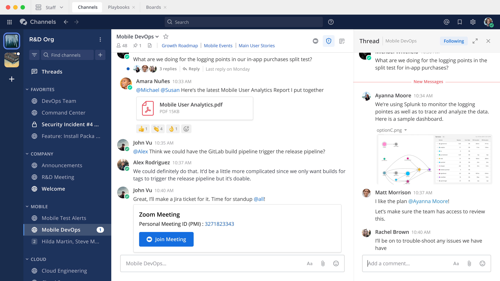

إذا كنت تستخدم Mattermost للتواصل والتعاون، وبناء عمليات مؤتمتة وقابلة للتكرار، وترغب في تخصيص المنصة لتناسب تفضيلات عملك، فإن هذا الدليل مخصص لك.

في هذه الوثائق، ستتعلم كيفية استخدام Mattermost بفعالية. لقد قام مسؤول النظام في مؤسستك بالفعل بتجهيز المنصة، وهي الآن جاهزة لتسجيل دخولك باستخدام بيانات الاعتماد الخاصة بك. مساحة عمل Mattermost هي المكان الذي ستتبادل فيه الرسائل، وتتابع تنبيهات النشاط، وتدير المشاريع، وتخصص شكل الواجهة وتجربة الاستخدام عبر التفضيلات الشخصية.

---

## 📚 أقسام الدليل

استكشف الأقسام أدناه لتعلم كيفية تحقيق أقصى استفادة من Mattermost:

*   **[الوصول إلى مساحة عملك](/access-your-workspace/access-your-workspace/
)**  
    تعلم كيفية الوصول إلى Mattermost باستخدام المتصفح، أو تطبيقات سطح المكتب، أو تطبيقات الهاتف المحمول، وكيفية تسجيل الدخول بأمان.

*   **[التعاون والمراسلة](/project-and-task-management/project-and-task-management/)**  
    اكتشف كيفية استخدام Mattermost للتواصل والتعاون اللحظي مع زملائك في الفريق.

*   **[أتمتة سير العمل](/workflow-automation/workflow-automation)**  
    تعلم كيفية استخدام **Mattermost Playbooks** لبناء عمليات متكررة، والعمل بسرعة أكبر، وتقليل الأخطاء باستخدام الأتمتة المستندة إلى قوائم المهام (Checklists).

*   **[المكالمات الصوتية ومشاركة الشاشة](/end-user-guide/collaborate/audio-and-screensharing)**  
    تعرف على ميزات المكالمات الصوتية المدمجة ومشاركة الشاشة، بالإضافة إلى تكاملات منصات الفيديو التي يدعمها Mattermost.

*   **[إدارة المشاريع والمهام](/end-user-guide/project-task-management)**  
    تعلم كيفية استخدام **Mattermost Boards** لتنسيق العمل العملياتي باستخدام لوحات التخطيط بنمط "كانبان" (Kanban).

*   **[وكلاء الذكاء الاصطناعي](/end-user-guide/agents)**  
    اكتشف كيفية الاستفادة من وكلاء الذكاء الاصطناعي لمساعدتك في اتخاذ القرارات، والبحث عن المعلومات، وأتمتة المهام المتكررة.

*   **[تخصيص تفضيلاتك](/end-user-guide/preferences)**  
    اجعل Mattermost يبدو ويعمل بالطريقة التي تفضلها من خلال تخصيص الإشعارات، والمظهر، والإعدادات الأمنية.

---

## 🖼️ نظرة عامة على الواجهة

يوضح المثال أدناه واجهة Mattermost التي تتضمن الفرق، شريط القنوات الجانبي، المحادثة النشطة في المنتصف، وسلاسل الردود (Threads) في الجانب الأيمن.

> **💡 نصيحة احترافية**
> بدءاً من إصدار Mattermost v9.1، يمكنك تغيير حجم كل من شريط القنوات الجانبي وشريط الردود الأيمن عند استخدام المتصفح أو تطبيق سطح المكتب للحصول على مساحة رؤية أفضل!

---

**هل أنت مستعد للبدء؟**  
انتقل مباشرة إلى قسم [الوصول إلى مساحة عملك](/end-user-guide/access/access-your-workspace) لتسجيل دخولك الأول.