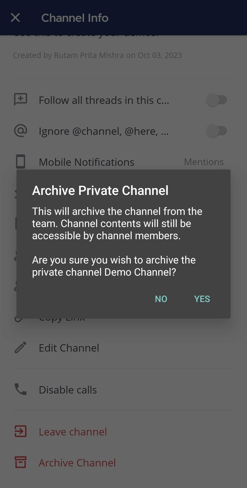
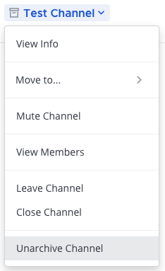
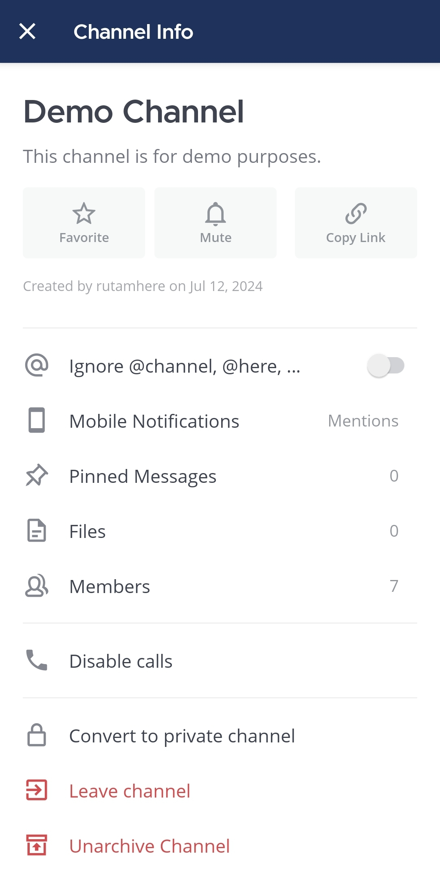
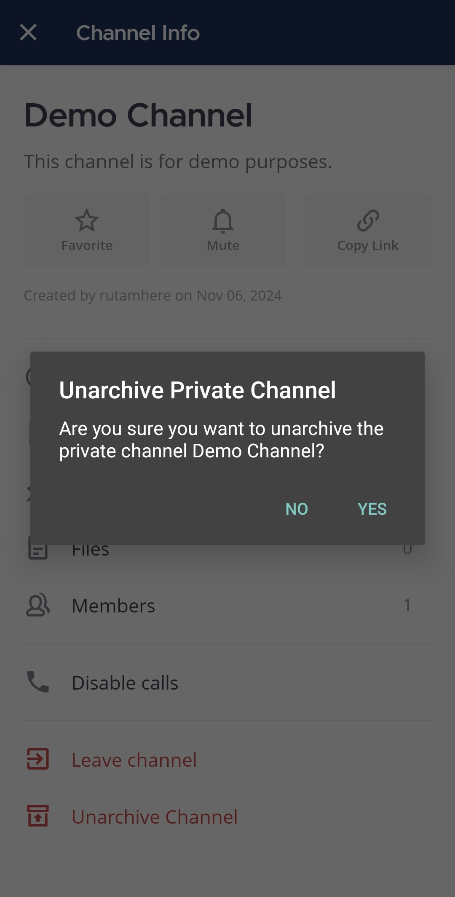

## أرشفة قناة (Archive a channel)

قم بحذف [القنوات العامة](/end-user-guide/collaborate/channel-types) و [القنوات الخاصة](/end-user-guide/collaborate/channel-types) عندما لا تعود هناك حاجة إليها عن طريق أرشفتها. تؤدي أرشفة القنوات إلى إزالتها من الشريط الجانبي للقناة وتمييزها للقراءة فقط. يمكن لأي شخص أرشفة قناة عامة أو خاصة يكون عضوًا فيها، ما لم يقم مسؤول النظام بـ [تعطيل](/administration-guide/onboard/advanced-permissions) قدرتك على القيام بذلك.

:::note
يمكنك الاستمرار في الوصول إلى القنوات المؤرشفة، ما لم يقم مسؤول النظام بـ [تعطيل](/administration-guide/configure/site-configuration-settings) قدرتك على القيام بذلك.
:::

الويب/سطح المكتب (Web/Desktop)

لأرشفة قناة، حدد اسم القناة في أعلى اللوحة المركزية للوصول إلى القائمة المنسدلة، ثم حدد **أرشفة القناة (Archive Channel)**.

الهاتف المحمول (Mobile)

لأرشفة قناة:

1. اضغط على القناة التي تريد حذفها.

2. اضغط على أيقونة **المزيد (More)** [\|more-icon-vertical\|](##SUBST##|more-icon-vertical|) الموجودة في الزاوية العلوية اليمنى من التطبيق.

3. اضغط على **عرض المعلومات (View info)**.

4. اضغط على **أرشفة القناة (Archive Channel)**.

5. اضغط على **نعم (Yes)** للتأكيد.

:::note
- عندما يتم تعطيل مستخدم Mattermost في النظام، يتم أرشفة [قناة الرسائل المباشرة](/end-user-guide/collaborate/channel-types) الخاصة بك مع ذلك المستخدم وتمييزها للقراءة فقط. تظهر أيقونة **مؤرشف (Archived)** [\|file-box\|](##SUBST##|file-box|) بجوار القنوات المؤرشفة. بدءًا من الإصدار v11.5 من Mattermost، تعرض القنوات الخاصة المؤرشفة أيقونة **قفل الأرشيف (Archive Lock)** مميزة لتمييزها عن القنوات المؤرشفة الأخرى.
- لا يمكن أرشفة [قنوات الرسائل الجماعية](/end-user-guide/collaborate/channel-types)، ولكن يمكن إغلاقها لإخفائها من الشريط الجانبي للقناة.
- لا يمكن أرشفة قناة **الساحة العامة (Town Square)** الافتراضية.
- يمكن لمسؤولي النظام أرشفة القنوات دون الحاجة إلى أن يكونوا أعضاء في القناة باستخدام وحدة تحكم النظام.
- نظرًا لوجود نسخة من القناة على الخادم، لا يمكنك إعادة استخدام عنوان URL لقناة مؤرشفة عند [إنشاء قناة جديدة](/end-user-guide/collaborate/create-channels).
:::

## إلغاء أرشفة قناة (Unarchive a channel)

يمكن لمسؤولي النظام ومسؤولي الفريق استعادة القنوات المؤرشفة. عندما يتم إلغاء أرشفة قناة، يتم استعادة عضوية القناة وجميع محتوياتها، ما لم يتم حذف الرسائل والملفات بناءً على [سياسة الاحتفاظ بالبيانات](/administration-guide/configure/compliance-configuration-settings).

الويب/سطح المكتب (Web/Desktop)

ابحث عن القناة إذا لزم الأمر. ثم افتح القناة، وحدد اسم القناة في أعلى اللوحة المركزية للوصول إلى القائمة المنسدلة وحدد **إلغاء أرشفة القناة (Unarchive Channel)**.

الهاتف المحمول (Mobile)

لإلغاء أرشفة قناة:

1. اضغط على القناة التي تريد إلغاء أرشفتها.

2. اضغط على أيقونة **المزيد (More)** [\|more-icon-vertical\|](##SUBST##|more-icon-vertical|) الموجودة في الزاوية العلوية اليمنى من التطبيق.

3. اضغط على **عرض المعلومات (View info)**.

4. اضغط على **إلغاء أرشفة القناة (Unarchive Channel)**.

5. اضغط على **نعم (Yes)** للتأكيد.

:::note
يمكن لمسؤولي النظام إلغاء أرشفة القنوات [عبر mmctl](/administration-guide/manage/mmctl-command-line-tool)، ويمكن لمسؤولي الفريق إلغاء الأرشفة عبر [واجهة برمجة التطبيقات (API)](https://api.mattermost.com/#operation/RestoreChannel).
:::
