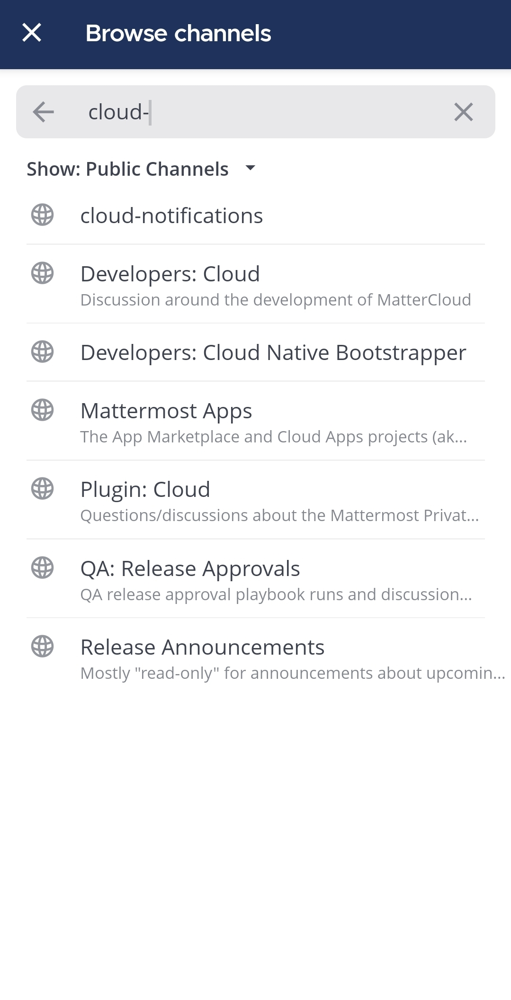
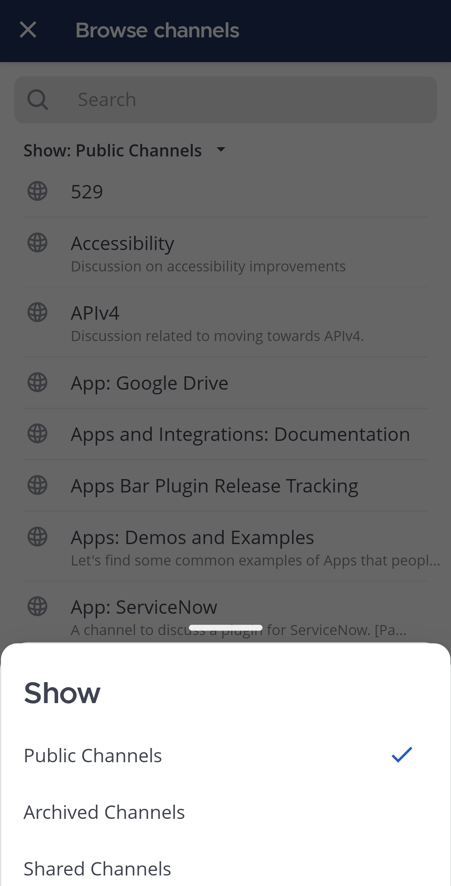

الويب/سطح المكتب (Web/Desktop)

1. اختر أيقونة **زائد (Plus)** [\|plus\|](##SUBST##|plus|) في أعلى الشريط الجانبي لمعرفة جميع القنوات العامة المتاحة التي يمكنك الانضمام إليها.
2. اختر **تصفح القنوات (Browse Channels)**.
3. ابحث عن القنوات بالاسم أو مرّر القائمة.
4. اختر **انضمام (Join)** بجانب أي قناة لتصبح عضوًا فيها.

:::note
بدءًا من الإصدار v9.1 من Mattermost، يمكنك تصفية القنوات حسب عامة، أو خاصة، أو مؤرشفة، وإخفاء القنوات التي أنت عضو فيها بالفعل.
:::

الهاتف المحمول (Mobile)

1. اضغط على أيقونة **زائد (Plus)** [\|plus\|](##SUBST##|plus|) في أعلى يمين التطبيق.

2. اضغط على **تصفح القنوات (Browse Channels)**.

3. ابحث عن القنوات بالاسم أو صفِّ قائمة القنوات لعرض القنوات العامة أو المؤرشفة أو المشتركة.

4. اضغط على اسم القناة للانضمام إليها.

:::note
يمكنك تصفية قائمة القنوات حسب عامة أو مؤرشفة أو مشتركة.
:::

هل تريد عرض كل القنوات التي أنت عضو فيها، أو لا تستطيع العثور على قناة خاصة؟ في المتصفح أو تطبيق سطح المكتب، اختر **البحث عن قناة (Find Channel)** في الشريط الجانبي لعرض كل القنوات التي أنت عضو فيها عبر جميع فرقك، بما في ذلك القنوات العامة والخاصة، والرسائل المباشرة والجماعية، والقنوات غير المقروءة، والسلاسل. القنوات المكتومة (muted) لا تظهر في النتائج.

## استرجاع القنوات الأخيرة (Retrieve recent channels)

في المتصفح أو تطبيق سطح المكتب، استخدم أسهم **السجل (History)** أعلى الشريط الجانبي للتنقل عبر سجل القنوات.

- اختر السهم الأيسر للرجوع صفحة واحدة.
- اختر السهم الأيمن للتقدم صفحة واحدة.
