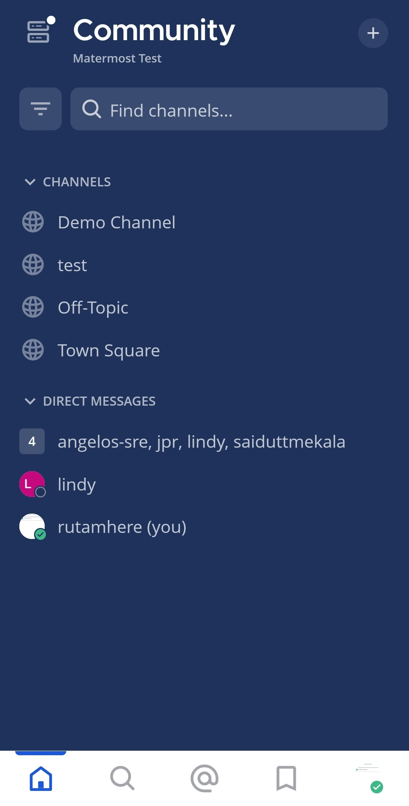
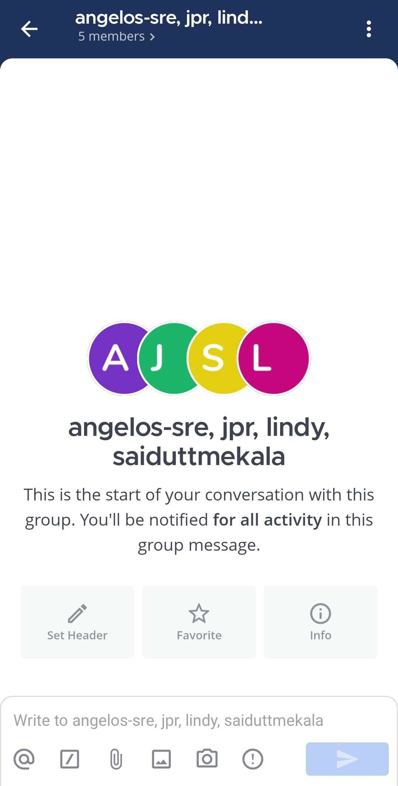
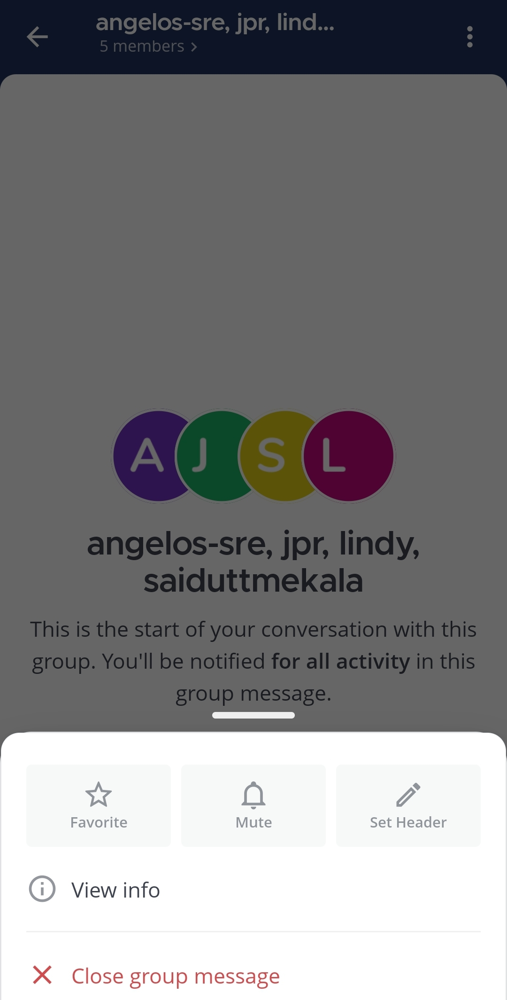
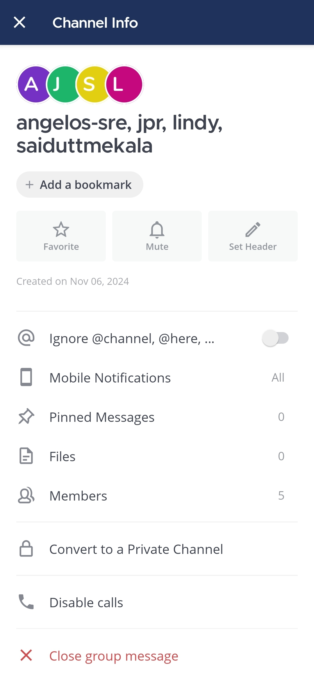
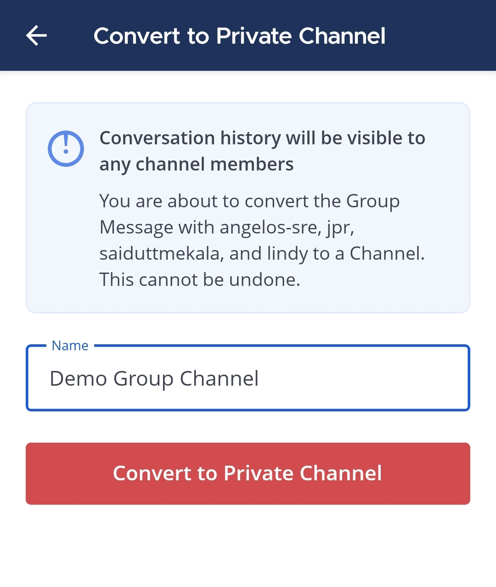

بدءًا من الإصدار v9.1 من Mattermost، يمكنك تغيير أعضاء محادثتك الجماعية عن طريق تحويل الرسالة الجماعية إلى قناة خاصة. عند تحويل رسالة جماعية إلى خاصة، يتم الحفاظ على سجلها وعضويتها. تظل العضوية في القناة الخاصة عن طريق الدعوة فقط.

:::note
- يمكن لأي عضو في رسالة جماعية موجودة، باستثناء [الضيوف](/administration-guide/onboard/guest-accounts)، تحويل تلك الرسالة الجماعية إلى قناة خاصة.
- سيكون سجل المحادثة مرئيًا لجميع أعضاء القناة.
- يجب أن يشترك جميع المشاركين في الرسالة الجماعية في عضوية فريق واحد على الأقل.
:::

الويب/سطح المكتب (Web/Desktop)

1. حدد اسم الرسالة الجماعية في أعلى اللوحة المركزية للوصول إلى القائمة المنسدلة، ثم حدد **تحويل إلى قناة خاصة (Convert to Private Channel)**.
2. حدد الفريق الذي سيتم إنشاء القناة الخاصة الجديدة فيه. سيُطلب منك تحديد فريق عندما يشترك جميع أعضاء الرسالة الجماعية في أكثر من عضوية فريق واحدة.
3. أدخل اسم القناة.
4. حدد **تحويل إلى قناة خاصة (Convert to private channel)**.

الهاتف المحمول (Mobile)

1. اضغط على الرسالة الجماعية التي تريد تحويلها إلى قناة خاصة.

2. اضغط على أيقونة **المزيد (More)** [\|more-icon-vertical\|](##SUBST##|more-icon-vertical|) الموجودة في الزاوية العلوية اليمنى من التطبيق.

3. اضغط على **عرض المعلومات (View info)**.

4. اضغط على **تحويل إلى قناة خاصة (Convert to a Private Channel)**.

5. أدخل اسم القناة الخاصة.

6. اضغط على **تحويل إلى قناة خاصة (Convert to Private Channel)** للتأكيد.

