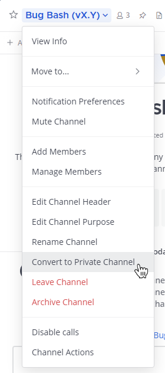
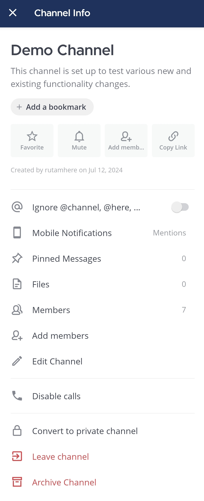
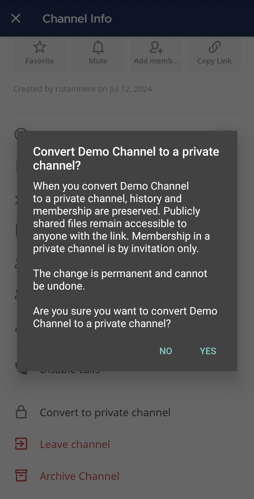

:::note
متاح في خطط [Entry و Professional و Enterprise و Enterprise Advanced](https://mattermost.com/pricing/)
:::

يجب أن تكون مسؤول نظام أو مسؤول فريق لتحويل القنوات العامة إلى قنوات خاصة. عند تحويل قناة من عامة إلى خاصة، يتم الحفاظ على سجلها وعضويتها. تظل العضوية في القناة خاصة عن طريق الدعوة فقط. تظل الملفات التي تمت مشاركتها علنًا متاحة لأي شخص لديه الرابط.

:::note
لا يمكن تحويل القناة الافتراضية **الساحة العامة (Town Square)** إلى قناة خاصة.
:::

الويب/سطح المكتب (Web/Desktop)

لتحويل قناة عامة إلى قناة خاصة، حدد اسم القناة العامة في أعلى اللوحة المركزية للوصول إلى القائمة المنسدلة، ثم حدد **تحويل إلى قناة خاصة (Convert to Private Channel)**.

الهاتف المحمول (Mobile)

لتحويل قناة عامة إلى قناة خاصة:

1. اضغط على القناة التي تريد تحويلها.

2. اضغط على أيقونة **المزيد (More)** [\|more-icon-vertical\|](##SUBST##|more-icon-vertical|) الموجودة in the top right corner of the app.

3. اضغط على **عرض المعلومات (View info)**.

4. اضغط على **تحويل إلى قناة خاصة (Convert to private channel)**.

5. اضغط على **نعم (Yes)** للتأكيد.

## تحويل القنوات الخاصة إلى قنوات عامة (Convert private channels to public channels)

نظرًا للمخاوف الأمنية المحتملة المتعلقة بمشاركة سجل القنوات الخاصة، يمكن لمسؤولي النظام فقط تحويل القنوات الخاصة إلى قنوات عامة باستخدام وحدة تحكم النظام.

:::note
- تقتصر القدرة على تحويل القنوات الخاصة إلى قنوات عامة باستخدام [واجهة برمجة التطبيقات (API)](https://api.mattermost.com/#tag/channels/operation/UpdateChannelPrivacy) أو [أمر mmctl channel modify](/administration-guide/manage/mmctl-command-line-tool) على مسؤولي النظام ومسؤولي الفريق والمستخدمين الذين لديهم أدوار مسؤول محددة. يتمتع مسؤولو الفريق بهذا الإذن افتراضيًا، ولكن يمكن لمسؤولي النظام تقييده أو تعيينه لأدوار أخرى.
- تتطلب الأدوار المحددة أذونات لإدارة قنوات ومجموعات إدارة المستخدمين، بما في ذلك `sysconsole_write_user_management_channels` و `sysconsole_write_user_management_groups`. قم بإدارة الأذونات من خلال [مخطط الأذونات](/administration-guide/onboard/advanced-permissions).
- إذا تم تمكين [إدارة قنوات مجموعات المزامنة (Sync Group channel management)](/administration-guide/manage/team-channel-members)، فلا يمكن تحويل القنوات الخاصة إلى قنوات عامة.
:::

1. انتقل إلى **وحدة تحكم النظام (System Console) > القنوات (Channels)**.
2. حدد **تحرير (Edit)** لقناة خاصة موجودة. يمكنك أيضًا تصفية قائمة القنوات إلى القنوات الخاصة فقط.
3. تحت **إدارة القناة (Channel Management) > قناة عامة أو قناة خاصة (Public channel or private channel)**، حدد **عامة (Public)**.
4. حدد **حفظ (Save)**.
