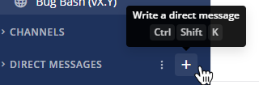
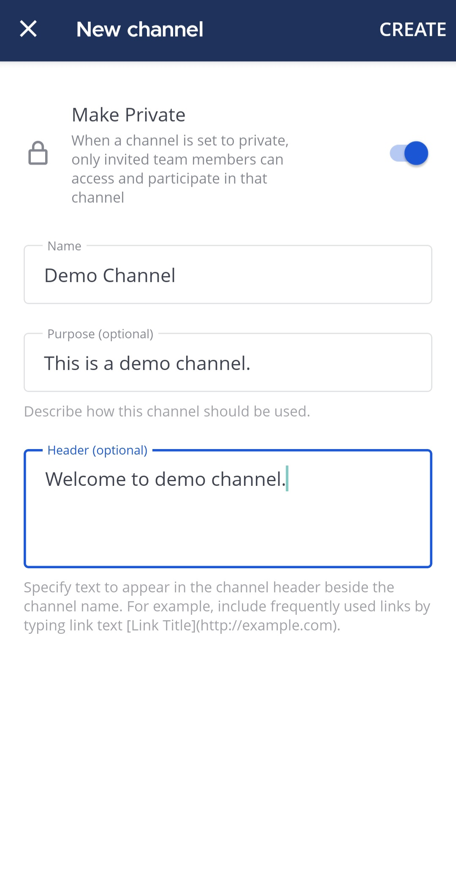
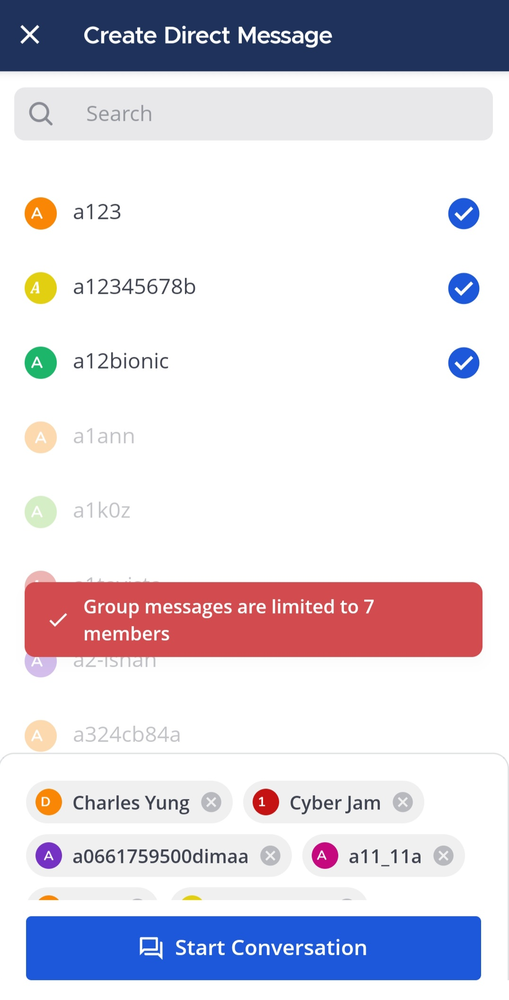

يمكن لأي مستخدم إنشاء قنوات عامة أو خاصة، ورسائل مباشرة، ورسائل جماعية، ما لم يقم مسؤول النظام بتقييد هذه الصلاحيات باستخدام [الأذونات المتقدمة](/administration-guide/onboard/advanced-permissions).

يمكن لمسؤولي النظام في بيئات Enterprise أيضًا تهيئة بعض القنوات لتكون [للقراءة فقط (read-only)](/administration-guide/onboard/advanced-permissions).

الويب/سطح المكتب (Web/Desktop)

### إنشاء قناة عامة أو خاصة (Create a public or private channel)

1. اختر زر **إضافة قنوات (Add channels)** في الشريط الجانبي للقنوات، ثم اختر **إنشاء قناة جديدة (Create New Channel)**. بدلاً من ذلك، يمكنك اختيار أيقونة [\|plus\|](##SUBST##|plus|) في أعلى الشريط الجانبي، ثم اختيار **إنشاء قناة جديدة (Create New Channel)**.

> 

2. أدخل اسم القناة.
3. اختر ما إذا كانت القناة عامة أو خاصة. راجع وثائق [أنواع القنوات](/end-user-guide/collaborate/channel-types) لمعرفة الفرق بين القنوات العامة والخاصة.
4. (اختياري) أضف وصفًا يحدد هدف القناة؛ يظهر هذا الوصف لجميع أعضاء القناة في ترويسة القناة.
5. (اختياري) قم بتعيين القناة إلى فئة. إذا قام مسؤول النظام بتمكين [فرز فئات القنوات](/administration-guide/configure/experimental-configuration-settings)، فيمكنك إضافة القناة إلى فئة جديدة أو قائمة موجودة. إذا لم تكن هذه الميزة متاحة، فيمكنك تخصيص الشريط الجانبي لقناتك عبر [تخصيص الشريط الجانبي لقناتك](/end-user-guide/preferences/customize-your-channel-sidebar).

### بدء رسالة مباشرة أو رسالة جماعية (Start a direct or group message)

1. اختر أيقونة [\|plus\|](##SUBST##|plus|) بجانب فئة **الرسائل المباشرة (Direct Messages)** في الشريط الجانبي.

> 

2. اختر ما يصل إلى سبعة مستخدمين من خلال البحث أو التصفح. إذا كانت مؤسستك تستخدم [مساحات العمل المتصلة (connected workspaces)](/administration-guide/onboard/connected-workspaces)، فيمكنك أيضًا اختيار مستخدمين عن بُعد من القنوات المشتركة للرسائل المباشرة والجماعية.

:::note
- بدلاً من ذلك، اختر أيقونة [\|plus\|](##SUBST##|plus|) في أعلى الشريط الجانبي، ثم اختر **فتح رسالة مباشرة (Open a Direct Message)**. ستظهر محادثاتك الأخيرة في قائمة **الرسائل المباشرة (Direct Messages)**.
- لإضافة أشخاص إلى المحادثة، اختر اسم القناة ثم **إضافة أعضاء (Add Members)**. يؤدي إضافة أعضاء إلى رسالة جماعية إلى إنشاء قناة جديدة وبدء محادثة جديدة.
- لا يمكنك إزالة أعضاء من رسالة جماعية موجودة؛ إذا كنت بحاجة إلى مجموعة مختلفة من الأعضاء، فأنشئ قناة خاصة جديدة.
- إذا كنت ترغب في إضافة أكثر من 7 مستخدمين، فأنشئ قناة خاصة بدلاً من رسالة جماعية.
:::

الهاتف المحمول (Mobile)

### إنشاء قناة عامة أو خاصة (Create a public or private channel)

اضغط على أيقونة [\|plus\|](##SUBST##|plus|) في أعلى يمين التطبيق، ثم اختر **إنشاء قناة جديدة (Create New Channel)**. يتم إنشاء القنوات كقنوات عامة افتراضيًا؛ لاختيار قناة خاصة، قم بتمكين خيار **جعلها خاصة (Make Private)**.

> 
>
> 

### بدء رسالة مباشرة أو رسالة جماعية (Start a direct or group message)

اضغط على أيقونة [\|plus\|](##SUBST##|plus|) في أعلى يمين التطبيق ثم اختر **فتح رسالة مباشرة (Open a Direct Message)**. يمكنك اختيار شخص واحد لرسالة مباشرة أو ما يصل إلى سبعة أشخاص لرسالة جماعية. إذا كانت مؤسستك تستخدم [مساحات العمل المتصلة (connected workspaces)](/administration-guide/onboard/connected-workspaces)، فستكون الحسابات البعيدة من القنوات المشتركة متاحة أيضًا. اضغط على **بدء (Start)** لبدء المحادثة.

> 
>
> 

## التشغيل التلقائي باستخدام إجراءات القناة (Automate using channel actions)

يصبح الشخص الذي ينشئ القناة تلقائيًا مسؤول القناة. يمكن لمسؤولي القنوات في متصفح الويب أو تطبيق سطح المكتب الوصول إلى **إجراءات القناة (Channel Actions)** من قائمة اسم القناة في اللوحة المركزية لإعداد إجراءات تلقائية عند [انضمام مستخدمين إلى القناة](/end-user-guide/collaborate/join-leave-channels) أو عند [إرسال رسالة](/end-user-guide/collaborate/send-messages).

تشمل الإجراءات التلقائية ما يلي:

- عرض رسالة ترحيبية مؤقتة للأعضاء الجدد.
- إضافة القناة تلقائيًا إلى [فئة في الشريط الجانبي لقناة المستخدم](/end-user-guide/preferences/customize-your-channel-sidebar).
- مطالبة بتشغيل دليل التشغيل (playbook) استنادًا إلى محتوى الرسالة.

يجب تمكين **أدلة التشغيل التعاونية (collaborative playbooks)** في إعدادات المؤسسة لاستخدام إجراءات القناة.
