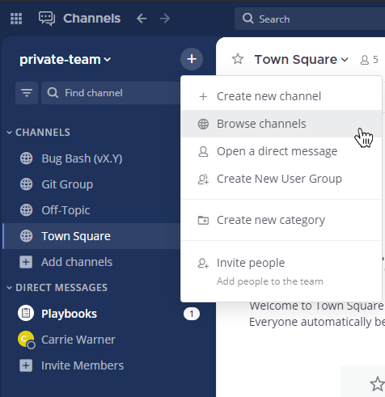
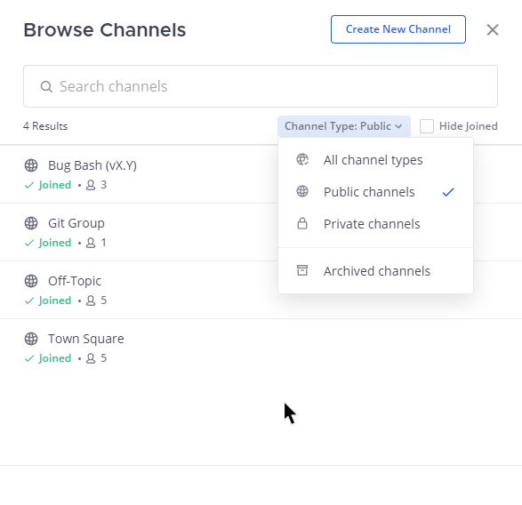
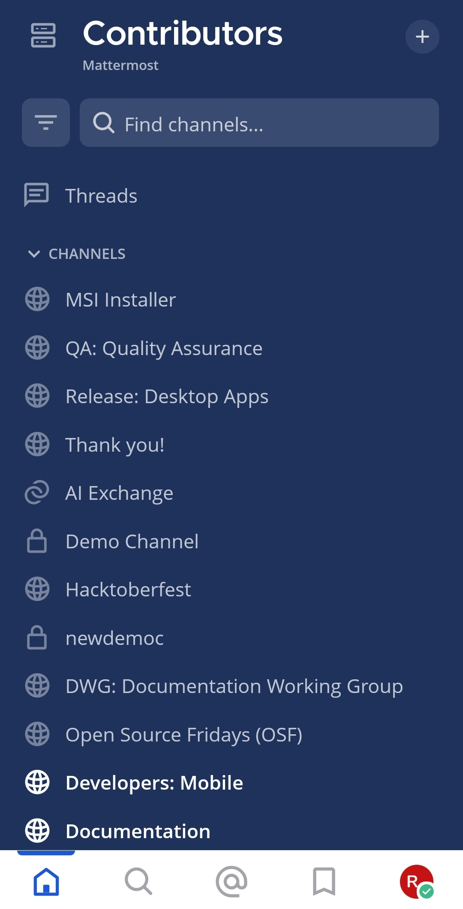
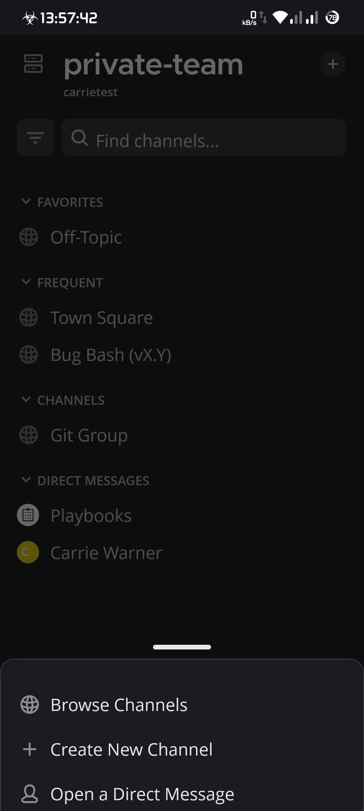
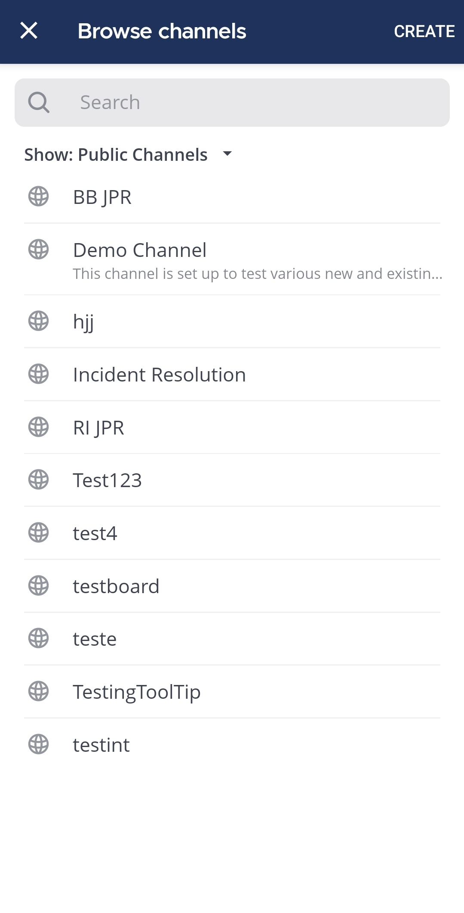
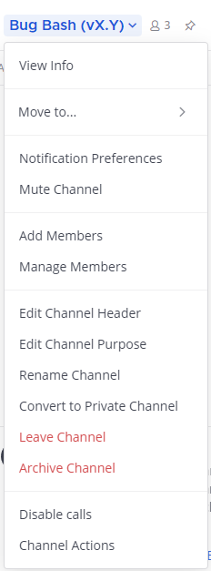
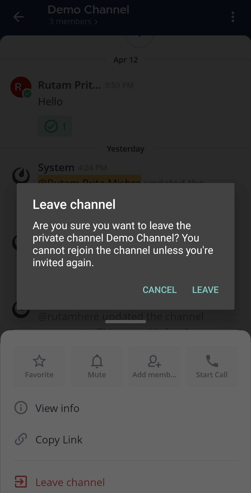

## الانضمام إلى قناة (Join a channel)

القنوات إما **عامة** أو **خاصة**.

- يتم تحديد القنوات **العامة** بأيقونة **الكرة الأرضية** [\|globe\|](##SUBST##|globe|). يمكن لأي شخص في الفريق الانضمام إلى قناة عامة.
- تُستخدم القنوات **الخاصة** عادةً للمواضيع الحساسة، ويتم تحديدها بأيقونة **القفل** [\|lock\|](##SUBST##|lock|). يجب أن يتم دعوتك إلى القنوات الخاصة من قبل عضو آخر في القناة.

:::note
للانضمام إلى قناة خاصة، يجب أن يتم إضافتك إلى القناة من قبل عضو في تلك القناة.
:::

للانضمام إلى قناة عامة:

الويب/سطح المكتب (Web/Desktop)

1. حدد زر **إضافة قنوات (Add channels)** في الشريط الجانبي للقناة، ثم حدد **تصفح القنوات (Browse Channels)**.

> 
>
> بدلاً من ذلك، يمكنك تحديد [\|plus\|](##SUBST##|plus|) في أعلى الشريط الجانبي للقناة، ثم تحديد **تصفح القنوات (Browse Channels)**.
>
> 

2. حدد **انضمام (Join)** بجانب القناة العامة التي تريد الانضمام إليها.

> 

الهاتف المحمول (Mobile)

1. اضغط على أيقونة [\|plus\|](##SUBST##|plus|) الموجودة في الزاوية العلوية اليمنى من التطبيق.

2. اضغط على **تصفح القنوات (Browse Channels)**.

3. اضغط على القناة العامة التي تريد الانضمام إليها.

:::note
عندما تنضم إلى القنوات، وبناءً على [إجراءات القناة المكونة](/end-user-guide/collaborate/create-channels)، قد ترى رسالة ترحيب، وقد يتم إضافة القنوات إلى [فئة في الشريط الجانبي لقناتك](/end-user-guide/preferences/customize-your-channel-sidebar) تلقائيًا. باستخدام Mattermost في متصفح ويب أو تطبيق سطح المكتب، يمكنك الوصول إلى **إجراءات القناة (Channel Actions)** من قائمة اسم القناة المنسدلة في اللوحة المركزية لرؤية الإجراءات التلقائية التي تم تكوينها.
:::

راجع الوثائق التالية لمعرفة المزيد حول العمل مع القنوات:

- [إنشاء القنوات (Create channels)](/end-user-guide/collaborate/create-channels)
- [تصفح القنوات (Browse channels)](/end-user-guide/collaborate/browse-channels)
- [تخصيص الشريط الجانبي لقناتك (Customize your channel sidebar)](/end-user-guide/preferences/customize-your-channel-sidebar)

## مغادرة قناة (Leave a channel)

عندما تغادر قناة خاصة، يجب أن يتم إضافتك مرة أخرى من قبل عضو آخر في القناة للانضمام مجددًا. لن تتلقى إشعارات إشارة من قناة إذا لم تكن عضوًا في تلك القناة.

:::note
يتم إضافة جميع المستخدمين إلى قناة **الساحة العامة (Town Square)** تلقائيًا. هذا يعني أن المستخدمين لا يمكنهم [أرشفة](/end-user-guide/collaborate/archive-unarchive-channels) أو [إلغاء أرشفة](/end-user-guide/collaborate/archive-unarchive-channels) أو مغادرة قناة **الساحة العامة (Town Square)**. ومع ذلك، فإن [الضيوف](/administration-guide/onboard/guest-accounts) الذين يتم دعوتهم يدويًا إلى **الساحة العامة (Town Square)** يمكنهم مغادرة القناة.
:::

الويب/سطح المكتب (Web/Desktop)

حدد اسم القناة في أعلى اللوحة المركزية للوصول إلى القائمة المنسدلة، ثم حدد **مغادرة القناة (Leave Channel)**.

الهاتف المحمول (Mobile)

1. اضغط على القناة التي تريد مغادرتها.

2. اضغط على أيقونة **المزيد (More)** [\|more-icon-vertical\|](##SUBST##|more-icon-vertical|) الموجودة في الزاوية العلوية اليمنى من التطبيق.

3. اضغط على **مغادرة القناة (Leave channel)**.

4. اضغط على **مغادرة (Leave)** لتأكيد اختيارك.

