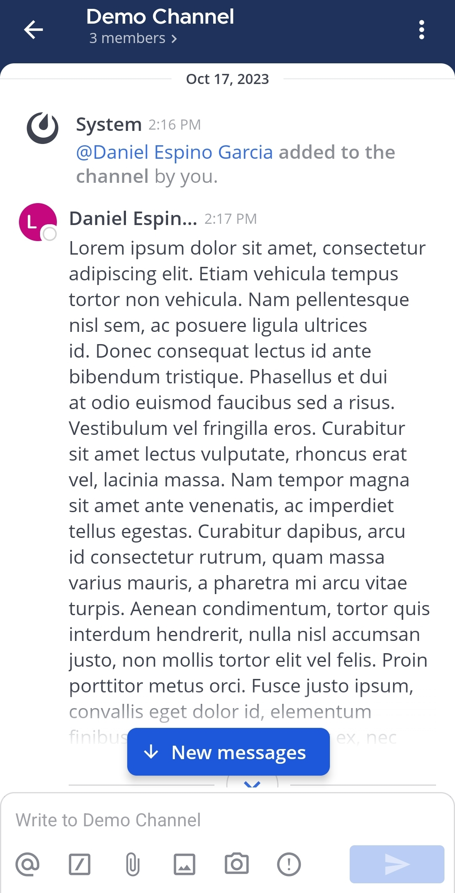
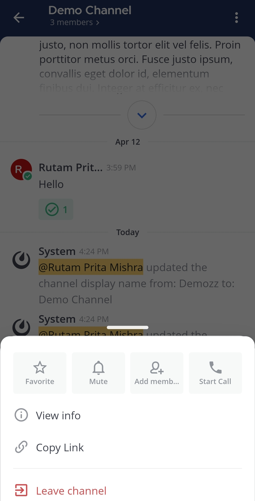
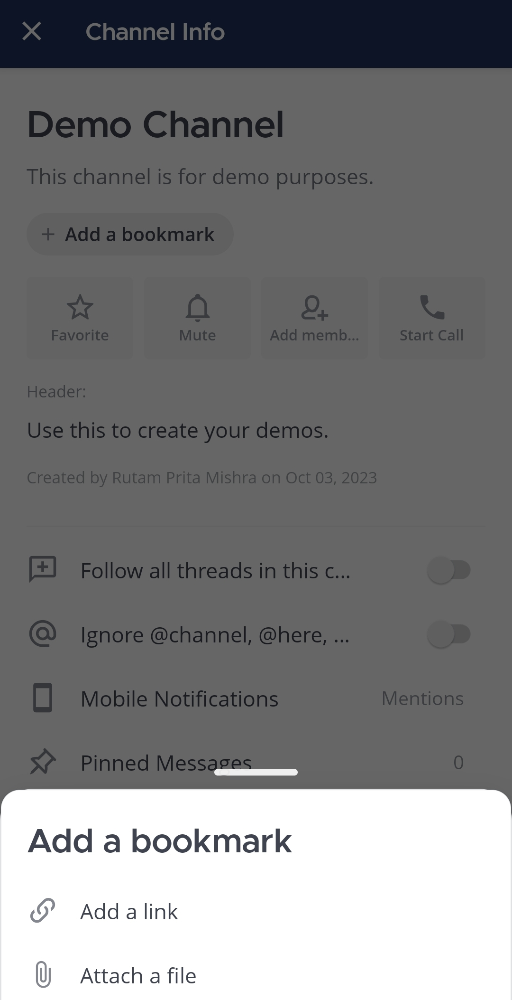
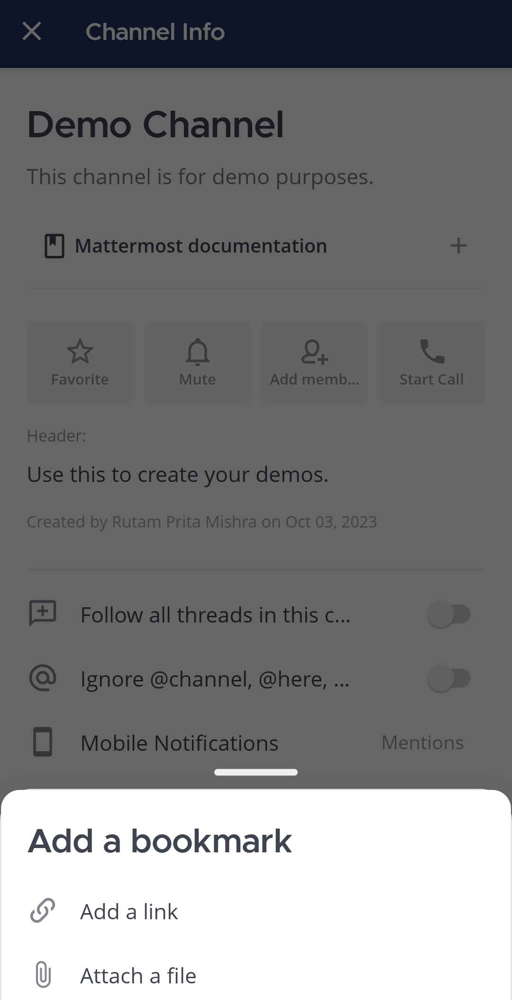
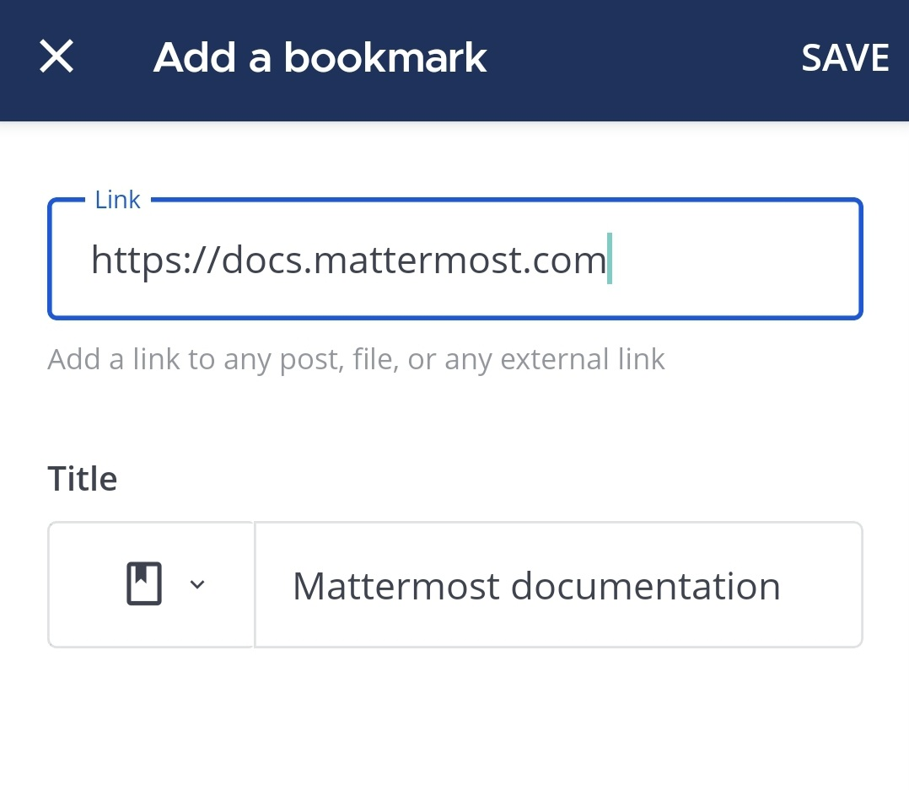
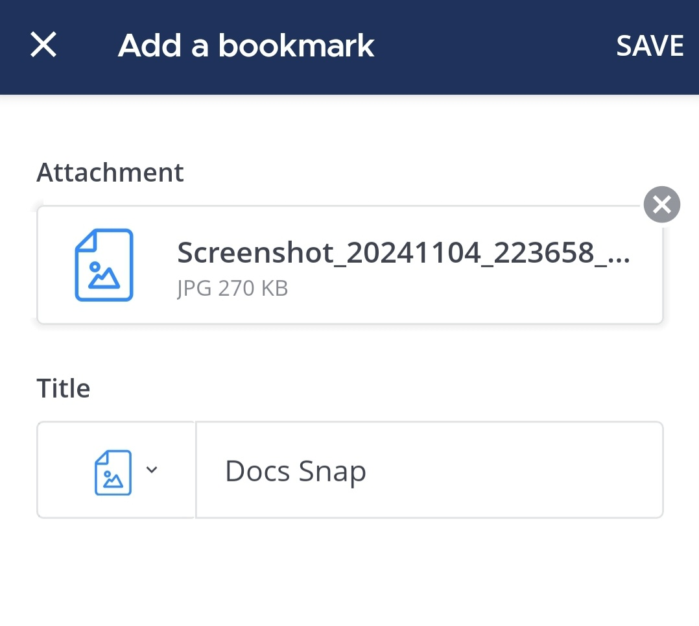
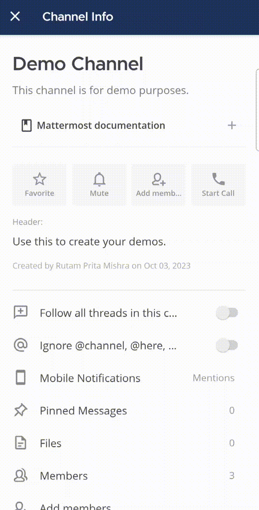
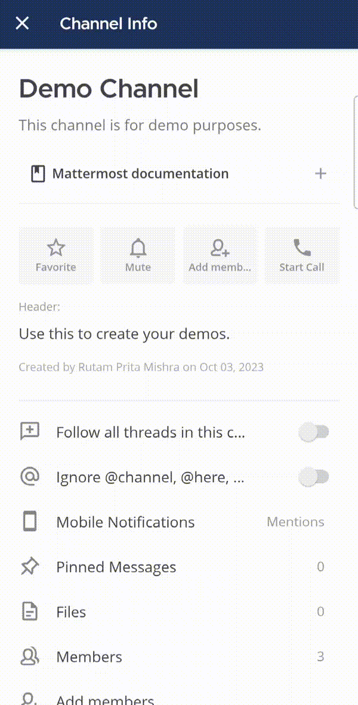
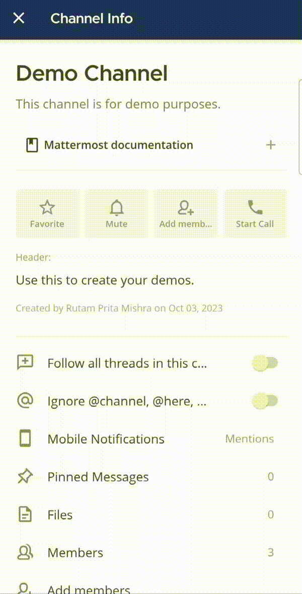

<Aside type="note">
[\|plans-img-yellow\|](##SUBST##|plans-img-yellow|) متاحة في [خطط Entry و Professional و Enterprise و Enterprise Advanced](https://mattermost.com/pricing/)
</Aside>

بدءًا من Mattermost v10.1، يمكنك إضافة ما يصل إلى 50 رابطًا أو ملفًا كـ "إشارات" (Bookmarks) في أعلى القنوات للوصول السريع، ما لم يقم مسؤول النظام بتعطيل هذه الميزة. تظهر الإشارات مباشرة تحت رأس القناة. الملفات المضافة كإشارات للقناة تكون قابلة للـ `بحث </end-user-guide/collaborate/search-for-messages>` في Mattermost.

## فتح إشارة

يعمل فتح إشارة قناة بنفس طريقة تحديد رابط ملف أو مرفق داخل رسالة. اختر الإشارة أو اضغط عليها لعرض الملف أو الرابط.

بدءًا من Mattermost v10.11، تفتح الإشارات التي تحتوي على روابط `mattermost://` مباشرة في تطبيق سطح المكتب عبر الروابط العميقة (deep linking). تحوّل هذه الإشارات إلى اختصارات بنقرة واحدة للقنوات أو المواضيع أو الرسائل، مما يتيح لك الانتقال مباشرة إلى المحتوى المهم بسرعة.

## إضافة إشارة

Web/Desktop

1.  في Mattermost v10.5 وما بعده، انقر على اسم القناة أعلى اللوحة المركزية لعرض القائمة المنسدلة، ثم اختر **Bookmarks Bar** لإضافة رابط أو إرفاق ملف. في الإصدارات السابقة لـ v10.5، اختر **Add a bookmark** في شريط الإشارات.

> - اختر **Add a link** لتحديد عنوان URL للرابط، ونص الإشارة، وأيقونة اختيارية.
> - اختر **Attach a file** لاختيار ملف، وتحديد نص الإشارة، وإضافة أيقونة اختيارية.

Mobile

يكون شريط الإشارات مخفيًا عندما لا تحتوي القناة على إشارات.

1.  داخل القناة، اضغط على أيقونة **المزيد**
    [\|more-icon-vertical\|](##SUBST##|more-icon-vertical|).

2.  اختر **View info**.

3.  اضغط على **Add a bookmark** لإضافة الإشارة الأولى.

لإضافة إشارات لاحقة، اختر أيقونة **Plus**
[\|plus\|](##SUBST##|plus|) في شريط الإشارات.

4.  يمكنك اختيار **Add a link** لتحديد عنوان URL للرابط، ونص الإشارة، وأيقونة اختيارية.

أو اختر **Add a file** لتحديد ملف، وتحديد نص الإشارة، وإضافة أيقونة اختيارية.

5.  اضغط على **Save**.

## إدارة الإشارات

يمكنك [تحرير](#edit-bookmarks) و[حذف](#delete-bookmarks) الإشارات، بالإضافة إلى [نسخ روابط الإشارات](#copy-bookmark-links). كما يمكن لمستخدمي الويب وسطح المكتب [إعادة ترتيب الإشارات](#reorder-bookmarks)، ويمكن لمستخدمي الجوال [مشاركة الإشارات](#share-bookmarks). تكون تغييرات الإشارات مرئية لجميع أعضاء القناة.

### إعادة ترتيب الإشارات

باستخدام Mattermost على متصفح الويب أو تطبيق سطح المكتب، اسحب الإشارات لإعادة ترتيبها في شريط الإشارات. تؤثر إعادة الترتيب على طريقة العرض لجميع أعضاء القناة.

<Aside type="note">
لا يمكنك إعادة ترتيب الإشارات من خلال تطبيق الجوال.
</Aside>

### تحرير الإشارات

يمكنك تعديل رابط الإشارة أو الملف، أو عنوان الإشارة، أو أيقونتها الاختيارية. يؤدي تحرير الإشارة إلى تحديثها لجميع أعضاء القناة.

Web/Desktop

اختر أيقونة **المزيد** [\|more-icon\|](##SUBST##|more-icon|) بجانب الإشارة ثم اختر **Edit**.

Mobile

اضغط مطولًا على الإشارة ثم اختر **Edit**.

### مشاركة الإشارات

باستخدام تطبيق الجوال، اضغط مطولًا على الإشارة ثم اختر **Share**.

### نسخ روابط الإشارات

يمكنك نسخ روابط الإشارات إذا سمح مسؤول النظام بذلك
`enabled your ability to do so <administration-guide/configure/site-configuration-settings:enable public file links>`.

Web/Desktop

اختر أيقونة **المزيد** [\|more-icon\|](##SUBST##|more-icon|) بجانب الإشارة ثم اختر **Copy link**.

Mobile

اضغط مطولًا على الإشارة واختر **Copy link**.

### حذف الإشارات

حذف إشارة قناة يؤدي إلى حذفها لجميع أعضاء القناة.

Web/Mobile

اختر أيقونة **المزيد** [\|more-icon\|](##SUBST##|more-icon|) بجانب الإشارة ثم اختر **Delete**.

Mobile

اضغط مطولًا على الإشارة واختر **Delete**.

