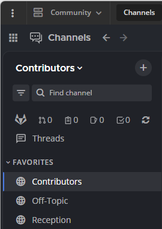
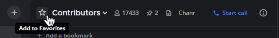
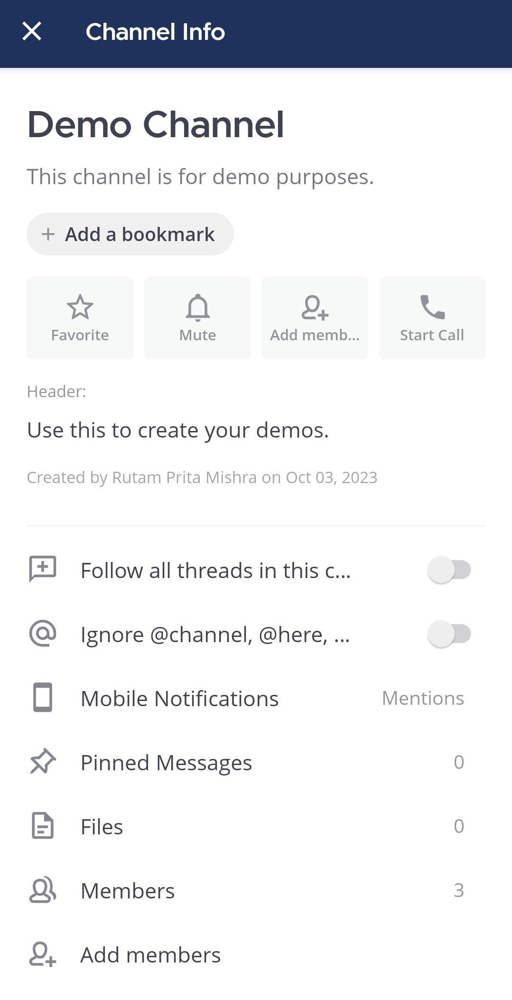
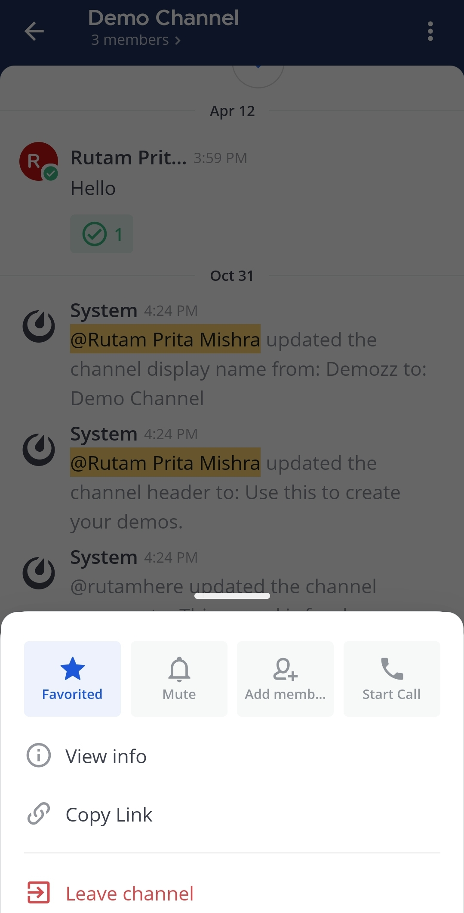
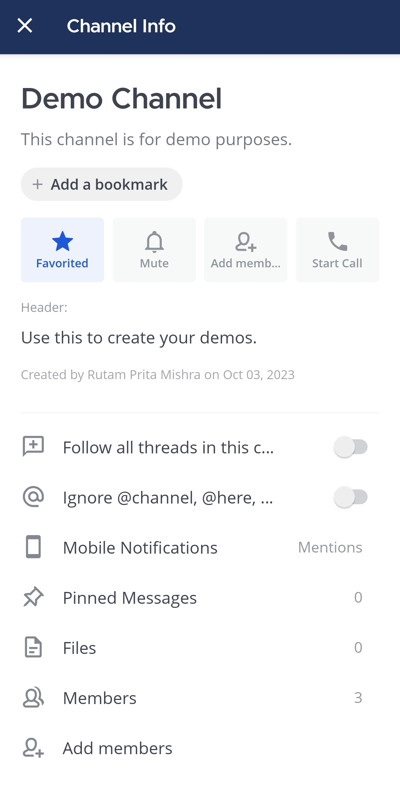

يمكنك تمييز القنوات العامة والخاصة، بالإضافة إلى الرسائل المباشرة والجماعية، كقنوات مفضلة ليسهل الوصول إليها لاحقًا. تظهر القنوات المفضلة في فئة **المفضلة (Favorites)** في الشريط الجانبي للقناة.

لتمييز قناة كـ **مفضلة (Favorite)**:

الويب/سطح المكتب (Web/Desktop)

1. افتح القناة.
2. انقر على أيقونة النجمة بجانب اسم القناة.

في أعلى الصفحة، اختر أيقونة [\|favorite-icon\|](##SUBST##|favorite-icon|) بجانب اسم القناة.

لإزالة قناة من قائمة **المفضلة (Favorites)** الخاصة بك، اختر أيقونة [\|favorite-icon\|](##SUBST##|favorite-icon|) مرة أخرى.

بدلاً من ذلك، لتمييز القنوات كمفضلة، اختر اسم القناة، ثم اختر أيقونة **عرض المعلومات (View Info)** [\|channel-info\|](##SUBST##|channel-info|)، ثم اختر **مفضلة (Favorite)** في اللوحة اليمنى. اختر **مُفضلة (Favorited)** لإزالة القناة من قائمة المفضلة لديك.

الهاتف المحمول (Mobile)

1. اضغط على القناة التي تريد تمييزها كقناة مفضلة.

2. اضغط على أيقونة **المزيد (More)** [\|more-icon-vertical\|](##SUBST##|more-icon-vertical|) الموجودة في الزاوية العلوية اليمنى من التطبيق.

3. اضغط على **مفضلة (Favorite)**.

بدلاً من ذلك، يمكنك تمييز القناة كقناة مفضلة كما يلي:

1. داخل القناة، اضغط على اسم القناة في أعلى الشاشة.

2. اضغط على **مفضلة (Favorite)**.

لإزالة قناة من قائمة **المفضلة (Favorites)**، اضغط على خيار **مُفضلة (Favorited)**.

