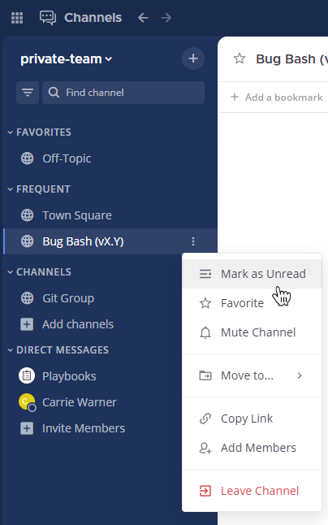

إذا قرأت الرسائل في قناة معينة ولكن لم يكن لديك الوقت للتعامل معها على الفور، يمكنك تمييز تلك القناة كغير مقروءة.

مرر مؤشر الفأرة فوق اسم القناة في الشريط الجانبي للقنوات، واختر أيقونة **المزيد (More)** [\|more-icon-vertical\|](##SUBST##|more-icon-vertical|)، ثم اختر **تمييز كغير مقروء (Mark as Unread)**.

:::note
يؤدي تمييز الرسائل كغير مقروءة إلى عرض تلك القنوات بخط عريض في الشريط الجانبي للقناة.
:::
