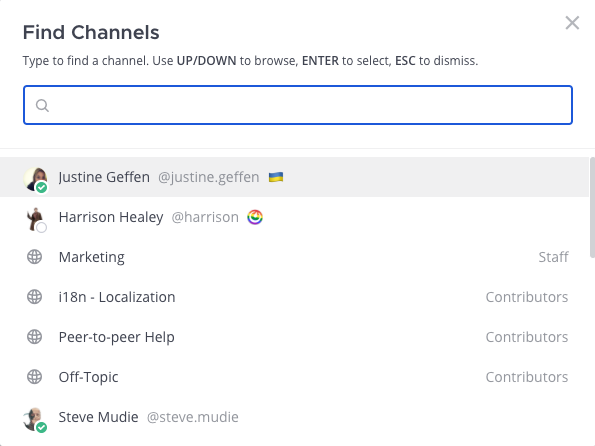

## التنقل بين القنوات (Navigate between channels)

باستخدام Mattermost في متصفح الويب أو تطبيق سطح المكتب، يمكنك التنقل بين القنوات عن طريق اختيار خيار **البحث عن قناة (Find channel)** في الشريط الجانبي للقناة، أو بالضغط على `Ctrl` `K` على Windows أو Linux، أو `⌘` `K` على Mac. تعرض شاشة البحث عن القنوات أيضًا [توفر الأعضاء (member availability)](/end-user-guide/preferences/set-your-status-availability) بنظرة سريعة.

> 

## العودة إلى القنوات التي تم عرضها مؤخرًا (Return to recently viewed channels)

باستخدام متصفح الويب أو تطبيق سطح المكتب، استخدم أسهم **السجل (History)** في أعلى الشريط الجانبي للتحرك ذهابًا وإيابًا عبر سجل القنوات الخاص بك.

- اختر السهم الأيسر للعودة صفحة واحدة للخلف.
- اختر السهم الأيمن للتقدم صفحة واحدة للأمام.
