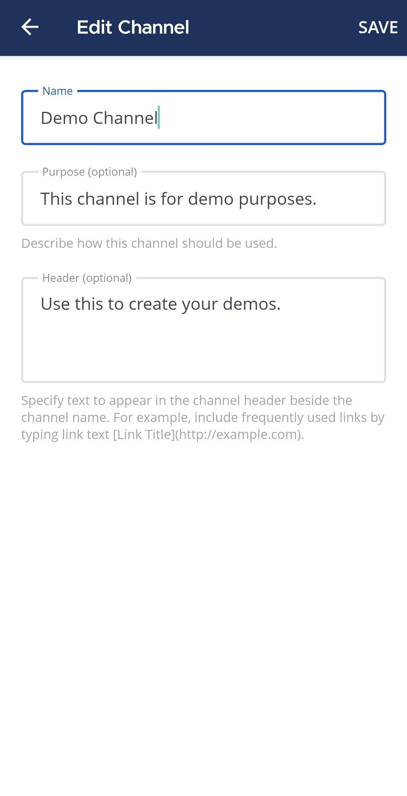

يمكن لأي شخص إعادة تسمية القنوات التي ينتمي إليها، ما لم يقم مسؤول النظام بـ [تقييد الأذونات للقيام بذلك باستخدام الأذونات المتقدمة](/administration-guide/onboard/advanced-permissions).

الويب/سطح المكتب (Web/Desktop)

اختر اسم القناة في أعلى اللوحة المركزية للوصول إلى القائمة المنسدلة، ثم اختر **إعدادات القناة (Channel Settings)**. سيُطلب منك تقديم معلومتين:

- **اسم القناة (Channel name):** اسم القناة الذي يظهر في واجهة مستخدم Mattermost لجميع المستخدمين. أدخل اسم قناة مختلفًا إذا لزم الأمر أو كان مفضلاً.
- **عنوان URL للقناة (Channel URL):** عنوان URL للويب المستخدم للوصول إلى القناة في متصفح الويب. اختر **تحرير (Edit)** لتغيير عنوان URL، واختر **تم (Done)** لحفظ تغييراتك. إذا قام مسؤول النظام بتمكين عناوين URL المجهولة للفريق والقنوات (متاحة في Mattermost Enterprise Advanced بدءًا من v11.6.0)، فسيتم تعيين عناوين URL للقناة تلقائيًا ولا تعكس اسم القناة.

إذا قام مسؤول النظام بتمكين [فرز فئات القنوات (channel category sorting)](/administration-guide/configure/experimental-configuration-settings#enable-channel-category-sorting)، فيمكنك تعيين القناة المعاد تسميتها إلى فئة قناة جديدة أو موجودة.

على سبيل المثال، يمكن تسمية قناة `تصميم تجربة المستخدم (UX Design)` ويكون لها عنوان URL هو `https://community.mattermost.com/core/channels/ux-design` (أو عنوان URL مجهول إذا تم تمكينه من قبل مسؤول النظام).

الهاتف المحمول (Mobile)

1. اضغط على القناة التي تريد إعادة تسميتها.

> 

2. اضغط على أيقونة **المزيد (More)** [\|more-icon-vertical\|](##SUBST##|more-icon-vertical|) الموجودة في الزاوية العلوية اليمنى من التطبيق.

> 

3. اضغط على **عرض المعلومات (View info)**.

> 

4. اضغط على **تحرير القناة (Edit Channel)**.

> 

5. سيُطلب منك تقديم ثلاث معلومات:

> - **الاسم (Name):** يظهر هذا في واجهة مستخدم Mattermost.
> - **الغرض (Purpose):** (اختياري) يستخدم لوصف وظيفة القناة أو هدفها.
> - **الترويسة (Header):** (اختياري) تستخدم لتضمين معلومات ذات صلة بالقناة، مثل جهات الاتصال الرئيسية أو روابط المستندات.
>
> اضغط على **حفظ (Save)** لحفظ اسم القناة الجديد.
>
> 

