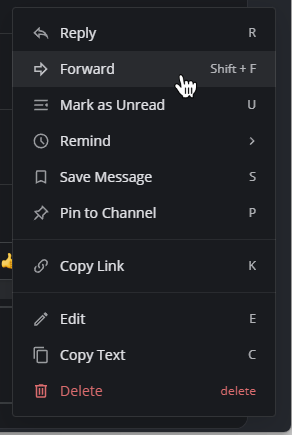

بدءًا من الإصدار v7.2 من Mattermost، وباستخدام متصفح الويب أو تطبيق سطح المكتب، يمكنك إعادة توجيه الرسائل في القنوات العامة إلى قنوات عامة أخرى. بدءًا من الإصدار v7.5، يمكنك أيضًا إعادة توجيه الرسائل من البوتات (bots) وخطافات الويب (webhooks).

:::note
لا يمكن إعادة توجيه القنوات الخاصة، والرسائل المباشرة، والرسائل الجماعية الموجهة لأشخاص محددين.
:::

لإعادة توجيه رسالة:

1. اختر أيقونة **المزيد (More)** [\|more-icon\|](##SUBST##|more-icon|) بجانب الرسالة، ثم اختر **إعادة توجيه (Forward)**.

> 

2. حدد المكان الذي تريد إعادة توجيه الرسالة إليه، وقم بتضمين تعليق اختياري.

تؤدي إعادة توجيه الرسالة أيضًا إلى إنشاء معاينة للرسالة.

:::note
تحترم المعاينات أذونات عضوية القناة، لذا فهي مرئية فقط للمستخدمين الذين لديهم وصول إلى الرسالة الأصلية. إذا كان الرابط لرسالة في قناة عامة، فيمكن لأي عضو في الفريق رؤية معاينة الرسالة. إذا كان الرابط لرسالة في قناة خاصة أو رسالة مباشرة، فيمكن فقط للأعضاء في تلك القناة رؤية معاينة الرسالة.
:::
