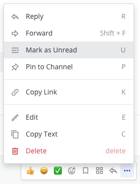
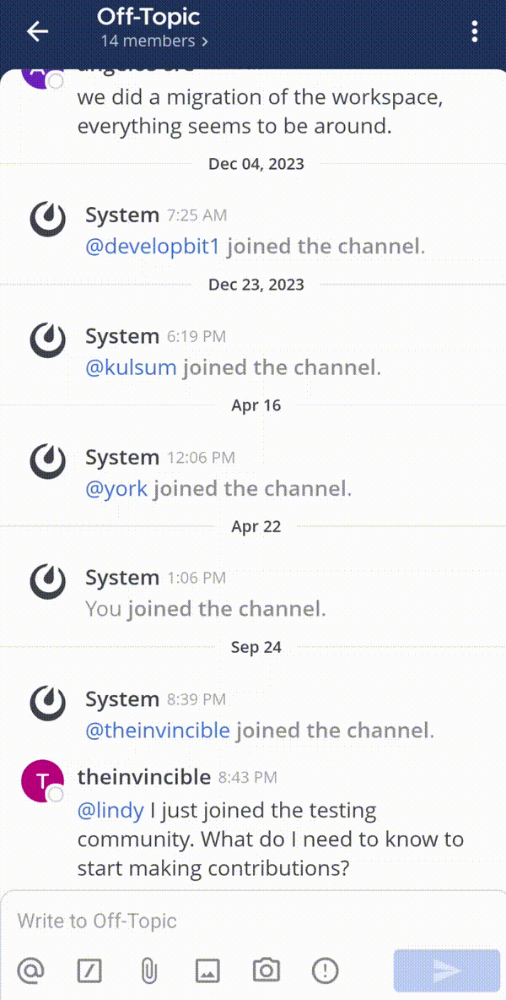

إذا قرأت رسالة ولكن ليس لديك وقت للتعامل معها فورًا، يمكنك تمييزها كغير مقروءة. يؤدي تمييز الرسالة كغير مقروءة إلى عرض اسم القناة بخط عريض في الشريط الجانبي وتجميع الرسالة مع باقي الرسائل غير المقروءة.

الويب/سطح المكتب (Web/Desktop)

مرّر مؤشر الفأرة فوق الرسالة، واختر أيقونة **المزيد (More)** [\|more-icon\|](##SUBST##|more-icon|) ثم اختر **تمييز كغير مقروء (Mark as Unread)**.

الهاتف المحمول (Mobile)

اضغط مطولاً على رسالة، ثم اضغط على **تمييز كغير مقروء (Mark as Unread)**.

