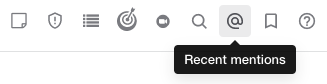

عندما تريد لفت انتباه مستخدمي Mattermost محددين، استخدم الإشارات (@mentions). يدعم Mattermost أنواعًا متعددة من التنبيهات باستخدام @، منها:

- [@username](#اسم-المستخدم-username)
- [@channel](#القناة-و-الكل-channel-and-all)
- [@all](#القناة-و-الكل-channel-and-all)
- [@here](#هنا-here)
- [@groupname](#اسم-المجموعة-groupname)
- [@customusergroupname](#اسم-مجموعة-مستخدمين-مخصصة-customusergroupname)

:::note
- إذا نسيت ذكر شخص في رسالة ثم قمت بتحرير الرسالة لإضافة @mention، فلن يتم إرسال إشعارات جديدة عن الذكر أو أصوات إشعار أو إشعارات سطح المكتب.
- يدعم Mattermost الأسماء التي تحتوي على أحرف تشكيل (diacritics)، مثل Zoë أو Jesús أو François، وتظهر هذه الأسماء في نتائج الإكمال التلقائي.
:::

## اسم المستخدم (@username)

يمكنك ذكر زميل باستخدام الرمز *@* متبوعًا باسم المستخدم لإرسال إشعار ذكر إليه.

اكتب `@` أو الرمز كامل العرض "＠" (U+FF20) لفتح قائمة بأعضاء الفريق القابلين للذكر. لتصفية القائمة، اكتب الحروف الأولى من اسم المستخدم أو الاسم الأول أو الاسم الأخير أو اللقب.

:::note
أضاف Mattermost في الإصدار v11.3 دعمًا لرمز @ كامل العرض لتحسين تجربة إدخال النص الياباني ولوحات المفاتيح الدولية؛ الإشارات الحالية لا تتأثر.
:::

:::note
في المتصفح أو تطبيق سطح المكتب، يمكنك استخدام أسهم `↑` و `↓` للتنقل في القائمة ثم الضغط على `ENTER` على <span dir="ltr">Windows</span>/Linux أو `↵` على Mac لاختيار المستخدم. عند الاختيار، يستبدل اسم المستخدم الاسم الكامل أو اللقب.
:::

مثال يرسل إشعار ذكر خاص إلى مستخدمة اسمها **alice**:

```text
@alice how did your interview go with the new candidate?
```

إذا كان المستخدم الذي ذكرته ليس عضوًا في القناة أو الفريق، يتم نشر رسالة نظام لك فقط وتظهر لك خيار إضافة هذا المستخدم إلى القناة.

## القناة والكل (@channel و @all)

يمكنك ذكر جميع أعضاء القناة بكتابة `@channel` أو `@all`. يحصل كل أعضاء القناة على إشعار ذكر كما لو ذكروا بشكل فردي. في قنوات "الساحة العامة" (Town Square)، يتم إخطار جميع أعضاء الفريق.

يمكنك تجاهل إشعارات الذكر على مستوى القناة عبر **قائمة القناة (Channel Menu) > تفضيلات الإشعارات (Notification Preferences) > تجاهل الإشارات لـ @channel و @here و @all**.

```text
@channel great work on interviews this week. I think we found some excellent potential candidates!
```

إذا كانت القناة تحتوي على خمسة أعضاء أو أكثر، قد يُطلب منك تأكيد إرسال الإشعار للجميع.

## هنا (@here)

يمكنك ذكر كل من هو متصل حاليًا في القناة بكتابة `@here`. يرسل هذا إشعار سطح مكتب ودفع (push) للمستخدمين المتصلين، ويُحتسب كذكر في الشريط الجانبي. الأعضاء غير المتصلين لن يتلقوا إشعارًا، ولن يرى الإشعار محسوبًا عند عودتهم إلا في حالات خاصة إذا كانت إعداداتهم على **لكل الأنشطة (For all activity)**.

```text
@here can someone complete a quick review of this?
```

كما هو الحال في @channel، قد يُطلب تأكيد الإرسال إذا كانت القناة تضم خمسة أعضاء أو أكثر.

يمكنك تجاهل الإشعارات الشاملة للقناة بتمكين **قائمة القناة (Channel Menu) > تفضيلات الإشعارات (Notification Preferences) > تجاهل الإشارات لـ @channel و @here و @all**.

## اسم المجموعة (@groupname)

:::note
[\|plans-img-yellow\|](##SUBST##|plans-img-yellow|) متاح في خطط [Enterprise و Enterprise Advanced](https://mattermost.com/pricing/)
:::

تمكّن هذه الميزة مسؤولي النظام من تهيئة إشعارات مخصصة لمجموعات LDAP المزامنة عبر صفحة إعدادات المجموعات. تدعم الميزة أيضًا تطبيق الجوال (بدءًا من الإصدار v1.34) مع اقتراح المجموعات تلقائيًا، وتمييز إشعارات أعضاء المجموعة، وعرض تحذير عند إخطار أكثر من خمسة مستخدمين.

بمجرد تفعيلها لمجموعة معينة، يمكن للمستخدمين ذكر المجموعة كاملة في القناة (بشكل مماثل لـ `@channel`) وسيصل الإشعار لأعضاء المجموعة في تلك القناة. إذا لم يكن بعض أعضاء المجموعة في القناة، سيُطلب منك دعوة هؤلاء الأعضاء.

لتخصيص معرّف ذكر المجموعة (slug):

1. افتح **وحدة تحكم النظام (System Console) > إدارة المستخدمين (User Management) > المجموعات (Groups)**.
2. اختر **تحرير (Edit)** بجانب المجموعة المراد تعديلها.
3. في **ملف تعريف المجموعة (Group Profile) > ذكر المجموعة (Group Mention)**، أدخل المعرف (slug) الجديد.
4. اختر **حفظ (Save)**.

كما هو الحال مع `@username`، اكتب `@` لفتح قائمة المجموعات القابلة للذكر، واستخدم أسهم لوحة المفاتيح للاختيار.

```text
@dev-managers great work hitting all of our code coverage goals this quarter!
```

## اسم مجموعة مستخدمين مخصصة (@customusergroupname)

يمكنك إضافة مجموعات مستخدمين إلى قناة أو فريق عبر [إنشاء مجموعة مخصصة](/end-user-guide/collaborate/organize-using-custom-user-groups) ثم ذكر تلك المجموعة في القناة.

- سيطلب منك Mattermost إضافة المستخدمين غير الأعضاء في القناة إلى القناة.
- منذ الإصدار v9.1 من Mattermost، قد يُعرض عليك أيضًا إضافة المستخدمين غير الأعضاء في الفريق إلى الفريق إذا كانت لديك الصلاحيات اللازمة.

## الكلمات التي تشغل التنبيهات (Words that trigger mentions)

يمكنك تخصيص كلمات تشغل إشعارات الذكر عبر **الإعدادات (Settings) > الإشعارات (Notifications) > الكلمات التي تشغل الإشارات (Words That Trigger Mentions)**. افتراضيًا، تتلقى إشعارات لاسم المستخدم الخاص بك و `@channel` و `@all` و `@here`، ويمكنك إضافة اسمك الأول ككلمة مشغلة.

أدخل الكلمات مفصولة بفواصل لتلقي إشعارات عند ظهورها — وهذا مفيد لموضوعات محددة مثل "المقابلة" (interviewing) أو "التسويق" (marketing).

## استعراض جميع الإشارات الأخيرة (View all recent mentions)

اختر أيقونة **@** يمين صندوق **البحث (Search)** للاستعلام عن أحدث إشاراتك وكلمات التنبيه (باستثناء إشعارات مجموعات LDAP).



تظهر إشاراتك الأخيرة عبر جميع فرقك.

اختر **انتقال (Jump)** بجانب نتيجة البحث للانتقال إلى الرسالة والموقع في اللوحة المركزية.

## حوار تأكيد الإشعارات (Notification confirmation dialog)

عندما يقوم مسؤول النظام بتكوين ضرورة تأكيدات الذكر، يجب عليك تأكيد أي ذكر سيُرسل لأكثر من خمسة مستخدمين قبل الإرسال.

يظهر مربع التأكيد هذا فقط إذا قام مسؤول النظام بتفعيل الإعداد في وحدة تحكم النظام. راجع [إعدادات التكوين](/administration-guide/configure/site-configuration-settings#show-@channel-@all-or-@here-confirmation-dialog) لمزيد من التفاصيل. هذه الخاصية مدعومة في تطبيق الجوال (بدءًا من v1.34) في حال تفعيل مجموعات `AD/LDAP`.

## تمييز الإشارات (Notification highlighting)

الذكر الصحيح يظهر بنص مميز مع بعض الاستثناءات (مثل تعطيل الذكر على مستوى القناة). يصبح النص المميز رابطًا عند عرض اسم المستخدم، واختيار الاسم يفتح نافذة الملف الشخصي.

عند توليد إشعار، يرى المستخدم المذكور خلفية ونصًا مميزًا يوضح أي من الإشارات في المنشور تسببت في الإشعار.
