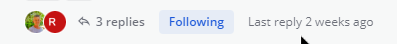
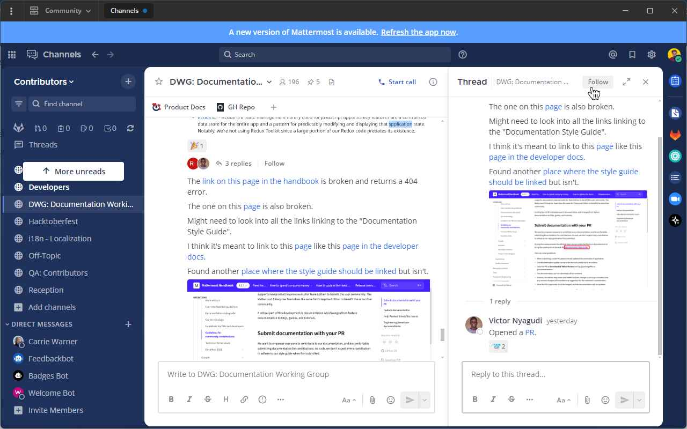
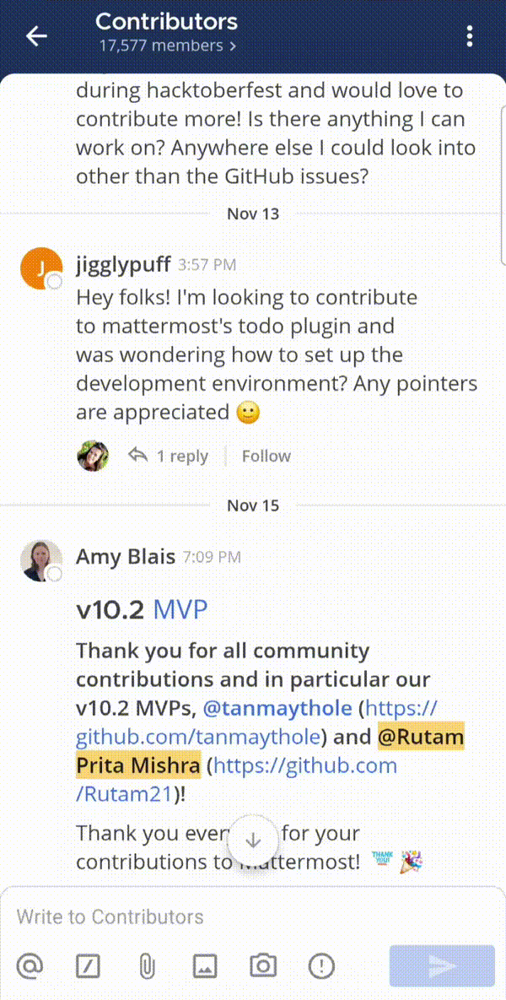
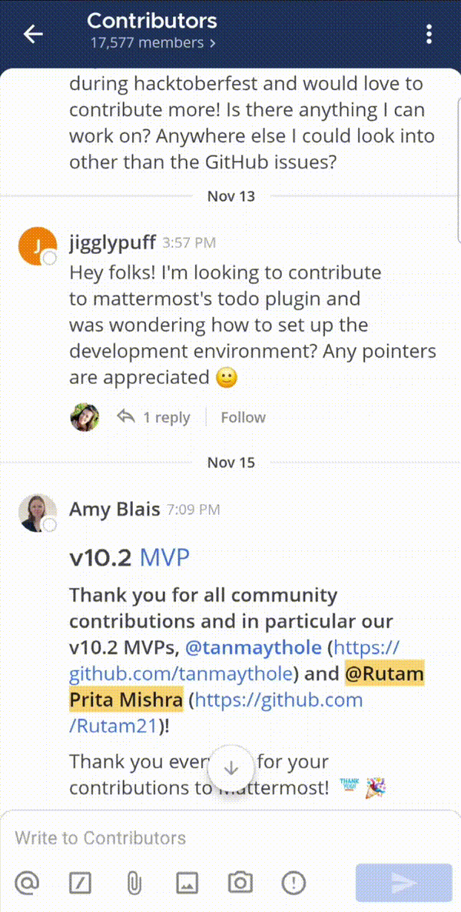
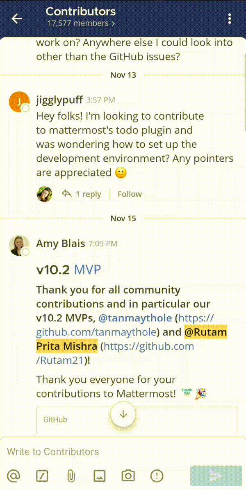
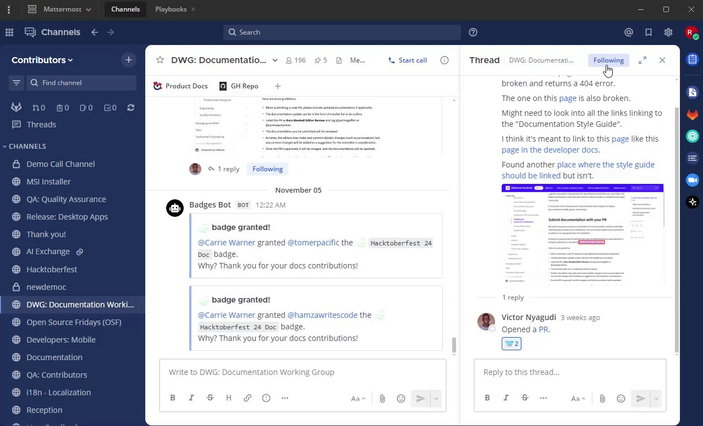
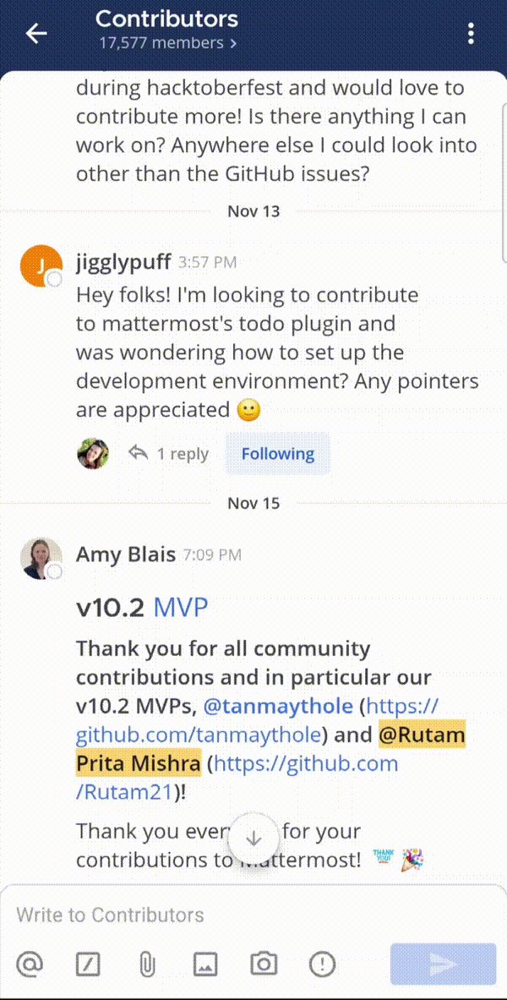
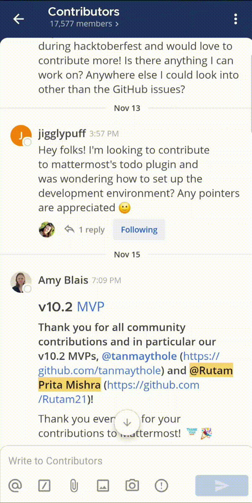
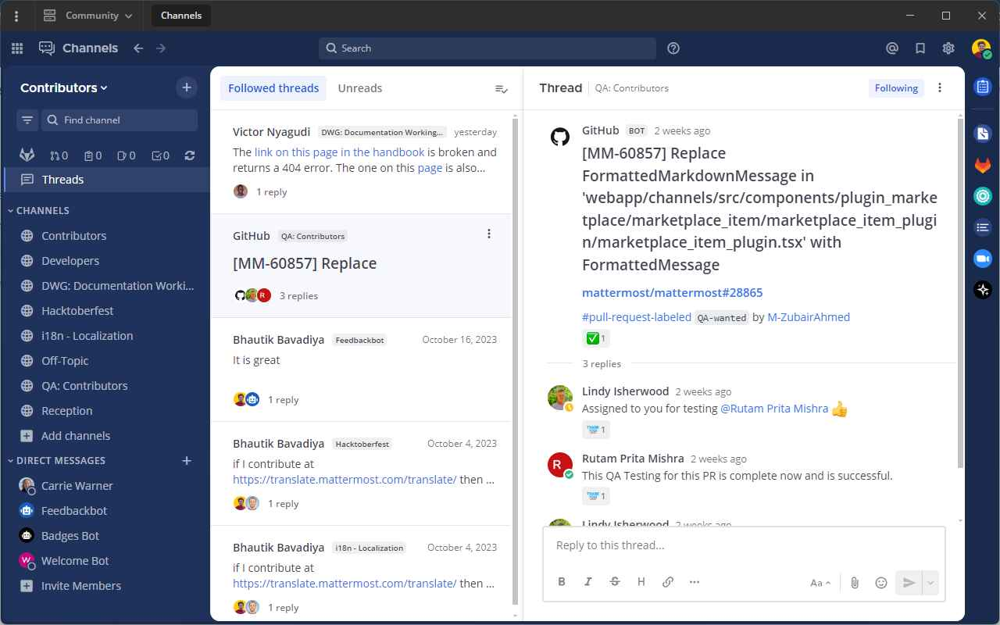

تعد سلاسل الرسائل (Threads) جزءًا أساسيًا من تجربة المراسلة في Mattermost. تُستخدم لتنظيم المحادثات وتمكين المستخدمين من مناقشة الموضوعات دون إضافة ضوضاء إلى القنوات أو الرسائل المباشرة.

توفر المناقشات المتسلسلة تجربة محسنة للمستخدمين الذين يتواصلون في السلاسل والرد على الرسائل، والتي تتضمن صندوق وارد موحد للسلاسل لقراءة جميع المحادثات في عرض واحد. تعمل السلاسل على تحسين القدرة على معالجة محتوى القناة، والعثور على المحادثات ومتابعتها واستئنافها بسهولة أكبر، والحفاظ على تركيز المحادثات المتسلسلة.

:::note
- بدءًا من الإصدار v7.0 من Mattermost، يتم تمكين المناقشات المتسلسلة افتراضيًا لجميع عمليات تثبيت Mattermost الجديدة. يمكن لجميع مستخدمي Mattermost إنشاء سلاسل جديدة، ما لم يقم مسؤول النظام بـ [تعطيل القدرة على القيام بذلك](/administration-guide/configure/site-configuration-settings#threaded-discussions).
- يمكن لمسؤولي النظام [تكوين التوفر الافتراضي واختيار المستخدم للانضمام](/administration-guide/configure/site-configuration-settings#threaded-discussions) للمناقشات المتسلسلة.
:::

## بدء أو الرد على السلاسل (Start or reply to threads)

يتم طي [الردود على الرسائل](/end-user-guide/collaborate/reply-to-messages) تحت الرسالة الأولى في السلسلة. افتح سلسلة من خلال اختيار الرسالة أو عدد الردود.

بدءًا من الإصدار v11.2 من Mattermost، عند استخدام Mattermost في متصفح الويب، يمكنك فتح السلاسل في نوافذ متصفح منفصلة عن طريق اختيار أيقونة **نافذة جديدة (New Window)** [\|new-window-icon\|](##SUBST##|new-window-icon|) في ترويسة السلسلة. يتيح لك ذلك عرض والمشاركة في سلاسل متعددة في وقت واحد دون فقدان السياق.

## متابعة السلاسل والرسائل (Follow threads and messages)

ستتابع تلقائيًا كل سلسلة تشارك فيها أو تُذكر فيها. يمكنك متابعة رسائل وسلاسل محددة يدويًا بحيث يؤدي أي نشاط رد إلى تشغيل [الإشعارات](/end-user-guide/preferences/manage-your-notifications). يمكنك متابعة أو إلغاء متابعة أي سلسلة في أي وقت. في القنوات، تعني النقطة الموجودة بجانب المشاركين في السلسلة وجود ردود غير مقروءة للسلاسل التي تتابعها.

الويب/سطح المكتب (Web/Desktop)

قم بتبديل خيار **متابعة (Follow)** الخاص بالسلسلة، أو اختر **متابعة السلسلة (Follow thread)** من أيقونة **مزيد من الإجراءات (More Actions)** [\|more-icon\|](##SUBST##|more-icon|).

:::note
- تابع الرسائل التي لا تحتوي على ردود من أيقونة **مزيد من الإجراءات (More Actions)** [\|more-icon\|](##SUBST##|more-icon|) ليتم إخطارك إذا قام شخص ما بالرد على الرسالة لاحقًا بناءً على تفضيلات الإشعارات الخاصة بك.
- يمكنك أيضًا استخدام مفاتيح الأسهم بلوحة المفاتيح للتنقل بين السلاسل في عرض **السلاسل (Threads)**.
:::

الهاتف المحمول (Mobile)

اضغط مطولاً على رسالة للوصول إلى خيارات الرسالة، ثم اضغط على **متابعة السلسلة (Follow Thread)**.

بدلاً من ذلك، يمكنك أيضًا الضغط على مؤشر **متابعة (Follow)** أسفل سلسلة الرسائل لمتابعتها.

:::note
تابع الرسائل التي لا تحتوي على ردود من أيقونة **المزيد (More)** [\|more-icon-vertical\|](##SUBST##|more-icon-vertical|) ليتم إخطارك إذا قام شخص ما بالرد على الرسالة لاحقًا بناءً على تفضيلات الإشعارات الخاصة بك.

:::

## إلغاء متابعة السلاسل (Unfollow threads)

إذا لم تعد مهتمًا بسلسلة رسائل، فقم بإلغاء متابعتها للتوقف عن تلقي الإشعارات. عرض السلسلة دون الرد عليها لا يؤدي تلقائيًا إلى متابعة تلك السلسلة.

الويب/سطح المكتب (Web/Desktop)

قم بتبديل مؤشر **متابع (Following)** الخاص بالسلسلة، أو اختر **إلغاء متابعة السلسلة (Unfollow thread)** من أيقونة **مزيد من الإجراءات (More Actions)** [\|more-icon\|](##SUBST##|more-icon|) لإلغاء متابعتها.

الهاتف المحمول (Mobile)

اضغط مطولاً على رسالة للوصول إلى خيارات الرسالة، ثم اضغط على **إلغاء متابعة السلسلة (Unfollow Thread)**.

بدلاً من ذلك، يمكنك الضغط على مؤشر **متابع (Following)** أسفل سلسلة الرسائل لإلغاء متابعتها.

## عرض جميع السلاسل (View all threads)

اختر **السلاسل (Threads)** في أعلى الشريط الجانبي للقناة لمرئية جميع السلاسل التي تتابعها في الفريق المحدد حاليًا. تظهر السلاسل التي تحتوي على أحدث الردود في أعلى القائمة.

اختر **غير مقروءة (Unreads)** لتصفية السلاسل التي تتابعها بحيث تظهر فقط السلاسل التي تحتوي على ردود غير مقروءة.

## فيديو تعليمي (Tutorial video)

 

## المشكلات المعروفة (Known issues)

تم إصدار المناقشات المتسلسلة كإصدار عام في Mattermost v7.0، بما في ذلك تحسينات كبيرة في أداء الخادم وخيارات تكوين أكثر مرونة لمسؤولي النظام لتمكين الميزة افتراضيًا. نوصي بشدة بـ [ترقية Mattermost](/administration-guide/upgrade/upgrading-mattermost-server) للاستفادة من تحسينات التكوين والأداء.
