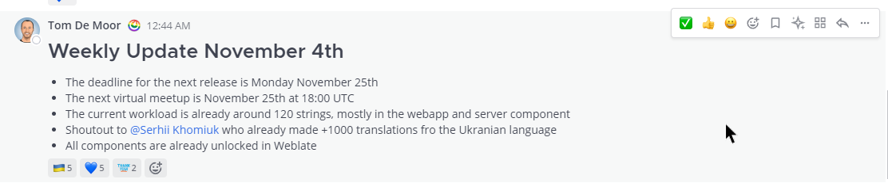
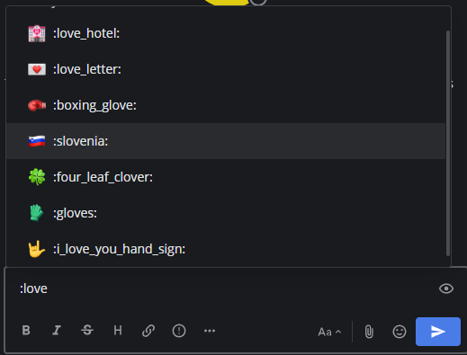
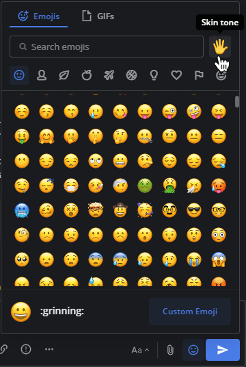
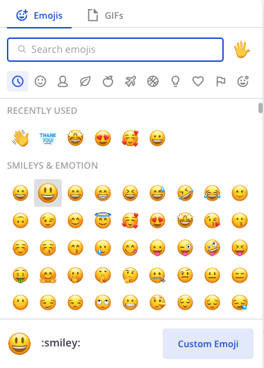
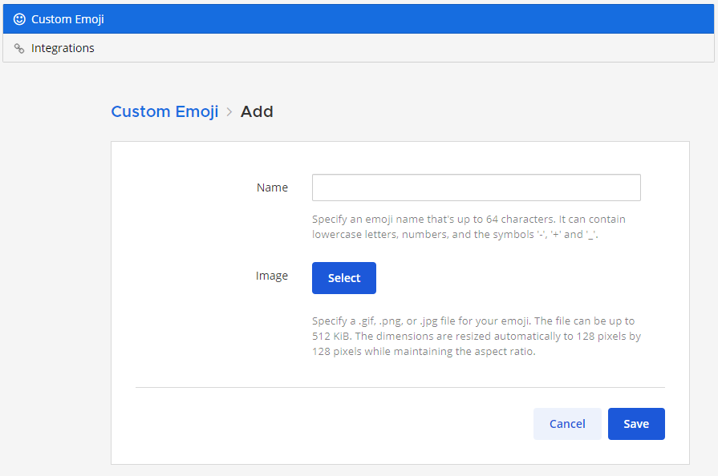
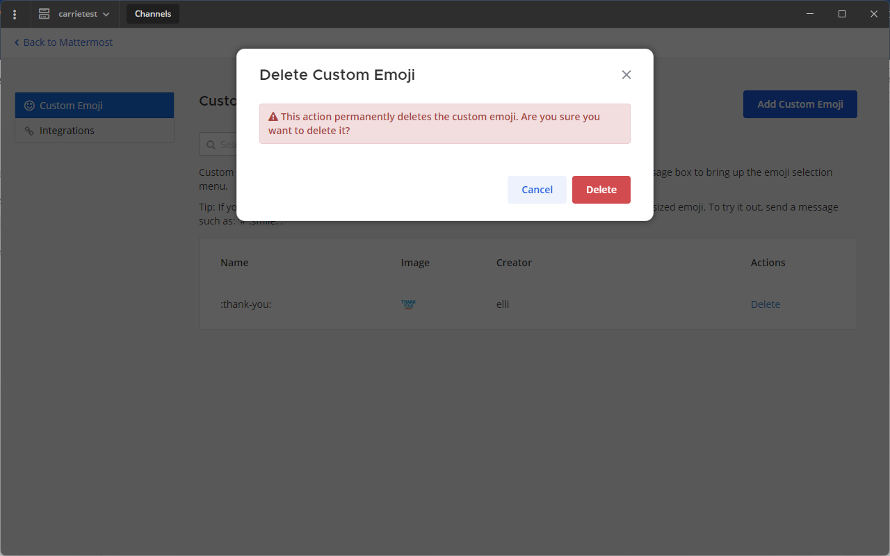

الرموز التعبيرية (Emojis) وملفات GIF هي صور صغيرة أو صور متحركة أو أيقونات تُستخدم للتواصل أو التعبير عن المشاعر والفكاهة والإيماءات داخل الرسائل.

بدءًا من الإصدار v10.10 من Mattermost، يتم تحويل الوجوه المكتوبة (مثل `:)` أو `:D`) تلقائيًا إلى رموز emoji في الرسائل بشكل افتراضي؛ يمكنك [تعطيل هذه الميزة](/end-user-guide/preferences/manage-your-display-options#render-emoticons-as-emojis) إذا رغبت في الاحتفاظ بها كنص.

## التفاعلات السريعة بالرموز التعبيرية (Quick emoji reactions)

يمكنك إضافة ما يصل إلى 50 رمزًا تعبيريًا كاستجابات لكل رسالة. يتم ترتيب الرموز المستخدمة مؤخرًا بناءً على معدل استخدامها. لا ترى الرموز المستخدمة مؤخرًا؟ قم بتفعيل التفاعلات السريعة عبر **الإعدادات (Settings) > العرض (Display)** ثم تفعيل **التفاعلات السريعة على الرسائل (Quick reactions on messages)**.

الويب/سطح المكتب (Web/Desktop)

مرّر مؤشر الفأرة فوق رسالة واختر واحدًا من الرموز المستخدمة مؤخرًا.

> 

الهاتف المحمول (Mobile)

اضغط مطولاً على رسالة ثم اختر رمزًا تعبيريًا من العناصر المستخدمة مؤخرًا.

## إدراج الرموز التعبيرية وGIF في الرسائل (Insert emojis and GIFs in messages)

:::note
لا تجد الرمز المناسب؟ يمكنك [تحميل رموز تعبيرية مخصصة](#تحميل-رموز-مخصصة-upload-custom-emojis).
:::

الويب/سطح المكتب (Web/Desktop)

اختر أيقونة **الابتسامة (Smile)** [\|smile-icon\|](##SUBST##|smile-icon|) داخل مربع إدخال الرسالة لفتح منتقي الرموز التعبيرية وGIF.

اختر رمزًا من تبويب **الرموز التعبيرية (Emojis)**، أو انتقل إلى تبويب **صور GIF (GIFs)** للبحث عن GIF.

يمكنك أيضًا إدخال اسم الرمز بكتابة `:` متبوعًا بحرفين على الأقل ليظهر الإكمال التلقائي للرموز، بما في ذلك تفاصيل لون البشرة للرموز البشرية عند توفرها.

الهاتف المحمول (Mobile)

اختر [\|smile-icon\|](##SUBST##|smile-icon|) لإضافة رمز تعبيري. يصل Mattermost إلى الرموز وصور GIF المتاحة على جهازك المحمول. يمكنك أيضًا كتابة اسم الرمز لفتح الإكمال التلقائي.

## إدارة الرموز التعبيرية (Manage emojis)

في متصفح الويب أو تطبيق سطح المكتب، يمكنك اختيار الرموز المستخدمة مؤخرًا، وتحديد لون بشرة افتراضي للرموز البشرية، وإدارة الرموز المخصصة. بدءًا من الإصدار v2.37.0 لتطبيق الجوال، يمكنك أيضًا اختيار الرموز المخصصة وتطبيق ألوان البشرة على الجوال.

### اختيار لون بشرة افتراضي (Select a default skin tone)

اختر أيقونة **لون البشرة (Skin tone)** في أعلى يمين منتقي الرموز لتحديد لون البشرة الافتراضي للرموز البشرية. يمكنك تغييره في أي وقت.

## تحميل رموز مخصصة (Upload custom emojis)

في المتصفح أو تطبيق سطح المكتب، يمكنك تحميل رموز جديدة يمكن لجميع مستخدمي مساحة العمل الوصول إليها، ما لم يقم مسؤول النظام بـ [تعطيل قدرتك على القيام بذلك](/administration-guide/configure/site-configuration-settings#enable-custom-emoji).

1. من منتقي الرموز، اختر **الرموز المخصصة (Custom Emoji)**.

2. أدخل اسمًا للرمز المخصص؛ يظهر هذا الاسم في الإكمال التلقائي.
3. اختر **تحديد (Select)** ثم اختر الصورة المراد استخدامها كرمز؛ الصور المربعة الصغيرة هي الأنسب. يجب أن تكون الصورة بصيغة JPG أو GIF أو PNG وبحجم يصل إلى 512 KiB.
4. اختر **حفظ (Save)** ليتم إضافة الرمز إلى قائمة الرموز المخصصة.

لاستخدام الرمز في رسالة، اختره من المنتقي أو اكتب `:` متبوعًا باسم الرمز لإظهاره في الإكمال التلقائي.

### حذف الرموز المخصصة (Delete custom emojis)

في المتصفح أو تطبيق سطح المكتب، يمكنك حذف الرموز المخصصة التي قمت بتحميلها.

1. افتح منتقي الرموز.
2. اختر **الرموز المخصصة (Custom Emoji)**.
3. إذا لزم الأمر، استخدم شريط البحث للعثور على الرمز.
4. ضمن **الإجراءات (Actions)**، اختر **حذف (Delete)**.
5. اختر **حذف (Delete)** للتأكيد.

