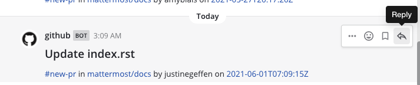
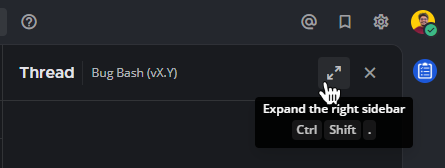
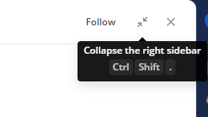

الويب/سطح المكتب (Web/Desktop)

قم بالرد على الرسائل عن طريق اختيار أيقونة **الرد (Reply)** [\|reply-arrow\|](##SUBST##|reply-arrow|) بجانب نص الرسالة.

الهاتف المحمول (Mobile)

اضغط مطولاً على رسالة واختر **رد (Reply)**، أو ببساطة اضغط عليها للرد.

بناءً على كيفية تكوين مسؤول النظام لـ Mattermost، قد تتمكن من [تحرير](/end-user-guide/collaborate/send-messages#تحرير-الرسائل-edit-messages)، و [استعادة](/end-user-guide/collaborate/send-messages#استعادة-نسخة-سابقة-من-رسالة-محررة-restore-a-previous-version-of-an-edited-message)، و [حذف](/end-user-guide/collaborate/send-messages#حذف-الرسائل-delete-messages) الرسائل بعد إرسالها.

:::note
من السهل العودة إلى رسالة قيد التنفيذ باستخدام مسودات الرسائل العالمية. يمكنك العثور على جميع مسودات رسائلك في عرض **المسودات (Drafts)** المتاح في أعلى الشريط الجانبي للقناة. راجع وثائق [مسودات الرسائل](/end-user-guide/collaborate/send-messages#مسودات-الرسائل-draft-messages) لمزيد من التفاصيل.
:::

## تنظيم المناقشات في سلاسل (Organize discussions into threads)

عند الرد على الرسائل، يتم [تنظيم هذه الردود في سلسلة مناقشة (discussion thread)](/end-user-guide/collaborate/organize-conversations). المناقشات المتسلسلة سهلة المتابعة وتسمح بإجراء محادثات متوازية متعددة في نفس الوقت دون ارتباك.

باستخدام Mattermost في متصفح الويب أو تطبيق سطح المكتب، تظهر الردود مزاحة قليلاً للداخل في اللوحة المركزية للإشارة إلى أنها رسائل تابعة لرسالة أصلية. يؤدي اختيار رابط الرد إلى فتح شريط جانبي في الجهة اليمنى في متصفح الويب وتطبيق سطح المكتب. لتوسيع الشريط الجانبي الأيمن إلى عرضه الكامل، اختر أيقونة **توسيع (Expand)** التي تحتوي على سهمين في أعلى الشريط الجانبي.

لتصغير الشريط الجانبي الأيمن إلى عرضه الأصلي، اختر نفس أيقونة **طي (Collapse)**.

