لديك طريقتان لتمييز منشور ليسهل العثور عليه لاحقًا:

- [حفظ رسالة](#حفظ-الرسائل-save-messages) يحفظها لك وحدك.
- [تثبيت رسالة](#تثبيت-الرسائل-pin-messages) يميزها للقناة بأكملها.

## حفظ الرسائل (Save messages)

الويب/سطح المكتب (Web/Desktop)

احفظ الرسائل للمتابعة اللاحقة عن طريق اختيار أيقونة **حفظ (Save)** [\|save-icon\|](##SUBST##|save-icon|) بجانب الرسالة.

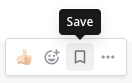

لرؤية جميع رسائلك المحفوظة، اختر أيقونة **الإشارة المرجعية (Bookmark)** الموجودة على يسار صورة ملفك الشخصي. سيفتح الشريط الجانبي الأيمن لعرض قائمة الرسائل المحفوظة.

قم بإزالة عنصر من قائمة **المنشورات المحفوظة (Saved Posts)** عن طريق اختيار أيقونة **حفظ (Save)** بجانب الرسالة لمسحها.

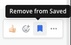

الهاتف المحمول (Mobile)

اضغط مطولاً على رسالة، ثم اختر **حفظ (Save)**.

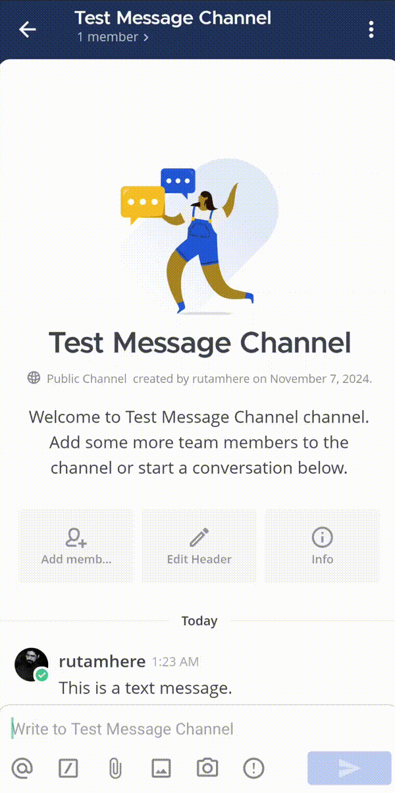

لرؤية جميع رسائلك المحفوظة، اضغط على أيقونة **حفظ (Save)** [\|save-icon\|](##SUBST##|save-icon|) في أسفل التطبيق.

قم بإزالة عنصر من قائمة **الرسائل المحفوظة (Saved Messages)** عن طريق الضغط مطولاً على الرسالة واختيار **إلغاء الحفظ (Unsave)**.

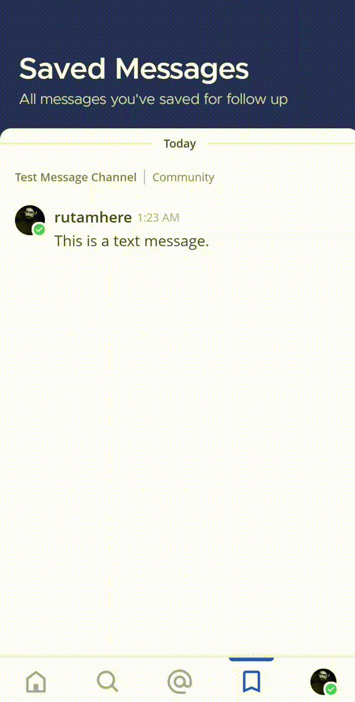

بدلاً من ذلك، يمكنك أيضًا الضغط على الرسالة المحفوظة في القناة ثم الضغط على أيقونة **تم الحفظ (Saved)** [\|saved-icon\|](##SUBST##|saved-icon|) أسفلها لإلغاء الحفظ.

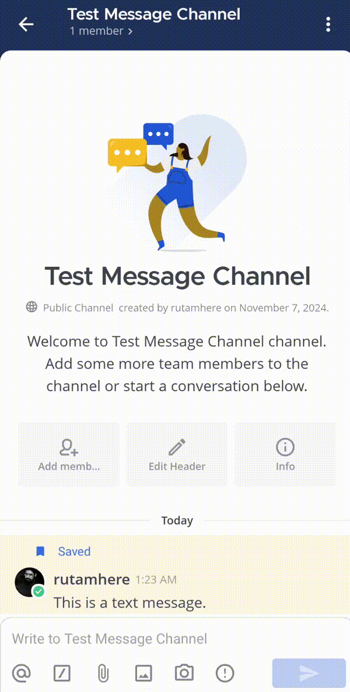

## تثبيت الرسائل (Pin messages)

يمكن لجميع أعضاء القناة تثبيت رسائل مهمة أو مفيدة في تلك القناة. تكون قائمة الرسائل المثبتة مرئية لجميع أعضاء القناة. لا يوجد حد لعدد المنشورات المثبتة في القناة. بدءًا من الإصدار v10.2 من Mattermost، يتم إخفاء أيقونة **المثبتة (Pinned)** [\|pinned-messages\|](##SUBST##|pinned-messages|) عندما لا توجد رسائل مثبتة.

الويب/سطح المكتب (Web/Desktop)

1. مرّر مؤشر الفأرة فوق الرسالة التي تريد تثبيتها. يظهر رابط أيقونة **المزيد (More)** [\|more-icon\|](##SUBST##|more-icon|).
2. اختر خيار **المزيد (More)**، ثم اختر **تثبيت في القناة (Pin to channel)**.

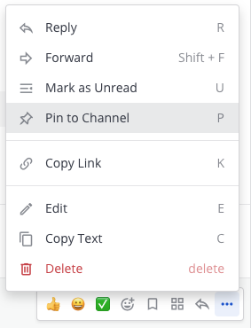

تتميز الرسائل المثبتة بأيقونة التثبيت. على سبيل المثال:

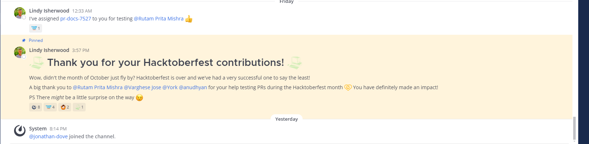

لرؤية جميع الرسائل المثبتة في قناة، اختر أيقونة **المنشورات المثبتة (Pinned posts)** في ترويسة القناة.

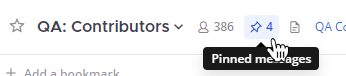

يفتح الشريط الجانبي الأيمن لعرض قائمة الرسائل المثبتة. على سبيل المثال:

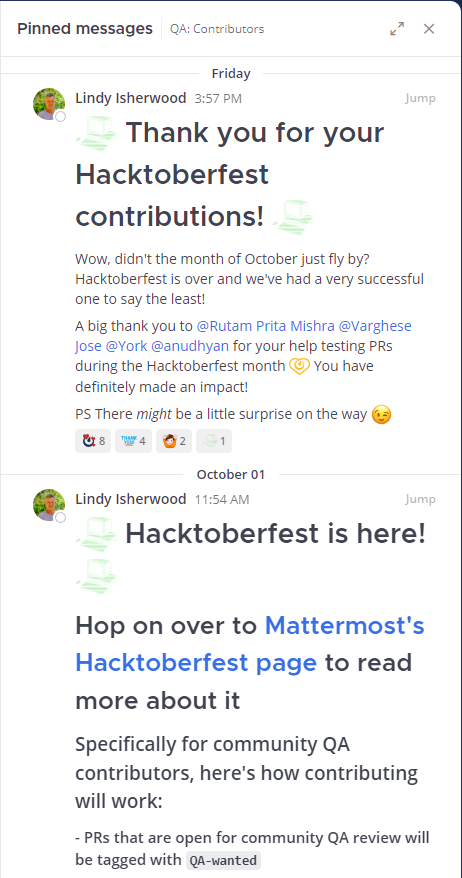

لإلغاء تثبيت رسالة:

1. مرّر مؤشر الفأرة فوق الرسالة التي تريد إلغاء تثبيتها. يظهر رابط أيقونة **المزيد (More)** [\|more-icon\|](##SUBST##|more-icon|).
2. اختر أيقونة **المزيد (More)**، ثم اختر **إلغاء التثبيت من القناة (Unpin from channel)**.

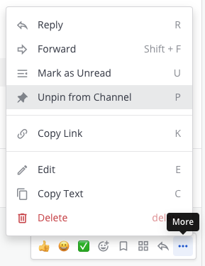

الهاتف المحمول (Mobile)

اضغط مطولاً على رسالة، ثم اختر **تثبيت في القناة (Pin to Channel)**.

لرؤية جميع الرسائل المثبتة في قناة:

1. اضغط على القناة التي تريد مراجعة رسائلها المثبتة.

2. اضغط على أيقونة **المزيد (More)** [\|more-icon-vertical\|](##SUBST##|more-icon-vertical|) الموجودة في الزاوية العلوية اليمنى من التطبيق.

3. اضغط على **عرض المعلومات (View Info)**.

4. اضغط على **الرسائل المثبتة (Pinned Messages)**.

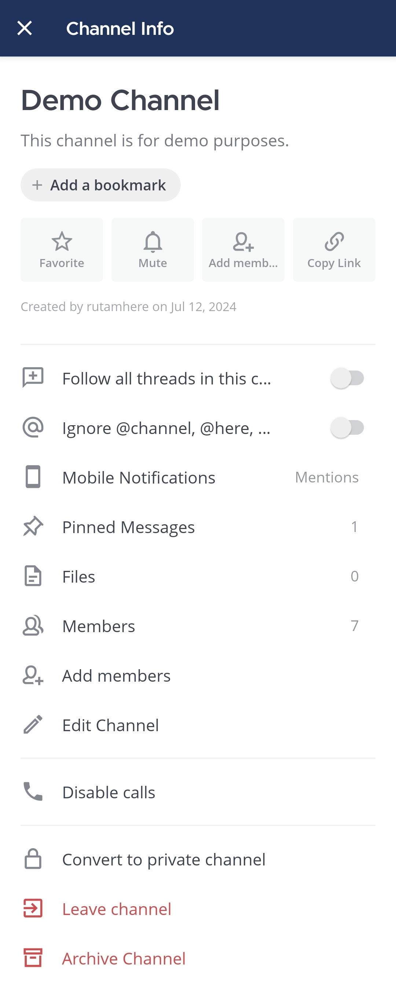

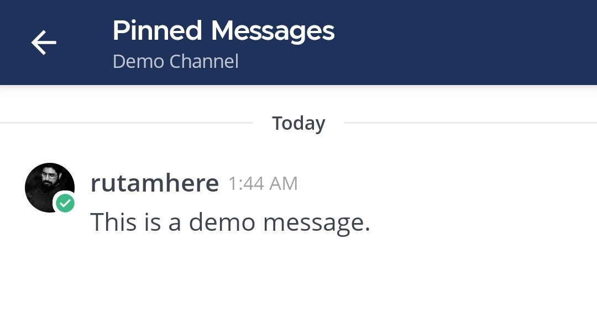

قم بإزالة عنصر من قائمة **الرسائل المثبتة (Pinned Messages)** عن طريق الضغط مطولاً على الرسالة واختيار **إلغاء التثبيت من القناة (Unpin from Channel)**.

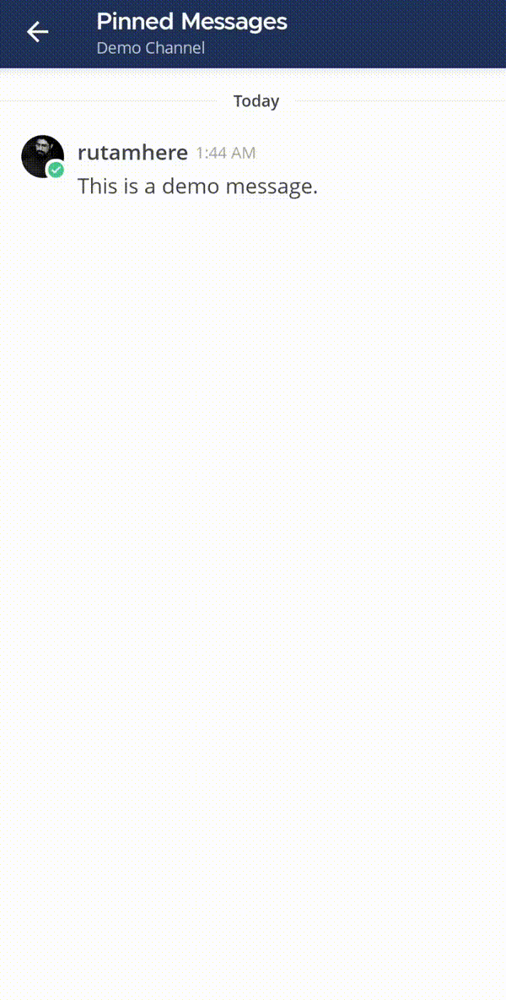

بدلاً من ذلك، يمكنك الضغط مطولاً على رسالة مثبتة في القناة ثم الضغط على **إلغاء التثبيت من القناة (Unpin from Channel)** لإلغاء تثبيتها.

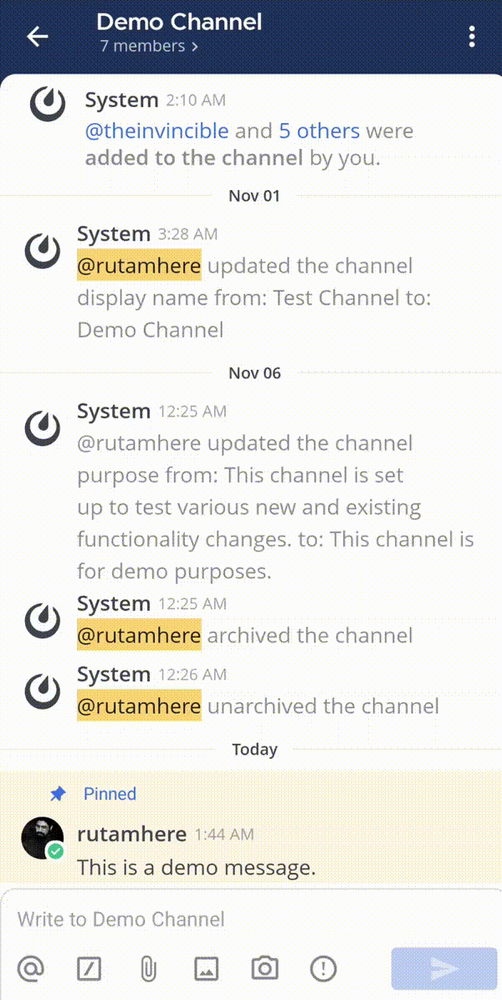

