استخدم بحث Mattermost للعثور على الرسائل والردود ومحتويات الملفات. يمكنك أيضًا البحث عن طريق [الوسوم (hashtags)](#الوسوم-hashtags)، أو إجراء عمليات بحث أكثر تقدمًا باستخدام [معاملات البحث](#معاملات-البحث-search-modifiers)، أو ضبط نتائج البحث لإظهار الرسائل من الفريق الحالي، أو فريق معين، أو جميع الفرق.

## البحث عن رسالة (Search for message)

الويب/سطح المكتب (Web/Desktop)

1. اختر حقل البحث، ثم اختر **الرسائل (Messages)**، وأدخل معايير البحث الخاصة بك.

> 
>
> 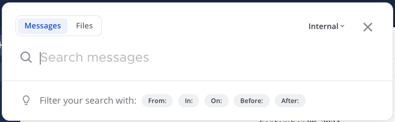

2. بشكل افتراضي، تتضمن نتائج البحث رسائل من جميع القنوات داخل فريقك الحالي. بدءًا من الإصدار v10.8 من Mattermost، يمكنك اختيار **جميع الفرق (All Teams)** للبحث في جميع القنوات عبر جميع الفرق، أو اختيار فريق معين بدلاً من ذلك، أو الاستمرار في البحث داخل الفريق الحالي.

> 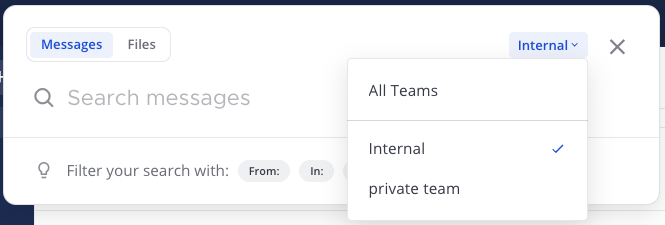
>
> :::tip
> بدءًا من الإصدار v10.10 من Mattermost، يتوفر معامل البحث `from:` لعمليات البحث عبر الفرق. عند البحث في جميع الفرق، يجب عليك إضافة معامل `from:` يدويًا كجزء من معايير البحث للبحث عن طريق مستخدمين محددين عبر الفرق.
> :::

3. عندما تظهر نتائج الرسائل في لوحة نتائج البحث، اختر **انتقال (Jump)** لعرض الرسالة كاملة في سياقها.

> 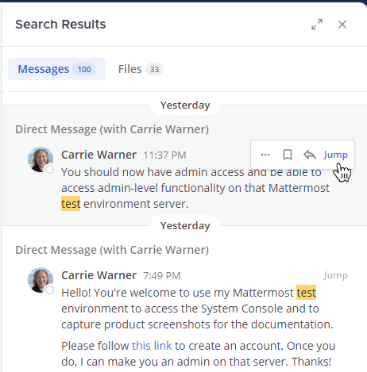

:::note
بدءًا من الإصدار v10.8 من Mattermost، يمكنك أيضًا ضبط نتائج البحث لإظهار الرسائل من الفريق الحالي، أو فريق معين، أو جميع الفرق.
:::

الهاتف المحمول (Mobile)

1. اضغط على أيقونة **البحث (Search)** [\|search-icon\|](##SUBST##|search-icon|) في أسفل التطبيق للبحث عن الرسائل أو الملفات المرفقة بالرسائل.

> 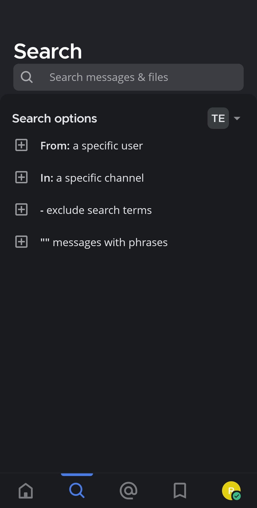

2. بشكل افتراضي، تتضمن نتائج البحث رسائل من جميع القنوات داخل فريقك الحالي. بدءًا من الإصدار v2.28 لتطبيق الجوال، اضغط على **جميع الفرق (All Teams)** للبحث في جميع القنوات عبر جميع الفرق، أو اختر فريقًا معينًا بدلاً من ذلك.

> 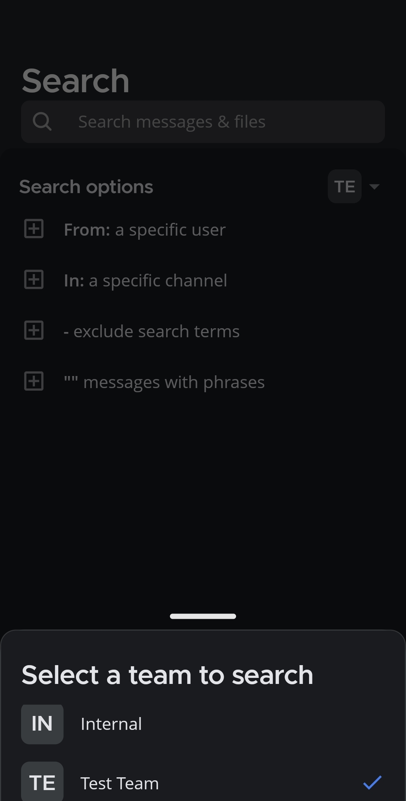

3. أدخل معايير البحث الخاصة بك.

> 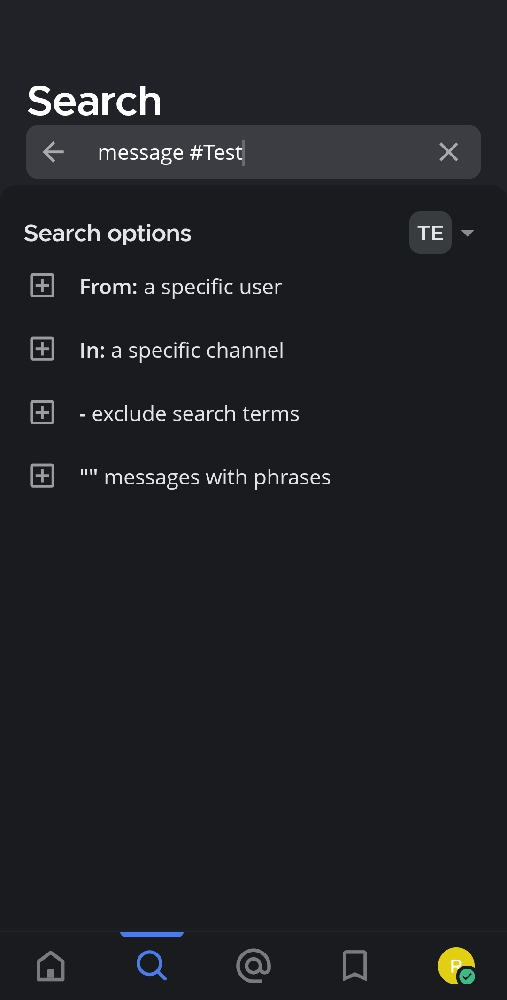

4. اضغط لتطبيق [معاملات البحث](#معاملات-البحث-search-modifiers) على بحثك.

> 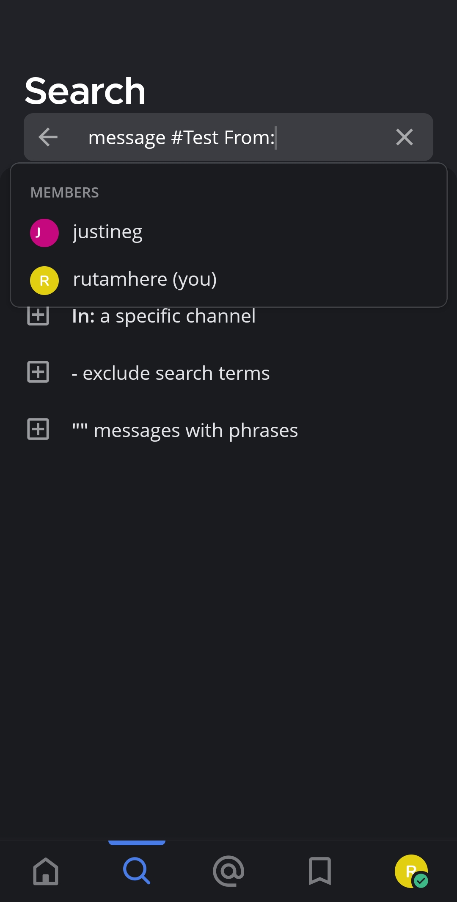
>
> 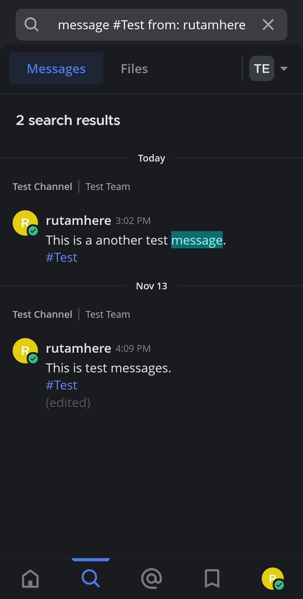

:::note
عند استخدام Mattermost في متصفح ويب أو تطبيق سطح المكتب، يمكنك فتح نتائج البحث الحالية في نافذة منبثقة منفصلة عن طريق اختيار أيقونة **فتح في نافذة جديدة (Open in new window)** [\|new-window-icon\|](##SUBST##|new-window-icon|) في ترويسة نتائج البحث.
:::

## البحث عن الملفات (Search for files)

من حقل **البحث (Search)**، اختر **الملفات (Files)** للبحث عن الملفات المرفقة بالرسائل. بدءًا من الإصدار v10.8 من Mattermost و v2.28 لتطبيق الجوال، يمكنك تحديد ما إذا كنت تريد البحث في جميع القنوات التي تنتمي إليها في الفريق الحالي، أو فريق معين، أو جميع القنوات عبر جميع الفرق.

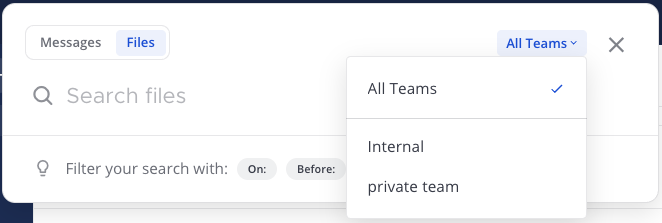

تتم إعادة محتويات الملفات التي تتطابق مع اسم الملف، أو تحتوي على محتوى نصي مطابق داخل أنواع المستندات المدعومة، في لوحة نتائج البحث. يتضمن كل نتيجة بحث اسم الملف وامتداده وتفاصيل الحجم، بالإضافة إلى تفاصيل حول زمان ومكان مشاركة الملف في الأصل. يمكنك ضبط نتائج البحث لإظهار الرسائل من الفريق الحالي، أو فريق معين، أو جميع الفرق.

- بالنسبة لـ [مساحات عمل Mattermost Cloud](/end-user-guide/end-user-guide-index)، تشمل تنسيقات ملفات المستندات المدعومة PDF و PPTX و DOCX و ODT و HTML ومستندات النص العادي. تنسيقات ملفات DOC و RTF، بالإضافة إلى محتويات ملفات ZIP، غير مدعومة.
- بالنسبة لعمليات تثبيت Mattermost المستضافة ذاتيًا، تشمل تنسيقات ملفات المستندات المدعومة PDF و PPTX و DOCX و ODT و HTML ومستندات النص العادي.

:::note
ملفات 7zip (`.7z`) غير مدعومة للبحث في محتوى الملفات ويتم تخطيها أثناء فهرسة البحث لأسباب أمنية. يتم دعم ملفات ZIP القياسية فقط عند تمكين البحث في ملفات ZIP.
:::

:::note
يمكن لمسؤولي النظام توسيع دعم البحث في محتوى الملفات لعمليات التثبيت المستضافة ذاتيًا لتشمل:
- [الملفات التي تمت مشاركتها قبل الترقية إلى Mattermost Server v5.35](/administration-guide/manage/mmctl-command-line-tool#mmctl-extract).
- [تنسيقات ملفات DOC و RTF](/administration-guide/configure/environment-configuration-settings#enable-document-search-by-content).
- [المستندات داخل ملفات ZIP](/administration-guide/configure/environment-configuration-settings#enable-searching-content-of-documents-within-zip-files).
:::

### تصفية النتائج حسب نوع الملف (Filter results by file type)

باستخدام Mattermost في متصفح الويب أو تطبيق سطح المكتب، يمكنك تضييق نتائج البحث بشكل أكبر عن طريق اختيار خيار **تصفية نوع الملف (File Type Filter)**، ثم اختيار أنواع ملفات محددة، مثل المستندات أو جداول البيانات أو الصور.

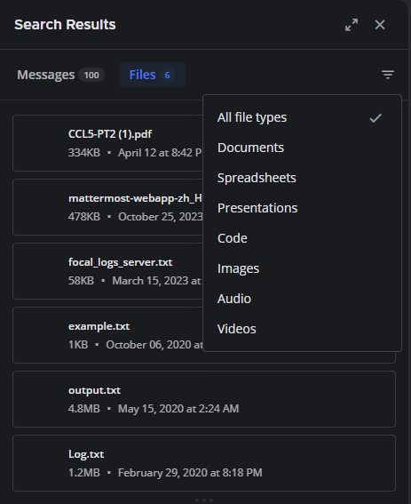

### الوصول إلى الملفات التي تمت مشاركتها مؤخرًا (Access recently shared files)

يمكنك الوصول إلى الملفات التي تمت مشاركتها مؤخرًا في القناة:

الويب/سطح المكتب (Web/Desktop)

اختر أيقونة **ملفات القناة (Channel Files)** [\|channel-files-icon\|](##SUBST##|channel-files-icon|) على يمين اسم القناة للوصول إلى الملفات التي تمت مشاركتها مؤخرًا في تلك القناة.

بدلاً من ذلك، يمكنك اختيار اسم القناة، واختيار أيقونة **عرض المعلومات (View Info)** [\|channel-info\|](##SUBST##|channel-info|)، ثم اختيار **الملفات (Files)** في اللوحة اليمنى.

الهاتف المحمول (Mobile)

اضغط على اسم القناة لعرض خيارات القناة، ثم اضغط على **الملفات (Files)**.

## معاملات البحث (Search modifiers)

يمكنك تطبيق معاملات البحث على أي بحث لتقليل عدد النتائج المعادة. اختر معامل بحث لإضافته إلى حقل البحث. المعاملات المدعومة موصوفة أدناه. تتضمن نتائج البحث الخاصة بك رسائل من جميع فرقك.

### `from:` و `in:`

- استخدم `from:` للعثور على رسائل أو ملفات من مستخدمين محددين.
  - على سبيل المثال، البحث عن `from:john.smith` يعيد فقط المحتوى من سجل رسائلك المباشرة مع John Smith.
  - بدءًا من الإصدار v10.10 من Mattermost، يمكنك استخدام `from:` في عمليات البحث عبر الفرق للعثور على رسائل من مستخدمين محددين عبر جميع الفرق التي تنتمي إليها.
- استخدم `in:` للعثور على رسائل أو ملفات تم نشرها في قنوات عامة محددة، أو قنوات خاصة، أو رسائل مباشرة، أو رسائل جماعية. يمكنك تحديد القنوات بالاسم المعروض أو معرف القناة.
  - على سبيل المثال، البحث عن `Mattermost in:town-square` يعيد فقط النتائج في القناة العامة "الساحة العامة" (Town Square) التي تحتوي على مصطلح `Mattermost`، بينما يعيد البحث عن `Mattermost in:john.doe` فقط النتائج التي تحتوي على مصطلح `Mattermost` في سجل رسائلك المباشرة مع John Smith.

### `before:` و `after:` و `on:`

- استخدم `before:` للعثور على رسائل أو ملفات تم نشرها قبل تاريخ محدد.
  - على سبيل المثال، البحث عن `website before: 2018-09-01` يعيد الرسائل أو الملفات التي تحتوي على مصطلح `website` والتي تم نشرها قبل 1 سبتمبر 2018.
- استخدم `after:` للعثور على رسائل أو ملفات تم نشرها بعد تاريخ محدد.
  - على سبيل المثال، البحث عن `website after: 2018-08-01` يعيد الرسائل أو الملفات التي تحتوي على مصطلح `website` والتي تم نشرها بعد 1 أغسطس 2018.
- استخدم كلاً من `before:` و `after:` معًا للبحث في نطاق زمني محدد.
  - على سبيل المثال، البحث عن `website before: 2018-09-01 after: 2018-08-01` يعيد جميع الرسائل أو الملفات التي تحتوي على مصطلح `website` والتي تم نشرها بين 1 أغسطس 2018 و 1 سبتمبر 2018.
- استخدم `on:` للعثور على رسائل أو ملفات تم نشرها في تاريخ محدد. استخدم منتقي التاريخ لاختيار تاريخ، أو اكتبه بصيغة YYYY-MM-DD.
  - على سبيل المثال، البحث عن `website on: 2018-09-01` يعيد الرسائل أو الملفات التي تحتوي على مصطلح `website` والتي تم نشرها في 1 سبتمبر 2018.

  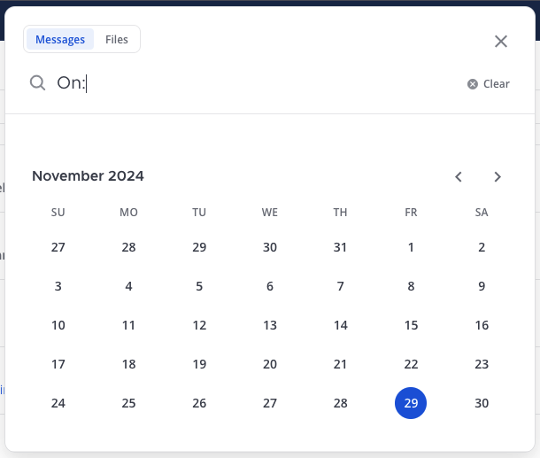

### الاستثناءات (Exclusions)

استخدم رمز الشرطة `-` لاستبعاد مصطلحات من نتائج بحثك. على سبيل المثال، البحث عن `test -release` يعيد فقط النتائج التي تتضمن مصطلح `test` وتستبعد مصطلح `release`.

يمكن استخدام معامل الاستبعاد هذا بالاشتراك مع معاملات أخرى لتحسين نتائج البحث بشكل أكبر. على سبيل المثال، البحث عن `test -release -in:release-discussion -from:eric` يعيد جميع النتائج التي تحتوي على مصطلح `test` ويستبعد المنشورات التي تحتوي على مصطلح `release` ويستبعد المنشورات التي تم إجراؤها في قناة `release-discussion` ويستبعد الرسائل المرسلة في الرسائل المباشرة من قبل `eric`.

### علامات الاقتباس (Quotation marks)

استخدم علامات الاقتباس `" "` لإعادة نتائج البحث عن مصطلحات دقيقة. على سبيل المثال، البحث عن `"Mattermost website"` يعيد الرسائل التي تحتوي على العبارة الدقيقة `Mattermost website` ولكنه لا يعيد النتائج التي تحتوي على `Mattermost` و `website` كمصطلحات منفصلة.

### الرموز العامة (Wildcards)

استخدم رمز النجمة `*` في نهاية الكلمة لإجراء بحث عام. يعيد البحث العام جميع الكلمات التي تبدأ بالحروف المحددة. لا يمكن استخدام الرمز العام في البحث في بداية الكلمة أو وسطها. على سبيل المثال، البحث عن `rea*` يعيد الرسائل أو الملفات التي تحتوي على كلمات مثل `reach` و `reason` و `reality` و `real` وغيرها من الكلمات التي تبدأ بـ `rea`. ومع ذلك، فإن عمليات البحث مثل `*each` و `re*ch` هي عمليات بحث عامة غير صالحة.

### الوسوم (Hashtags)

الوسوم هي تسميات قابلة للبحث للرسائل. يمكن لأي شخص إنشاء وسم في رسالة باستخدام علامة المربع `#` متبوعة بأحرف أبجدية رقمية أو أحرف يونيكود أخرى. تشمل أمثلة الوسوم: `#bug` و `#marketing` و `#user_testing` و `#per.iod` و `#check-in` و `#마케팅`.

الوسوم الصالحة:
- لا تبدأ برقم.
- لا يقل طولها عن ثلاثة أحرف، باستثناء رمز `#`.
- تتكون من أحرف أبجدية رقمية أو أحرف يونيكود أخرى.
- قد تحتوي على نقاط أو شرطات أو خطوط سفلية.

للبحث عن رسائل تحتوي على وسوم، اختر وسمًا في منشور موجود، أو اكتب الوسم (بما في ذلك رمز المربع `#`) في شريط البحث.

:::note
الوسوم لا تربط بالقنوات. إذا كان لديك قناة تسمى "التسويق" (Marketing)، فإن اختيار وسم `#marketing` لا ينقلك إلى قناة التسويق. للربط بالقنوات العامة، استخدم رمز التلدة `~` متبوعًا باسم القناة. على سبيل المثال، `~marketing`.
:::

## البحث في القنوات العامة التي لم تنضم إليها (Search public channels you haven't joined)

:::note
[\|plans-img-yellow\|](##SUBST##|plans-img-yellow|) متاح في خطط [Enterprise و Enterprise Advanced](https://mattermost.com/pricing/)
:::

بدءًا من الإصدار v11.6 من Mattermost، عندما يقوم مسؤول النظام بـ [تمكين البحث في القنوات العامة بدون عضوية](/administration-guide/configure/environment-configuration-settings#allow-searching-public-channels-without-membership)، يمكن أن تتضمن نتائج البحث رسائل من قنوات عامة لم تنضم إليها. تقتصر النتائج على الفرق التي تنتمي إليها، لذا سترى فقط رسائل من القنوات العامة في فرقك. لا يؤثر هذا الإعداد على القنوات الخاصة — يمكنك فقط البحث في القنوات الخاصة التي تنتمي إليها.

## ملاحظات حول إجراء عمليات بحث في Mattermost (Notes about performing Mattermost searches)

- عمليات البحث متعددة الكلمات تعيد النتائج التي تحتوي على *جميع* معايير بحثك.
- يمكن أن تساعد معاملات البحث في تضييق نطاق عمليات البحث. راجع قسم [معاملات البحث](#معاملات-البحث-search-modifiers) لمزيد من التفاصيل.
- يمكنك البحث في القنوات المؤرشفة طالما كنت عضوًا في تلك القناة.
  - إذا كنت غير قادر على رؤية الرسائل أو الملفات في القنوات المؤرشفة في نتائج بحثك، فاسأل مسؤول النظام عما إذا كان قد تم تعطيل **السماح للمستخدمين بعرض القنوات المؤرشفة** عبر **وحدة تحكم النظام (System Console) > تكوين الموقع (Site Configuration) > المستخدمون والفرق (Users and Teams)**.
  - لإزالة القنوات المؤرشفة من نتائج بحثك، يمكنك مغادرة القنوات المؤرشفة.
- مثل العديد من محركات البحث، الكلمات الشائعة مثل `the` و `which` و `are` (المعروفة باسم "كلمات الإيقاف")، بالإضافة إلى مصطلحات البحث المكونة من حرفين أو حرف واحد، لا تظهر في نتائج البحث لأنها عادةً ما تعيد الكثير من النتائج. راجع قسم [الملاحظات التقنية حول البحث](#الملاحظات-التقنية-حول-البحث-technical-notes-about-searching) أدناه لمزيد من التفاصيل.
- عناوين IP (على سبيل المثال `10.100.200.101`) لا تعيد نتائج.

## ملاحظات تقنية حول البحث (Technical notes about searching)

بشكل افتراضي، يستخدم Mattermost دعم البحث في النص الكامل المتضمن في PostgreSQL. اختر **قائمة المنتج (product menu)** [\|product-list\|](##SUBST##|product-list|) ثم اختر **حول Mattermost (About Mattermost)** لمعرفة قاعدة البيانات التي تستخدمها.

- يتم تصفية كلمات الإيقاف من نتائج البحث. راجع وثائق قاعدة بيانات [PostgreSQL](https://www.postgresql.org/docs/10/textsearch-dictionaries.html#TEXTSEARCH-STOPWORDS) للحصول على قائمة كاملة بكلمات الإيقاف المعمول بها.
- عناوين URL لا تعيد نتائج.
- الوسوم أو الإشارات الأخيرة لأسماء المستخدمين التي تحتوي على شرطة لا تعيد نتائج.
- المصطلحات التي تحتوي على شرطة تعيد نتائج غير صحيحة لأن الشرطات يتم تجاهلها في محرك البحث.
- بدءًا من الإصدار v7.1 من Mattermost، تحترم نتائج البحث قيمة `default_text_search_config` بدلاً من أن تكون ثابتة باللغة الإنجليزية. نوصي مسؤولي نظام Mattermost بمراجعة هذه القيمة للتأكد من تعيينها بشكل صحيح.
