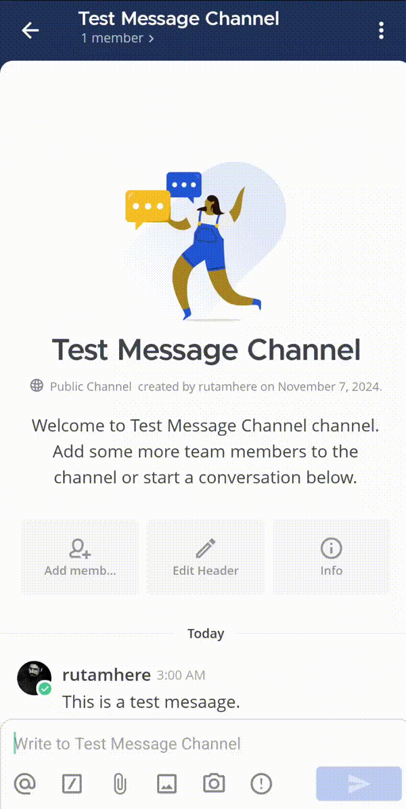
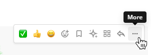

import { Tabs, TabItem, Steps,Aside } from '@astrojs/starlight/components';
import { Image } from 'astro:assets';

{/* استيراد الصور */}
import mobileTypeMessage from '../../../../images/mobile-type-a-message-in-a-channel.jpg';
import mobileSendingGif from '../../../../images/mobile-sending-a-message.gif';
import globalDraftsGif from '../../../../images/Global-Drafts-Animated-GIF.gif';
import mobileDraftGif from '../../../../images/mobile-draft-a-message.gif';
import moreActionsImg from '../../../../images/more-actions.png';

يمكنك إرسال رسائل في القنوات العامة والخاصة، وكذلك إلى مستخدمين آخرين في Mattermost. اعتمادًا على توقيت إنشاء الرسالة، يمكنك إرسالها فورًا، أو [جدولتها لاحقاً](/end-user-guide/collaborate/schedule-messages)، أو [تعيين أولوية الرسالة](/end-user-guide/collaborate/message-priority).

قد يعرض Mattermost تحذيرًا عند محاولة إرسال رسالة لمستلم وضع حالته على [عدم الإزعاج](/end-user-guide/preferences/set-your-status-availability#set-your-availability) وكان الوقت المحلي للمستلم خارج ساعات العمل (بين الساعة 10 مساءً و 6 صباحًا). يظهر هذا التحذير فوق حقل كتابة الرسالة.

<Aside type="note">
    بدءًا من الإصدار v11.5 من Mattermost، يمكنك الوصول إلى موارد المساعدة الخاصة بتنسيق الرسائل عبر رابط **مساعدة** أسفل حقل إدخال الرسالة.
</Aside>

<Tabs>
  <TabItem label="الويب/سطح المكتب" icon="laptop">
    أدخل رسالتك في حقل النص، ثم اختر **إرسال** [\|send-icon\|](##SUBST##|send-icon|) لإرسالها.

    

      <strong style={{ display: 'block', marginBottom: '0.5rem' ,color: 'var(--sl-color-white)' }}>ℹ️ ملاحظة</strong>
      
        يمكنك أيضًا استخدام لوحة المفاتيح لإرسال الرسائل:
        <ul style={{ listStyleType: 'disc', paddingInlineStart: '1.5rem', marginTop: '0.5rem' }}>
          <li>اضغط على `Enter` على Windows أو Linux، أو `↵` على Mac.</li>
          <li>يمكنك تهيئة Mattermost ليتطلب `Shift`+`Enter` على Windows أو Linux، أو `⇧`+`↵` على Mac لإرسال رسائل متعددة الأسطر. اختر أيقونة **الترس** [\|gear\|](##SUBST##|gear|) للذهاب إلى **الإعدادات** ثم **متقدم > إرسال الرسائل باستخدام CTRL+ENTER**.</li>
        </ul>
      
    

  </TabItem>

  <TabItem label="الهاتف المحمول" icon="mobile">
    <Steps>
    1. اضغط على حقل النص في أسفل تطبيق Mattermost لكتابة رسالة.
       <Image src={mobileTypeMessage} alt="اكتب رسالة في مربع النص" width={300} />

    2. اضغط على **إرسال** [\|send-icon\|](##SUBST##|send-icon|) لإرسالها في القناة.
       <Image src={mobileSendingGif} alt="إرسال الرسالة" width={300} />
    </Steps>
  </TabItem>
</Tabs>

## إعادة صياغة الرسائل باستخدام الذكاء الاصطناعي (AI Message Rewriting)

يمكنك استخدام الذكاء الاصطناعي لتحسين رسائلك قبل إرسالها — مثل تحسين الأسلوب، تصحيح الأخطاء الإملائية، تعديل الطول، أو تحويل النص وفق احتياجات محددة.

بدءًا من الإصدار v11.5 من Mattermost، عند استخدام ميزة "إعادة الصياغة بالذكاء الاصطناعي" (AI Rewrite) أثناء كتابة رد في سلسلة، يأخذ الذكاء الاصطناعي سياق السلسلة بعين الاعتبار لتوليد اقتراحات مناسبة.

على الويب/سطح المكتب أو الجوال:

1. اكتب رسالتك في حقل التأليف.
<<<<<<< HEAD
2. اختر خيار **إعادة صياغة (Rewrite)** [\|ai-rewrite\|](##SUBST##|ai-rewrite|) من إجراءات الرسالة.
3. اختر وكيل الذكاء الاصطناعي (AI agent) المتاح.
4. اختر أحد خيارات إعادة الصياغة المتاحة:
   - **تحسين الكتابة (Improve writing)**: تحسين الوضوح والاحترافية.
   - **تصحيح الإملاء (Fix spelling)**: تصحيح الأخطاء الإملائية والنحوية.
   - **تقصير (Shorten)**: اختصار النص.
   - **توسع (Elaborate)**: إضافة مزيد من التفاصيل والسياق.
   - **تبسيط (Simplify)**: تبسيط اللغة لتكون أوضح.
   - **تلخيص (Summarize)**: تلخيص النقاط الأساسية.
   - **موجه مخصص (Custom prompt)**: تحديد تعليمات مخصصة.
5. راجع الاقتراح المولد؛ اختر **إعادة توليد (Regenerate)** لتجربة اقتراح جديد أو **تجاهل (Discard)** للعودة للنص الأصلي.
6. اختر **إرسال (Send)** [\|send-icon\|](##SUBST##|send-icon|).

:::note
الرسائل التي تمت إعادة صياغتها باستخدام الذكاء الاصطناعي يتم وسمها تلقائيًا كمحتوى مُنتَج بواسطة AI لأغراض الشفافية. يجب على مسؤول النظام [تكوين وكلاء الذكاء الاصطناعي](/administration-guide/configure/agents-admin-guide) ليكون الخيار متاحًا.
:::

## إرسال رسائل مخفية حتى القراءة (Burn-on-read messages)

:::note
[\|plans-img-yellow\|](##SUBST##|plans-img-yellow|) متاح في خطط [Entry و Enterprise Advanced](https://mattermost.com/pricing/)
:::

بدءًا من الإصدار v11.3 من Mattermost، تبقى الرسائل المخفية حتى يختار المستلم كشفها، وبعد ذلك تُحذف لدى ذلك المستلم عند انتهاء المؤقت. لا يمكن الرد على رسائل "المسح عند القراءة" (burn-on-read) أو تعديلها. يمكنك إرسال هذه الرسائل ما لم يقم مسؤول النظام بـ [تعطيل القدرة على القيام بذلك](/administration-guide/configure/site-configuration-settings#enable-burn-on-read-messages).

الويب/سطح المكتب (Web/Desktop)

1. اكتب رسالتك.
2. اختر أيقونة **المسح عند القراءة (Burn-on-read)** [\|burn-on-read-icon\|](##SUBST##|burn-on-read-icon|) في شريط أدوات الرسالة.
3. اختر **إرسال (Send)** [\|send-icon\|](##SUBST##|send-icon|).

الهاتف المحمول (Mobile)

بدءًا من الإصدار v2.38.0 لتطبيق Mattermost المحمول، يمكنك إرسال رسائل "المسح عند القراءة" من التطبيق.

1. اكتب رسالتك.
2. اضغط على أيقونة **المسح عند القراءة (Burn-on-read)** [\|burn-on-read-icon\|](##SUBST##|burn-on-read-icon|).
3. اضغط على **إرسال (Send)** [\|send-icon\|](##SUBST##|send-icon|).

يرى المستلم عنصر نائب مخفي مع خيار **كشف (Reveal)**؛ بعد الكشف، يظهر مؤقت يبيّن متى ستُحذف الرسالة.

يمكن للمرسل تمرير المؤشر فوق أيقونة **المسح عند القراءة (Burn-on-read)** [\|burn-on-read-icon\|](##SUBST##|burn-on-read-icon|) لرؤية عدد المستلمين الذين قرأوا الرسالة. يمكنك حذف رسالة "المسح عند القراءة" لجميع المستلمين قبل انتهاء المؤقت عن طريق اختيار نفس الأيقونة أعلى الرسالة.

## المسودات (Drafts)

بدءًا من الإصدار v7.7 من Mattermost، عند كتابة رسالة جديدة يمكنك العودة إلى مسودة محفوظة لاحقًا ما لم يقم مسؤول النظام بـ [تعطيل المسودات العالمية](/administration-guide/configure/site-configuration-settings#enable-server-syncing-of-message-drafts).

بشكل افتراضي، تتم مزامنة مسودات الرسائل على خادم Mattermost وتصبح متاحة في أي مكان تصل فيه إلى Mattermost. لتقييد المسودات على العميل الحالي فقط، اذهب إلى **الإعدادات (Settings) > متقدم (Advanced) > السماح بمزامنة مسودات الرسائل مع الخادم (Allow message drafts to sync with the server)** وأوقف مزامنة المسودات.

الويب/سطح المكتب (Web/Desktop)

تُضاف المسودات إلى عرض **المسودات (Drafts)** في أعلى الشريط الجانبي للقنوات.

الهاتف المحمول (Mobile)

عند تأليف رسالة، يمكنك الاختيار لإكمالها لاحقًا؛ تبقى المسودة في حقل النص ويظهر خيار **تحرير (Edit)** [\|edit-icon\|](##SUBST##|edit-icon|) بجانب اسم القناة.

بدءًا من الإصدار v10.5 من Mattermost، ستجد المسودات المحلية تحت **المسودات (Drafts)**. ستظهر المسودات المتزامنة مع الخادم تحت **المسودات (Drafts)** في إصدار جوال لاحق.

## تحرير الرسائل (Edit messages)

يمكن لجميع المستخدمين تحرير رسائلهم المرسلة ما لم يقم مسؤول النظام بـ [تقييد القدرة على القيام بذلك](/administration-guide/onboard/advanced-permissions).

الويب/سطح المكتب (Web/Desktop)

1. في المتصفح أو تطبيق سطح المكتب، اختر أيقونة **المزيد (More)** [\|more-icon\|](##SUBST##|more-icon|) بجانب الرسالة المرسلة.

> 

2. اختر **تحرير (Edit)** لتعديل رسالتك؛ لن تؤدي عملية التحرير إلى تشغيل إشعارات [@mention](/end-user-guide/collaborate/mention-people) جديدة أو إشعارات سطح المكتب.

:::note
بدءًا من الإصدار v10.5 من Mattermost، يمكن تعديل أو إزالة مرفقات الرسائل عند تحريرها على الويب وسطح المكتب.
:::

## حذف الرسائل (Delete messages)

يمكن لجميع المستخدمين حذف رسائلهم المرسلة ما لم يقم مسؤول النظام بـ [تقييد القدرة على القيام بذلك](/administration-guide/onboard/advanced-permissions).

1. اختر أيقونة **المزيد (More)** [\|more-icon\|](##SUBST##|more-icon|) بجانب الرسالة المرسلة.
2. اختر **حذف (Delete)**.
3. اختر **حذف (Delete)** مرة أخرى للتأكيد.
=======
2. اختر خيار **إعادة صياغة** [\|ai-rewrite\|](##SUBST##|ai-rewrite|) من إجراءات الرسالة.
3. اختر وكيل الذكاء الاصطناعي المتاح.
4. اختر أحد خيارات إعادة الصياغة المتاحة:
   - **تحسين الكتابة**: تحسين الوضوح والاحترافية.
   - **تصحيح الإملاء**: تصحيح الأخطاء الإملائية والنحوية.
   - **تقصير**: اختصار النص.
   - **توسع**: إضافة مزيد من التفاصيل والسياق.
   - **تبسيط**: تبسيط اللغة لتكون أوضح.
   - **تلخيص**: تلخيص النقاط الأساسية.
   - **موجه مخصص**: تحديد تعليمات مخصصة.
5. راجع الاقتراح المولد؛ اختر **إعادة توليد** لتجربة اقتراح جديد أو **تجاهل** للعودة للنص الأصلي.
6. اختر **إرسال** [\|send-icon\|](##SUBST##|send-icon|).

  <strong style={{ display: 'block', marginBottom: '0.5rem' ,color: 'var(--sl-color-white)' }}>ℹ️ ملاحظة</strong>
  
    الرسائل التي تمت إعادة صياغتها باستخدام الذكاء الاصطناعي يتم وسمها تلقائيًا كمحتوى مُنتَج بواسطة AI لأغراض الشفافية. يجب على مسؤول النظام تكوين وكلاء الذكاء الاصطناعي ليكون الخيار متاحًا.
  

## إرسال رسائل مخفية حتى القراءة (Burn-on-read messages)

  <strong style={{ display: 'block', marginBottom: '0.5rem' ,color: 'var(--sl-color-white)' }}>ℹ️ ملاحظة</strong>
  
    [\|plans-img-yellow\|](##SUBST##|plans-img-yellow|) متاح في خطط Entry و Enterprise Advanced.
  

بدءًا من الإصدار v11.3 من Mattermost، تبقى الرسائل المخفية حتى يختار المستلم كشفها، وبعد ذلك تُحذف لدى ذلك المستلم عند انتهاء المؤقت. لا يمكن الرد على رسائل "المسح عند القراءة" أو تعديلها. يمكنك إرسال هذه الرسائل ما لم يقم مسؤول النظام بتعطيل القدرة على القيام بذلك.

<Tabs>
  <TabItem label="الويب/سطح المكتب" icon="laptop">
    1. اكتب رسالتك.
    2. اختر أيقونة **المسح عند القراءة** [\|burn-on-read-icon\|](##SUBST##|burn-on-read-icon|) في شريط أدوات الرسالة.
    3. اختر **إرسال** [\|send-icon\|](##SUBST##|send-icon|).
  </TabItem>

  <TabItem label="الهاتف المحمول" icon="mobile">
    بدءًا من الإصدار v2.38.0 لتطبيق Mattermost المحمول، يمكنك إرسال رسائل "المسح عند القراءة" من التطبيق.
    1. اكتب رسالتك.
    2. اضغط على أيقونة **المسح عند القراءة** [\|burn-on-read-icon\|](##SUBST##|burn-on-read-icon|).
    3. اضغط على **إرسال** [\|send-icon\|](##SUBST##|send-icon|).
  </TabItem>
</Tabs>

يرى المستلم عنصر نائب مخفي مع خيار **كشف**؛ بعد الكشف، يظهر مؤقت يبيّن متى ستُحذف الرسالة.

يمكن للمرسل تمرير المؤشر فوق أيقونة **المسح عند القراءة** لرؤية عدد المستلمين الذين قرأوا الرسالة. يمكنك حذف رسالة "المسح عند القراءة" لجميع المستلمين قبل انتهاء المؤقت عن طريق اختيار نفس الأيقونة أعلى الرسالة.

## المسودات (Drafts)

بدءًا من الإصدار v7.7 من Mattermost، عند كتابة رسالة جديدة يمكنك العودة إلى مسودة محفوظة لاحقًا ما لم يقم مسؤول النظام بتعطيل المسودات العالمية.

بشكل افتراضي، تتم مزامنة مسودات الرسائل على خادم Mattermost وتصبح متاحة في أي مكان تصل فيه إلى Mattermost. لتقييد المسودات على العميل الحالي فقط، اذهب إلى **الإعدادات > متقدم > السماح بمزامنة مسودات الرسائل مع الخادم** وأوقف مزامنة المسودات.

<Tabs>
  <TabItem label="الويب/سطح المكتب" icon="laptop">
    تُضاف المسودات إلى عرض **المسودات** في أعلى الشريط الجانبي للقنوات.
    <Image src={globalDraftsGif} width={700} alt="المسودات العالمية" />
  </TabItem>

  <TabItem label="الهاتف المحمول" icon="mobile">
    عند تأليف رسالة، يمكنك الاختيار لإكمالها لاحقًا؛ تبقى المسودة في حقل النص ويظهر خيار **تحرير** [\|edit-icon\|](##SUBST##|edit-icon|) بجانب اسم القناة.

    بدءًا من الإصدار v10.5 من Mattermost، ستجد المسودات المحلية تحت **المسودات**. ستظهر المسودات المتزامنة مع الخادم تحت **المسودات** في إصدار جوال لاحق.
    <Image src={mobileDraftGif} width={300} alt="مسودة الهاتف" />
  </TabItem>
</Tabs>

## تحرير الرسائل (Edit messages)

يمكن لجميع المستخدمين تحرير رسائلهم المرسلة ما لم يقم مسؤول النظام بتقييد القدرة على القيام بذلك.

<Tabs>
  <TabItem label="الويب/سطح المكتب" icon="laptop">
    1. في المتصفح أو تطبيق سطح المكتب، اختر أيقونة **المزيد** [\|more-icon\|](##SUBST##|more-icon|) بجانب الرسالة المرسلة.
       <Image src={moreActionsImg} alt="تحرير الرسالة" width={600} />

    2. اختر **تحرير** لتعديل رسالتك؛ لن تؤدي عملية التحرير إلى تشغيل إشعارات الإشارة الجديدة أو إشعارات سطح المكتب.

    

      <strong style={{ display: 'block', marginBottom: '0.5rem' ,color: 'var(--sl-color-white)' }}>ℹ️ ملاحظة</strong>
      
        بدءًا من الإصدار v10.5 من Mattermost، يمكن تعديل أو إزالة مرفقات الرسائل عند تحريرها على الويب وسطح المكتب.
      
    

  </TabItem>
</Tabs>

## حذف الرسائل (Delete messages)

يمكن لجميع المستخدمين حذف رسائلهم المرسلة ما لم يقم مسؤول النظام بتقييد القدرة على القيام بذلك.

1. اختر أيقونة **المزيد** بجانب الرسالة المرسلة.
2. اختر **حذف**.
3. اختر **حذف** مرة أخرى للتأكيد.
>>>>>>> ee4a147 (Saving local documentation changes before merge)
