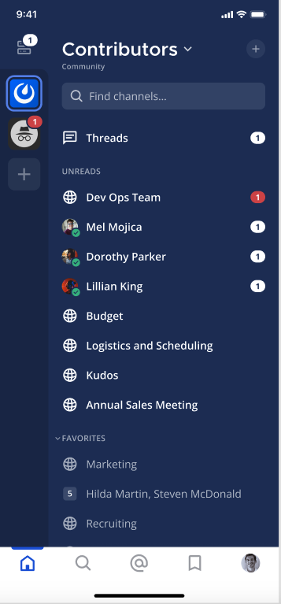

بدءًا من الإصدار v7.7 من Mattermost و v2.4 لتطبيق الجوال، يمكنك إضافة ملصق أولوية الرسالة إلى الرسائل الأصلية (root messages) لجعل الرسائل المهمة التي تتطلب إجراءً أو ردًا في الوقت المناسب أكثر وضوحًا وأقل عرضة للتجاهل.

لتعيين أولوية رسالة أصلية جديدة:

1. اختر أيقونة **أولوية الرسالة (Message Priority)** [\|message-priority-icon\|](##SUBST##|message-priority-icon|) في شريط أدوات تنسيق الرسائل. اختر من بين **قياسي (Standard)** أو **مهم (Important)** أو **عاجل (Urgent)**.
2. حدد الأولوية للرسالة. الرسائل لها أولوية قياسية بشكل افتراضي.
3. اختر **تطبيق (Apply)**.

عندما ترسل رسالة ذات أولوية، يظهر ملصق الأولوية بجانب اسمك في القناة، بالإضافة إلى عرض **السلاسل (Threads)** عندما يرد الآخرون على السلسلة.

## إرسال إشعارات مستمرة (Send persistent notifications)

بدءًا من الإصدار v8.0 من Mattermost، يمكن للرسائل التي تم وضع علامة عليها كعاجلة مع ملصق أولوية وتحتوي على إشارة (@mention) أن تشغل إشعارات مستمرة تتكرر حتى يقر المستلم بالرسالة أو يتفاعل معها أو يرد عليها.

لتمكين الإشعارات المستمرة لرسالة:

1. قم بإنشاء رسالة أصلية تحتوي على إشارة (@mention) واحدة على الأقل.
2. اختر أيقونة **أولوية الرسالة (Message Priority)** [\|message-priority-icon\|](##SUBST##|message-priority-icon|) في شريط أدوات تنسيق الرسائل.
3. اختر **عاجل (Urgent)**.
4. اختر **إرسال إشعارات مستمرة (Send persistent notifications)**.
5. اختر **تطبيق (Apply)**.

:::note
- الإشارات لـ @channel و @all و @here لا ترسل إشعارات مستمرة.
- يمكن لمسؤولي النظام تخصيص الحد الأقصى لعدد الإشارات (@mentions) المسموح به، وعدد المرات وعدد الإشعارات المستمرة التي يتم إرسالها، بالإضافة إلى تعطيل الإشعارات المستمرة لجميع المستخدمين، إذا رغبوا في ذلك. بشكل افتراضي، يتم إخطار المستخدمين كل 5 دقائق لمدة إجمالية قدرها 30 دقيقة. راجع وثائق [التكوين](/administration-guide/configure/site-configuration-settings#persistent-notifications) لمزيد من التفاصيل.
:::

## تلقي إشعارات مستمرة (Receive persistent notifications)

يجب أن يكون لديك إشعارات سطح المكتب و/أو إشعارات الدفع (push) للهاتف المحمول مفعلة لتلقي الإشعارات المستمرة. تعتمد كيفية إخطارك على [تفضيلات الإشعارات](/end-user-guide/preferences/manage-your-notifications) الخاصة بك لسطح المكتب والدفع للهاتف المحمول. لن يتم إخطارك عندما تكون حالتك مضبوطة على **عدم الإزعاج (Do Not Disturb)**، أو إذا كنت [خارج المكتب (Out of Office)](/end-user-guide/preferences/set-your-status-availability#set-your-availability). تعرف على المزيد حول إدارة وتخصيص كيفية تلقي [إشعارات Mattermost](/end-user-guide/preferences/manage-your-notifications).

تظهر الرسائل العاجلة شارة ذكر حمراء تظل مرئية حتى تعرض الرسالة. اختيار أيقونة **تأكيد الاستلام (Acknowledge)** (عند توفرها) لن يؤثر على شارة الذكر الحمراء العاجلة.

للتوقف عن تلقي الإشعارات المستمرة، يمكنك الرد على السلسلة، أو اختيار أيقونة **تأكيد الاستلام (Acknowledge)** (عند توفرها)، أو التفاعل مع السلسلة برمز تعبيري. تتوقف الإشعارات المستمرة أيضًا إذا تم حذف الرسالة الأصلية، أو إذا تم إرسال الحد الأقصى لعدد الإشعارات المستمرة.

## طلب تأكيدات الاستلام (Request acknowledgements)

يمكنك بالإضافة إلى ذلك أن تطلب من المستلمين تأكيد استلام الرسالة بفعالية لتتبع ما إذا كانت الرسائل قد تمت رؤيتها واتخاذ إجراء بشأنها. بشكل افتراضي، يؤدي وضع علامة على الرسالة كأولوية "عاجلة" إلى طلب تأكيد الاستلام تلقائيًا.

عندما تطلب تأكيد استلام لرسالة، يتم إضافة زر **تأكيد الاستلام (Acknowledge)** [\|acknowledge-button\|](##SUBST##|acknowledge-button|) أسفل الرسالة المرسلة. يمكنك تمييز الرسالة كـ "تم تأكيد الاستلام" عن طريق اختيار الزر، ويمكنك تمرير مؤشر الفأرة فوق أيقونة **تم تأكيد الاستلام (Acknowledged)** [\|acknowledge-button\|](##SUBST##|acknowledge-button|) لمراجعة من قام بتأكيد استلام الرسالة.

:::note
- عندما تكون إشعارات الدفع مفعلة على الهاتف المحمول، سيتم إخطارك كل خمس دقائق حتى تقوم بتأكيد الاستلام أو الرد على الرسالة.
- بعد تأكيد استلام الرسالة، لديك ما يصل إلى خمس دقائق لتغيير رأيك. اختر زر **تم تأكيد الاستلام (Acknowledged)** [\|acknowledge-button\|](##SUBST##|acknowledge-button|) مرة أخرى لإزالة اسمك من قائمة المستخدمين الذين أكدوا الاستلام.
:::
