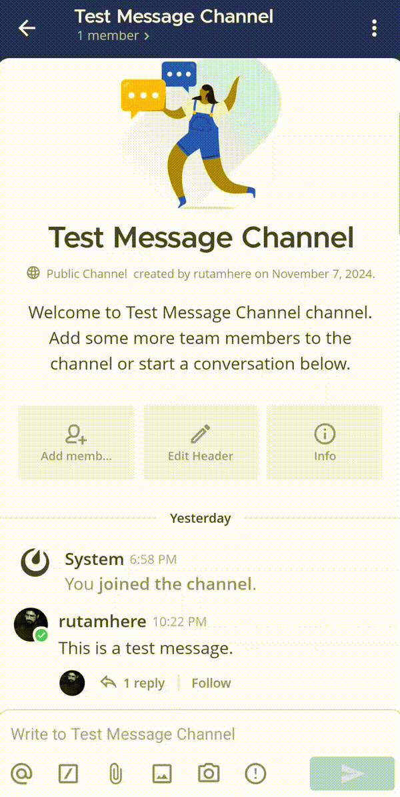
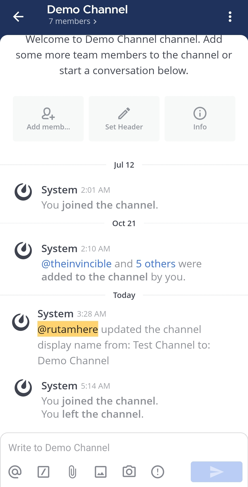
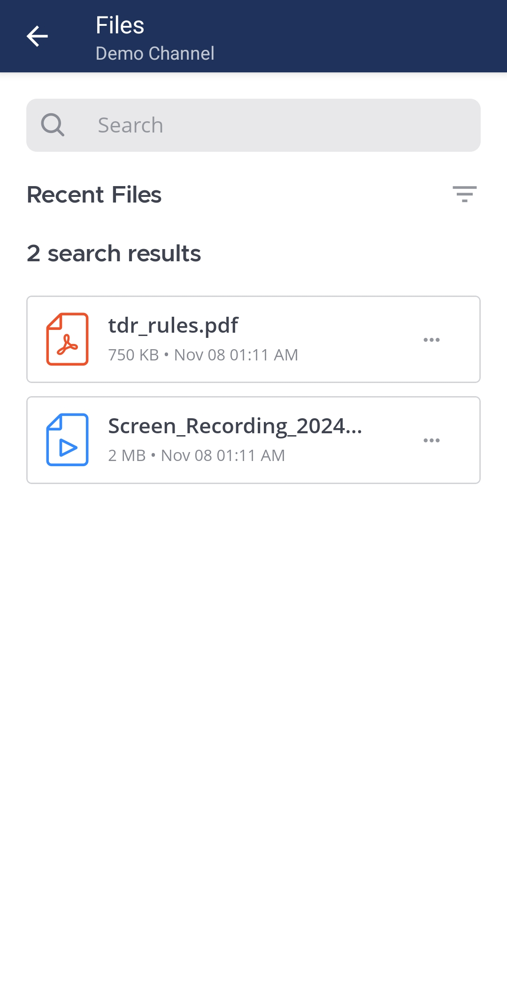
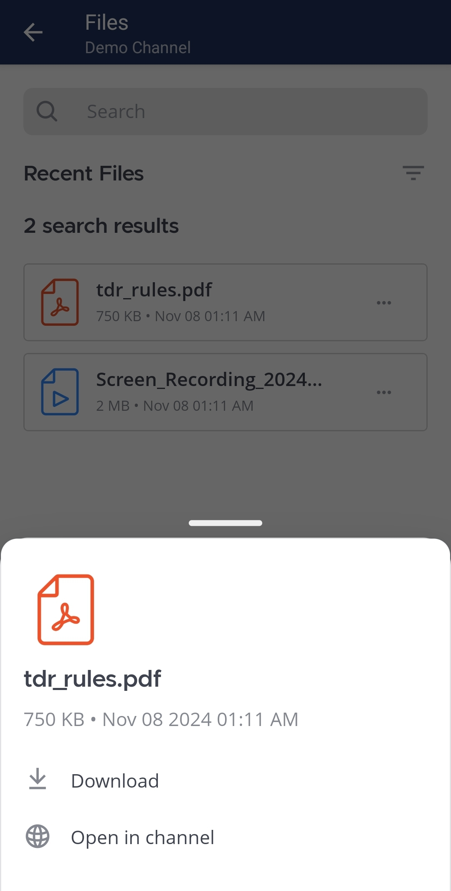

باستخدام المرفقات، يمكنك مشاركة معلومات إضافية تساعد فريقك على فهم الأفكار بصريًا. مشاركة مقاطع الفيديو، التسجيلات الصوتية، لقطات الشاشة، والصور تجعل الرسائل أكثر فعالية ووضوحًا.

الويب/سطح المكتب (Web/Desktop)

يمكنك مشاركة ملفات مع مستخدمي Mattermost أو مع قنوات كاملة عن طريق:

- سحب وإفلات الملفات داخل القناة.
- اختيار أيقونة **المرفقات (Attachment)** [\|attachments-icon\|](##SUBST##|attachments-icon|) داخل مربع إدخال الرسالة.
- اللصق من الحافظة.

### مشاركة روابط عامة (Share public links)

تتيح الروابط العامة مشاركة مرفقات الرسائل مع أي شخص خارج [مساحة العمل (workspace)](/end-user-guide/end-user-guide-index). لمشاركة مرفق، اختر الصورة المصغرة ثم **الحصول على رابط عام (Get Public Link)**.

:::note
إذا لم يظهر خيار **الحصول على رابط عام (Get Public Link)** في عارض الملفات، فاطلب من مسؤول النظام تمكينه من وحدة تحكم النظام (System Console) ضمن **تكوين الموقع (Site Configuration) > الروابط العامة (Public Links)**.
:::

### تنزيل الملفات (Download files)

يمكنك تنزيل ملف مرفق عن طريق اختيار أيقونة **تنزيل (Download)** [\|download-icon\|](##SUBST##|download-icon|) بجانب الصورة المصغرة.

:::note
من تطبيق سطح المكتب الإصدار v5.2، يمكنك مراجعة حالة التنزيلات والوصول إليها ومسح القائمة من خيار **التنزيلات (Downloads)** [\|desktop-download-icon\|](##SUBST##|desktop-download-icon|) في أعلى يمين نافذة التطبيق.
:::

### الوصول إلى الملفات (Access files)

اطّلع على كل الملفات المشتركة في القناة عن طريق اختيار أيقونة **ملفات القناة (Channel files)** [\|channel-files-icon\|](##SUBST##|channel-files-icon|) في ترويسة القناة.

الهاتف المحمول (Mobile)

يمكنك مشاركة ملفات عن طريق النقر على أيقونة **المرفقات (Attachment)** [\|attachments-icon\|](##SUBST##|attachments-icon|) تحت حقل إدخال الرسالة.

بدءًا من الإصدار v10.7 من Mattermost و v2.27 لتطبيق الجوال، يمكنك تشغيل وتنزيل ملفات الصوت مباشرة من سلسلة الرسائل.

### الوصول إلى الملفات على الجوال (Access files on mobile)

1. اضغط على اسم القناة في أعلى الشاشة.

2. اضغط على **الملفات (Files)**.

3. اضغط على ملف لتنزيله أو فتحه أو نسخ رابط عام له.

أو استخدم أيقونة **المزيد (More)** [\|more-icon\|](##SUBST##|more-icon|) لتنزيل الملف أو فتحه في القناة.

## حدود المرفقات والأحجام (Attachment limits and sizes)

يمكن إرفاق ما يصل إلى 10 ملفات في المنشور الواحد. الحجم الافتراضي الأقصى للملف هو 100 ميغابايت، ويمكن لمسؤول النظام تغييره. راجع [إعدادات التكوين](/administration-guide/configure/environment-configuration-settings#maximum-file-size) لمزيد من التفاصيل.

يمكن أن تصل أبعاد الصور إلى 7680 × 4320 بكسل، بحد أقصى دقة 33 ميجابيكسل أو دقة 8K وحجم خام تقريبًا 253 ميغابايت. يمكن للمسؤولين تخصيص الحد داخل ملف `config.json` — راجع [إعدادات التكوين](/administration-guide/configure/experimental-configuration-settings#maximum-image-resolution).

## معاينة المرفقات (Preview attachments)

يتضمّن Mattermost عارض ملفات مدمجًا يمكنك من:

- تنزيل الملفات.
- مشاركة روابط عامة.
- عرض الوسائط.

اختر الصورة المصغرة لفتح الملف في عارض الملفات.

### عرض الوسائط (View media)

تنسيقات الوسائط المدعومة في معظم المتصفحات:

- الصور: BMP, GIF, JPG, JPEG, PNG, SVG, WEBP.
- الفيديو: تنسيقات الفيديو المدعومة من المتصفح (مثل MP4 و MOV).
- الصوت: MP3, M4A.
- الملفات: PDF, TXT.

لا يتم دعم معاينات بعض المستندات (مثل Word أو Excel أو PPT) حتى الآن.
