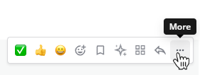
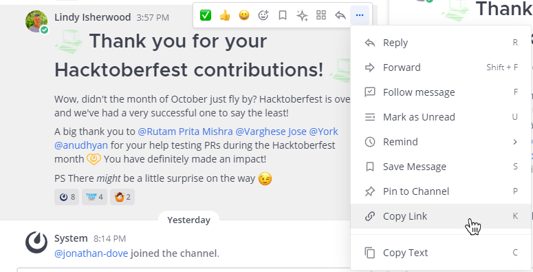
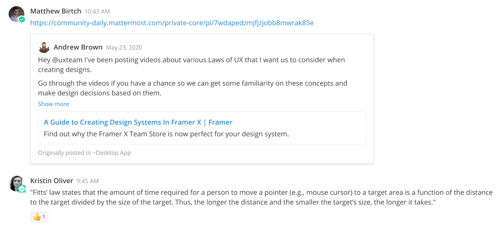
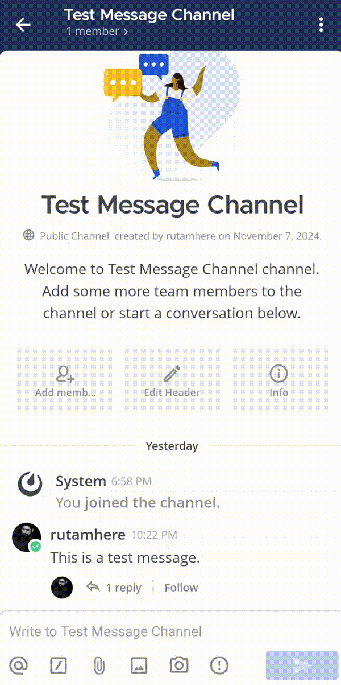

يمكنك مشاركة روابط إلى [القنوات](#مشاركة-روابط-القنوات-share-channel-links) و [الرسائل](#مشاركة-روابط-الرسائل-share-message-links) في Mattermost مع المستخدمين الآخرين.

## مشاركة روابط القنوات (Share channel links)

مشاركة رابط قناة تسهّل على الآخرين العثور عليها والانضمام إليها. لمشاركة رابط قناة، اكتب `~` في صندوق النص ثم اختر القناة المراد ربطها. إذا كنت عضوًا في عدة فرق، يتم عرض القنوات الخاصة بالفريق الحالي فقط.

:::note
بدلًا عن ذلك، يمكنك اختيار أيقونة **عرض المعلومات (View info)** [\|channel-info\|](##SUBST##|channel-info|) في أعلى اليمين للوصول إلى خيارات إدارة القناة، بما في ذلك **نسخ الرابط (Copy Link)** لمشاركته.
:::

## مشاركة روابط الرسائل (Share message links)

الويب/سطح المكتب (Web/Desktop)

عند مشاركة رابط رسالة، سيعرض Mattermost معاينة للمحتوى في المنشور. لمشاركة رابط رسالة، اختر أيقونة **المزيد (More)** [\|more-icon\|](##SUBST##|more-icon|) بجانب الرسالة ثم **نسخ الرابط (Copy Link)**.

ألصق الرابط في رسالة لمشاركته — سيقوم Mattermost بإنشاء معاينة للمحتوى المشارك.

:::note
- يمكنك أيضًا تحريك المؤشر فوق صورة واختيار أيقونة [\|copy-link-icon\|](##SUBST##|copy-link-icon|).
- يعمل الطابع الزمني بجانب اسم المستخدم لأي رسالة كرابط دائم (permalink) لتلك المحادثة.
:::

الهاتف المحمول (Mobile)

اضغط مطولاً على رسالة ثم اختر **نسخ الرابط (Copy Link)** لنسخ الرابط إلى الحافظة. بدءًا من الإصدار v2.23 لتطبيق الجوال، يتم إنشاء معاينة للرسائل عند مشاركة الروابط.

:::note
- تحترم معاينات الرسائل صلاحيات عضوية القناة؛ لذلك يتم عرضها فقط للمستخدمين الذين لديهم حق الوصول إلى الرسالة الأصلية. إذا كان الرابط لرسالة في قناة عامة، فيمكن لأي عضو في الفريق رؤية المعاينة. إذا كان الرابط لرسالة في قناة خاصة أو رسالة مباشرة، فإن الأعضاء في تلك القناة فقط يمكنهم رؤية المعاينة.
- إذا لم تتمكن من مشاركة الروابط، فاتصل بمسؤول النظام؛ قد يكون مطلوبًا وجود شهادة SSL (أو شهادة موقعة ذاتيًا) لتفعيل هذه الوظيفة.
:::

## الروابط العميقة (Deep links)

تُتيح الروابط العميقة إنشاء روابط مباشرة إلى فرق أو قنوات أو رسائل أو سلاسل محددة في Mattermost، مما يسهل التنقل السريع إلى المحتوى الهام.

يمكن استخدام الروابط العميقة مع البوتات والسكريبتات والتكاملات لتنفيذ إجراءات محددة داخل Mattermost.

بدءًا من الإصدار v10.11 من Mattermost، فإن [إشارات القنوات المرجعية (channel bookmarks)](/end-user-guide/collaborate/manage-channel-bookmarks) التي تحتوي على `mattermost://` تُفتح مباشرة في تطبيق سطح المكتب باستخدام الربط العميق، مما يحول العلامات المرجعية للقنوات إلى اختصارات بنقرة واحدة.

### صيغة الروابط العميقة (Deep link format)

يجب تنسيق الروابط العميقة كما يلي:

- رابط عميق لفريق:
  `mattermost://<your-Mattermost-server-URL>/<team-name>`
- رابط عميق لقناة:
  `mattermost://<your-Mattermost-server-URL>/<team-name>/channels/<channel-name>`
- رابط عميق لرسالة أو سلسلة:
  `mattermost://<your-Mattermost-server-URL>/<team-name>/pl/<post-id>`
- رابط عميق لرسالة مباشرة:
  `mattermost://<your-Mattermost-server-URL>/<team-name>/messages/@<user-name>`
