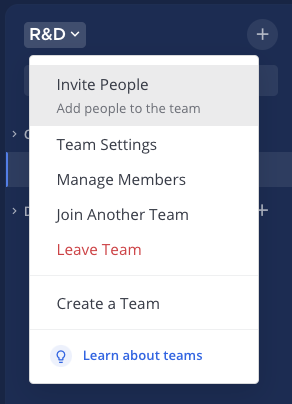
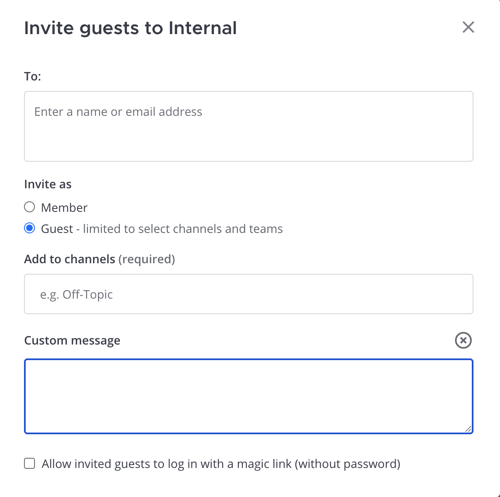
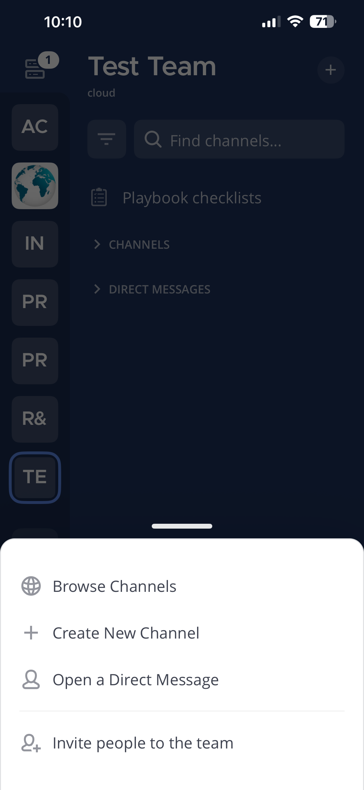
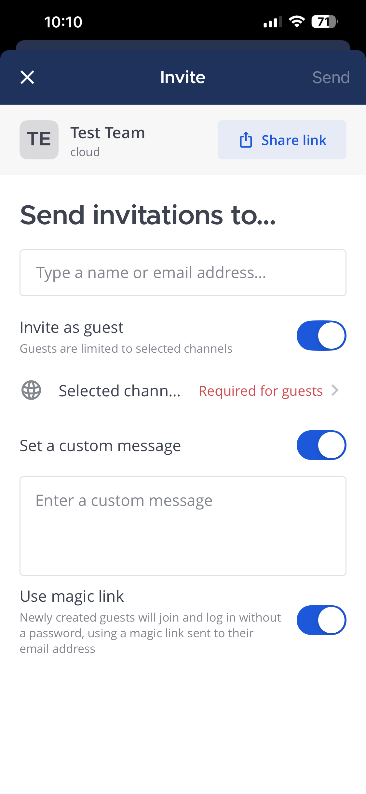

يمكن لأي شخص دعوة الأشخاص إلى فرق وقنوات Mattermost، ما لم يقم مسؤول النظام بـ [تعطيل](/administration-guide/onboard/advanced-permissions) قدرتك على القيام بذلك.

الويب/سطح المكتب (Web/Desktop)

1. حدد اسم الفريق في أعلى الشريط الجانبي للقناة، ثم حدد **دعوة الأشخاص (Invite People)**.

> 

2. اختر كيفية دعوة الأشخاص:

> - **نسخ رابط الدعوة (Copy invite link)**: شارك رابط دعوة مع الآخرين باستخدام التطبيقات على جهازك المحمول.
> - **دعوة كعضو (Invite as member)**: أرسل دعوة عبر البريد الإلكتروني إلى الأشخاص الذين ليس لديهم حساب في مساحة عمل Mattermost الخاصة بك عن طريق تحديد عنوان بريدهم الإلكتروني واختيار **دعوة (Invite)**.
> - **إضافة مستخدمين موجودين (Add existing users)**: أضف مستخدمي مساحة العمل الحاليين كأعضاء في الفريق الحالي عن طريق تحديد اسم المستخدم الخاص بهم واختيار **دعوة (Invite)**.
> - **دعوة كضيف (Invite as guest)**: قم بدعوة ضيف مؤقتًا مع وصول محدود لمساحة العمل. حدد عنوان بريدهم الإلكتروني، واختر القنوات التي يمكنهم الوصول إليها، وأضف رسالة مخصصة اختياريًا. راجع وثائق [حسابات الضيوف](/administration-guide/onboard/guest-accounts) لمعرفة المزيد عن حسابات الضيوف.
>   - **استخدام الرابط السحري (Use magic link)**: قم بدعوة الضيوف لتسجيل الدخول بدون كلمة مرور باستخدام رابط سحري عندما [يتم تمكينه من قبل مسؤول النظام](/administration-guide/onboard/guest-accounts). راجع وثائق [تسجيل الدخول بالرابط السحري للضيوف](/end-user-guide/access/access-your-workspace) للحصول على تفاصيل تسجيل الدخول.
>
> 

الهاتف المحمول (Mobile)

1. اضغط على أيقونة [\|plus\|](##SUBST##|plus|) في الزاوية العلوية اليمنى من الشاشة واضغط على **دعوة أشخاص إلى الفريق (Invite people to the team)**.

> 

2. اختر كيفية دعوة الأشخاص:

> - **مشاركة الرابط (Share link)**: شارك رابط دعوة مع الآخرين باستخدام التطبيقات على جهازك المحمول.
> - **دعوة كعضو (Invite as member)**: أرسل دعوة عبر البريد الإلكتروني إلى الأشخاص الذين ليس لديهم حساب في مساحة عمل Mattermost الخاصة بك عن طريق تحديد عنوان بريدهم الإلكتروني واضغط على **إرسال (Send)**.
> - **إضافة مستخدمين موجودين (Add existing users)**: أضف مستخدمي مساحة العمل الحاليين كأعضاء في الفريق الحالي عن طريق تحديد اسم المستخدم الخاص بهم واضغط على **إرسال (Send)**.
> - **دعوة كضيف (Invite as guest)**: قم بدعوة ضيف مؤقتًا مع وصول محدود لمساحة العمل. راجع وثائق [حسابات الضيوف](/administration-guide/onboard/guest-accounts) لمعرفة المزيد عن حسابات الضيوف. حدد عنوان بريدهم الإلكتروني، واختر القنوات التي يمكنهم الوصول إليها، وأضف رسالة مخصصة اختياريًا. اضغط على **إرسال (Send)** عندما تكون مستعدًا.
>   - **استخدام الرابط السحري (Use magic link)**: قم بدعوة الضيوف لتسجيل الدخول بدون كلمة مرور باستخدام رابط سحري عندما [يتم تمكينه من قبل مسؤول النظام](/administration-guide/onboard/guest-accounts). راجع وثائق [تسجيل الدخول بالرابط السحري للضيوف](/end-user-guide/access/access-your-workspace) للحصول على تفاصيل تسجيل الدخول.
>
> 

:::note
- لا يمكنك مشاركة روابط الدعوة؟ اتصل بمسؤول نظام Mattermost للحصول على المساعدة. قد يكون [شهادة SSL (أو شهادة موقعة ذاتيًا)](/administration-guide/onboard/ssl-client-certificate) مطلوبة لتعمل الدعوات القائمة على الروابط.
- عند دعوة الضيوف، يجب عليك تحديد قناة واحدة على الأقل يمكنهم الوصول إليها. يقتصر الضيوف على القنوات التي تحددها ولا يمكنهم اكتشاف قنوات أخرى.
- يمكن استخدام رابط الدعوة من قبل أي شخص ولا يتغير إلا إذا تمت إعادة إنشائه أو إلغاؤه من قبل مسؤول النظام أو مسؤول الفريق عبر **إعدادات الفريق (Team Settings) > الوصول (Access) > رمز الدعوة (Invite Code)**.
- يجب على مسؤول النظام الخاص بك [تمكين دعوات البريد الإلكتروني](/administration-guide/configure/authentication-configuration-settings) وتكوين [البريد الإلكتروني (SMTP)](/administration-guide/configure/environment-configuration-settings) لـ Mattermost لإرسال الدعوات المستندة إلى البريد الإلكتروني.
  - تنتهي صلاحية روابط الدعوة المرسلة عبر البريد الإلكتروني بعد 48 ساعة ويمكن استخدامها مرة واحدة فقط.
- يمكن لمسؤول النظام [إلغاء جميع دعوات البريد الإلكتروني](/administration-guide/configure/authentication-configuration-settings) التي لم يتم قبولها بعد داخل وحدة تحكم النظام.
:::
