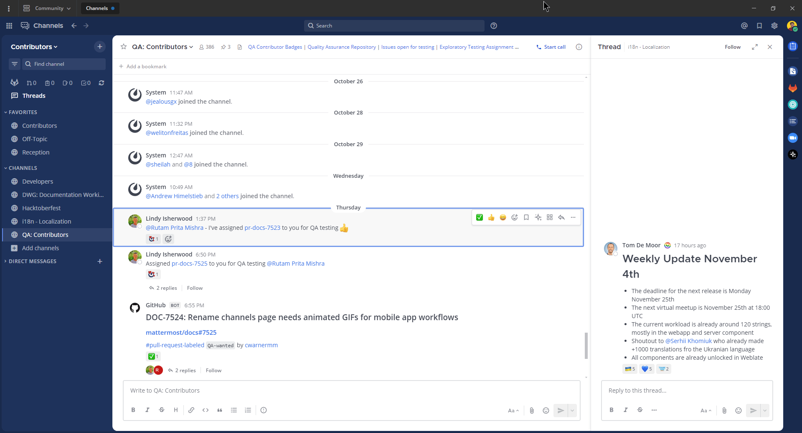
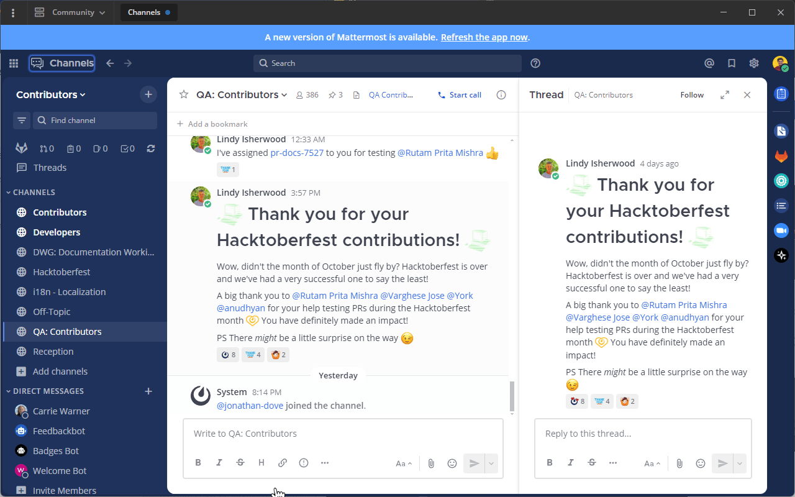

import { Tabs, TabItem, Steps, Aside, Badge } from '@astrojs/starlight/components';
import { Image } from 'astro:assets';
import navigationGif from '../../../../images/navigation.gif';
import messageNavGif from '../../../../images/message-navigation.gif';
import sidebarNavGif from '../../../../images/channel-sidebar-navigation.gif';

<Aside type="note" title="توفر الميزة">
  متوفر في خطط: <Badge text="Entry" variant="note" /> <Badge text="Professional" variant="note" /> <Badge text="Enterprise" variant="note" /> <Badge text="Enterprise Advanced" variant="note" />
</Aside>

Navigational keyboard shortcuts help you use Mattermost in a web browser or the desktop app without needing a mouse. Below is a list of supported accessibility shortcuts.

<table>
<colgroup>
<col style="width: 36%" />
<col style="width: 63%" />
</colgroup>
<thead>
<tr>
<th>Keyboard shortcut</th>
<th>Description</th>
</tr>
</thead>
<tbody>
<tr>
<td>Desktop App: <code role="kbd">F6</code><br/>Browser: <code role="kbd">Ctrl</code> <code role="kbd">F6</code></td>
<td>Move focus to the next section</td>
</tr>
<tr>
<td>Desktop App: <code role="kbd">Shift</code> <code role="kbd">F6</code><br/>Browser: <code role="kbd">Ctrl</code> <code role="kbd">Shift</code> <code role="kbd">F6</code></td>
<td>Move focus to the previous section</td>
</tr>
<tr>
<td><code role="kbd">Tab</code></td>
<td>Move focus to the next element</td>
</tr>
<tr>
<td><code role="kbd">Shift</code> <code role="kbd">Tab</code></td>
<td>Move focus to the previous element</td>
</tr>
<tr>
<td><code role="kbd">↑</code> or <code role="kbd">↓</code></td>
<td>Move focus between messages in the post list or sections in the channel sidebar</td>
</tr>
<tr>
<td><code role="kbd">Enter</code></td>
<td>Take action on the focused element</td>
</tr>
</tbody>
</table>

# Region navigation

<<<<<<< HEAD
Mattermost has eight regions that can be focused for navigation. Use
`F6` in the desktop app, or use `Ctrl` `F6` in a browser repeatedly to
move focus and loop through the regions in this order:

1.  Message list region
2.  Message input region
3.  Right-hand side message list region
4.  Right-hand side message input region
5.  Team menu region
6.  Channel sidebar region
7.  Channel header region
8.  Search


# Message navigation

When the message list region is focused, use the `↑` or `↓` arrow keys
to navigate through messages and reply threads. Press `Tab` to navigate
through message actions.



## Message composition

Mattermost is compatible with most popular screen readers, such as
[Apple VoiceOver](https://www.apple.com/ca/accessibility/vision/) or
[JAWS for
<span dir="ltr"><span dir="ltr"><span dir="ltr"><span dir="ltr"><span dir="ltr">Windows</span></span></span></span></span>](https://www.freedomscientific.com/products/software/jaws/). A
custom readout is composed for each message by combining the message
elements and reading them together in full sentences. Message elements
will read in the following order:

1.  Header: Author, timestamp, message type (i.e. parent post or reply)
2.  Main Content: The message content typed by the author
3.  Attachments: The number of attachments (if applicable)
4.  Emoji Reactions: The number of unique emoji reactions (if
    applicable)
5.  Saves/Pins: If a message is saved or pinned (if applicable)

For example, a message read by a screen reader may sound like the
following:
=======
Mattermost has eight regions that can be focused for navigation. Use `F6` in the desktop app, or use `Ctrl` `F6` in a browser repeatedly to move focus and loop through the regions in this order:

<Steps>
1. Message list region
2. Message input region
3. Right-hand side message list region
4. Right-hand side message input region
5. Team menu region
6. Channel sidebar region
7. Channel header region
8. Search
</Steps>
<Image src={navigationGif} alt="Navigate sections using keyboard" height="500" />

# Message navigation

When the message list region is focused, use the `↑` or `↓` arrow keys to navigate through messages and reply threads. Press `Tab` to navigate through message actions.

<Image src={messageNavGif} alt="Message navigation" height={500} style={{ display: 'block', margin: '12px auto' }} />

## Message composition

Mattermost is compatible with most popular screen readers, such as [Apple VoiceOver](https://www.apple.com/ca/accessibility/vision/) or [JAWS for Windows](https://www.freedomscientific.com/products/software/jaws/). A custom readout is composed for each message by combining the message elements and reading them together in full sentences. Message elements read in this order:

<Steps>
1. Header: Author, timestamp, message type (parent post or reply)
2. Main Content: The message content typed by the author
3. Attachments: The number of attachments (if applicable)
4. Emoji Reactions: The number of unique emoji reactions (if applicable)
5. Saves/Pins: If a message is saved or pinned (if applicable)
</Steps>

For example, a message read by a screen reader may sound like:
>>>>>>> ee4a147 (Saving local documentation changes before merge)

``` text
Eric Sethna at 12:57pm Thursday June 13th wrote a reply "Thanks for the review", 3 attachments, 2 reactions, message is saved and pinned.
```

# Channel sidebar navigation

<<<<<<< HEAD
When the channel sidebar region is focused, use the `↑` or `↓` arrow
keys to focus individual sidebar sections, such as Insights, Threads,
Favorites, custom categories, public channels, private channels, and
direct messages. Press `Tab` to navigate through channels or other
buttons within a sidebar section.


=======
When the channel sidebar region is focused, use the `↑` or `↓` arrow keys to focus individual sidebar sections (Insights, Threads, Favorites, custom categories, public channels, private channels, and direct messages). Press `Tab` to navigate through channels or other buttons within a sidebar section.

<Image src={sidebarNavGif} alt="Channel sidebar navigation" height={500} style={{ display: 'block', margin: '12px auto' }} />
>>>>>>> ee4a147 (Saving local documentation changes before merge)
