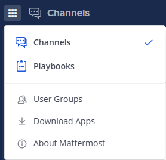
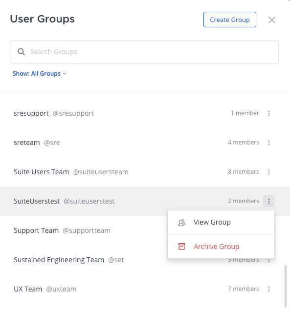
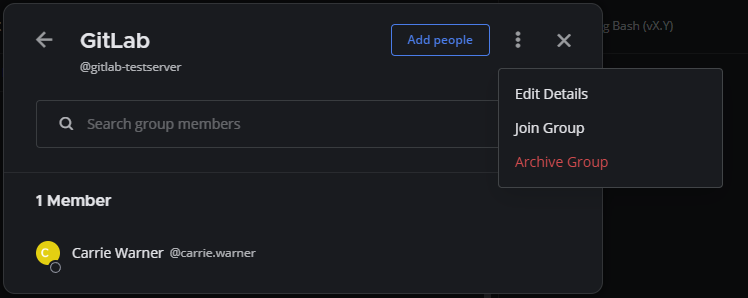

تقلل المجموعات المخصصة من الضجيج وتحسن التركيز عن طريق إخطار الأشخاص المناسبين في القناة في الوقت المناسب، مع الحفاظ على الشفافية لجميع الأعضاء في تلك القناة. تتيح لك مجموعات المستخدمين المخصصة إخطار ما يصل إلى 256 مستخدمًا في وقت واحد بدلاً من إخطار المستخدمين بشكل فردي.

على سبيل المعلومات، ربما ترغب في الإشارة (@mention) إلى فريق عابر للوظائف حول إصلاحات الأخطاء المطلوبة لإصدار ميزة قادمة، دون إخطار أي شخص آخر في القناة. استخدام مجموعة مخصصة يخطر الفريق العابر للوظائف على الفور، مع إبقاء أصحاب المصلحة المهمين على اطلاع بحالة إصدار الميزة.

أو ربما ترغب في إضافة مجموعة من المستخدمين إلى فريق وقناة. عندما تشير (@mention) إلى مجموعة مخصصة في قناة، يطالبك Mattermost بإضافة أي شخص من تلك المجموعة المخصصة ليس عضوًا بالفعل في القناة والفريق. راجع وثائق [دعوة الأشخاص إلى مساحة العمل الخاصة بك](/end-user-guide/collaborate/invite-people) للحصول على التفاصيل.

بمجرد إنشاء مجموعة مستخدمين مخصصة، يمكنك ذكر تلك المجموعة بنفس الطريقة التي تشير بها (@mention) إلى عضو آخر في Mattermost. راجع وثائق [الإشارة إلى الأشخاص في الرسائل](/end-user-guide/collaborate/mention-people) للحصول على التفاصيل.

:::note
- يحتاج مسؤولو النظام إلى تمكين هذه الميزة. راجع وثائق [إعدادات تكوين Mattermost](/administration-guide/configure/site-configuration-settings) للحصول على التفاصيل.
- بدءًا من الإصدار v7.2 من Mattermost، يمكن لمسؤولي النظام تحديد من يمكنه إدارة مجموعات المستخدمين المخصصة من خلال دور مسؤول إدارة المجموعات المخصصة (Custom Group Manager). راجع وثائق [الإدارة المحببة المفوضة (delegated granular administration)](/administration-guide/onboard/delegated-granular-administration) للحصول على التفاصيل.
- ستكون القدرة على إنشاء مجموعات مستخدمين مخصصة على الهاتف المحمول متاحة في إصدار مستقبلي. تعمل الإشارات (@mentions) لمجموعات المستخدمين المخصصة على الهاتف المحمول بنفس طريقة [المجموعات المتزامنة مع LDAP](/end-user-guide/collaborate/mention-people).
:::

## إنشاء مجموعة مخصصة (Create a custom group)

1. باستخدام Mattermost في متصفح ويب أو تطبيق سطح المكتب، حدد [\|plus\|](##SUBST##|plus|) في أعلى الشريط الجانبي للقناة، ثم حدد **إنشاء مجموعة مستخدمين جديدة (Create New User Group)**.
2. حدد اسمًا وإشارة (mention). الإشارة هي المقبض (handle) الذي تستخدمه للإشارة (@mention) بإشعار للمجموعة. يجب أن تكون أسماء المجموعات فريدة عبر [مساحة عمل Mattermost](/end-user-guide/end-user-guide-index). إذا كان الاسم مستخدمًا كاسم قناة، أو اسم عرض، أو اسم مجموعة مخصصة أخرى، فلن يكون متاحًا.
3. ابحث عن الأعضاء واختارهم لإضافتهم إلى مجموعة المستخدمين المخصصة، ثم حدد **إنشاء مجموعة (Create Group)**.

## مراجعة أعضاء المجموعة (Review group members)

بدءًا من الإصدار v7.8 من Mattermost، باستخدام Mattermost في متصفح ويب أو تطبيق سطح المكتب، حدد إشارة المجموعة في سلسلة محادثات لعرض قائمة بأعضاء المجموعة.

## إدارة مجموعات المستخدمين المخصصة (Manage custom user groups)

يمكنك مراجعة وتصفية قائمة المجموعات المخصصة، أو إضافة أشخاص إلى مجموعة موجودة، أو تعديل اسم المجموعة أو الإشارة، أو مغادرة المجموعة، أو أرشفة المجموعة.

لإدارة مجموعة مستخدمين مخصصة في متصفح ويب أو تطبيق سطح المكتب، حدد **مجموعات المستخدمين (User Groups)** من قائمة المنتجات (Products menu)، ثم حدد المجموعة التي تريد تعديلها.

### مراجعة المجموعات المتاحة (Review available groups)

راجع قائمة بجميع مجموعات المستخدمين المخصصة المتاحة، وابحث عن مجموعات محددة بالاسم.

:::note
يمكنك تصفية قائمة المجموعات لعرض المجموعات التي أنت عضو فيها فقط، أو المجموعات المؤرشفة فقط.
:::

### تغيير الاسم أو الإشارة (Change name or mention)

1. من أيقونة **المزيد من الإجراءات (More Actions)** [\|more-icon-vertical\|](##SUBST##|more-icon-vertical|) الموجودة على يمين أي مجموعة مخصصة، حدد **عرض المجموعة (View Group)**.

> 

2. من أيقونة **المزيد من الإجراءات (More Actions)** [\|more-icon-vertical\|](##SUBST##|more-icon-vertical|)، حدد **تعديل التفاصيل (Edit Details)**.

> 

3. قم بتحديث **الاسم (Name)** أو **الإشارة (Mention)**، ثم حدد **حفظ التفاصيل (Save Details)**.

### إضافة أشخاص (Add people)

1. حدد **إضافة أشخاص (Add People)**.
2. ابحث عن الأشخاص واختارهم لإضافتهم إلى المجموعة، ثم حدد **إضافة أشخاص (Add People)**.

### إزالة أشخاص (Remove people)

قم بالتحويم فوق أحد الأعضاء، ثم حدد أيقونة **سلة المهملات (Trash)** لإزالته من المجموعة.

### الانضمام إلى مجموعة (Join a group)

أثناء عرض أعضاء المجموعة، من أيقونة **المزيد من الإجراءات (More Actions)** [\|more-icon-vertical\|](##SUBST##|more-icon-vertical|)، حدد **الانضمام إلى المجموعة (Join Group)**.

### مغادرة مجموعة (Leave a group)

من أيقونة **المزيد من الإجراءات (More Actions)** [\|more-icon-vertical\|](##SUBST##|more-icon-vertical|)، حدد **مغادرة المجموعة (Leave Group)**.

### أرشفة المجموعة (Archive group)

من أيقونة **المزيد من الإجراءات (More Actions)** [\|more-icon-vertical\|](##SUBST##|more-icon-vertical|)، حدد **أرشفة المجموعة (Archive Group)**. عندما تقوم بأرشفة مجموعة مستخدمين مخصصة، فلن تتمكن من ذكر مقبض المجموعة أو عرض أعضائها. ومع ذلك، لا يتم حذف المجموعة من القائمة، ويظل جميع الأعضاء في المجموعة ما لم يتم إزالتهم يدويًا.

### إلغاء أرشفة المجموعة (Unarchive group)

بدءًا من الإصدار v9.1 من Mattermost، يمكنك استعادة مجموعة مؤرشفة. من أيقونة **المزيد من الإجراءات (More Actions)** [\|more-icon-vertical\|](##SUBST##|more-icon-vertical|)، قم بتصفية قائمة المجموعات لعرض المجموعات المؤرشفة فقط. حدد مجموعة مؤرشفة لعرض التفاصيل عنها، إذا رغبت في ذلك، ثم حدد **استعادة المجموعة (Restore Group)**.
