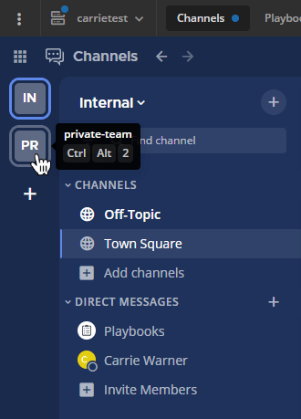
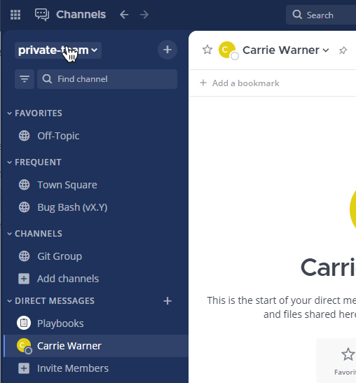

الفريق هو [مساحة عمل رقمية](/end-user-guide/end-user-guide/) تتيح لك ولزملائك التعاون داخل Mattermost. اعتماداً على إعدادات مؤسستك، يمكنك الانتماء إلى فريق واحد أو عدة فرق، وقد يكون الوصول إلى الفريق مفتوحاً للجميع أو مقيداً.

---

### 🔗 روابط سريعة
* [إعدادات الفريق](/messaging-collaboration/organize-using-teams/organize-using-teams/)
* [اختصارات لوحة المفاتيح الخاصة بالفرق](/messaging-collaboration/organize-using-teams/team-keyboard-shortcuts/)

---

## فريق واحد مقابل فرق متعددة

نوصي عادةً بنشر Mattermost بتنسيق **فريق واحد** لتعزيز التواصل الشامل، ولكن في بعض الحالات قد تفضل المؤسسات استخدام **فرق متعددة**.

### لماذا نوصي بالفريق الواحد؟
* **تواصل أفضل:** يمنع انعزال المجموعات ويعزز الشفافية.
* **البحث الموحد:** حالياً، لا يدعم النظام البحث عبر فرق متعددة في وقت واحد.
* **تكامل الأدوات:** تظل الروابط (Webhooks) والأوامر فعالة عبر مساحة العمل بالكامل.

### متى نستخدم الفرق المتعددة؟
* **الفصل الإداري:** مثل تخصيص فريق للموظفين وآخر للمقاولين الخارجيين.
* **تحسين الأداء:** توزيع المستخدمين على فرق أصغر يجعل تحميل القنوات وقواعد البيانات أسرع.
* **الخصوصية:** التحكم في من يمكنه رؤية القنوات أو الانضمام إليها بشكل أدق.

---

## التنقل عبر شريط الفرق

إذا كنت عضواً في أكثر من فريق، سيظهر شريط جانبي على يسار الشاشة (أو يمينها حسب اللغة).
* **إعادة الترتيب:** يمكنك سحب وإسقاط أيقونات الفرق لتغيير ترتيبها.
* **الاختصارات:** استخدم لوحة المفاتيح للتنقل السريع بين مساحات العمل المختلفة.

---

## إنشاء فريق جديد

يمكنك إنشاء فريق عبر المتصفح أو تطبيق سطح المكتب ما لم يقم المسؤول بتعطيل هذه الميزة.

1. اضغط على اسم الفريق الحالي في القائمة العلوية.
2. اختر **إنشاء فريق جديد (Create a Team)**.
3. أدخل اسم الفريق واختر الرابط الخاص به (URL).

### متطلبات التسمية والروابط

| العنصر | القيود والمتطلبات |
| :--- | :--- |
| **اسم الفريق** | من 2 إلى 64 حرفاً. يمكن استخدامه الرموز والأرقام. |
| **رابط الفريق (URL)** | حروف صغيرة وأرقام وشرطات فقط. يجب أن يبدأ بحرف. |

> **ملاحظة:** إذا كانت مؤسستك تستخدم "الروابط المجهولة" (إصدار v11.6.0+)، فسيتم تعيين الرابط تلقائياً ولن يطلب منك اختياره.

---

## إدارة العضوية

### الانضمام إلى فريق
يمكنك الانضمام إلى أي فريق مفتوح أو فريق تلقيت دعوة إليه. عند تسجيل الدخول لأول مرة، ستظهر لك الفرق المتاحة للانضمام. للانضمام إلى فريق إضافي، اختر **انضمام إلى فريق آخر** من قائمة الفريق.

### مغادرة الفريق
من **قائمة الفريق > مغادرة الفريق**. سيؤدي هذا لإزالتك من جميع القنوات (العامة والخاصة) داخل ذلك الفريق. ستحتاج لدعوة جديدة للعودة ما لم يكن الفريق مفتوحاً.

### إزالة الأعضاء
يمكن لمديري الفريق إزالة المستخدمين عبر **إدارة الأعضاء > إزالة من الفريق**.
* الإزالة لا تعني حذف الحساب، بل فقدان الوصول إلى ذلك الفريق فقط.
* يمكن للمستخدم المزال الانضمام مجدداً إذا تلقى دعوة جديدة أو إذا كان الفريق متاحاً للجميع.

---

## أرشفة الفرق

يمكن لمسؤول النظام أرشفة الفرق غير المستخدمة عبر **لوحة تحكم النظام > الفرق**.

* **بعد الأرشفة:** يختفي الفريق من شريط الفرق الجانبي لجميع الأعضاء.
* **استعادة البيانات:** الأرشفة لا تحذف البيانات نهائياً؛ تظل محفوظة في قاعدة البيانات ويمكن استعادتها أو الوصول إليها عبر واجهة البرمجية (API).

---

**هل تحتاج للمساعدة؟**
اتصل بمسؤول النظام في مؤسستك أو راجع [دليل تسجيل الدخول](/access-your-workspace/access-your-workspace/).