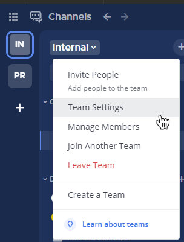
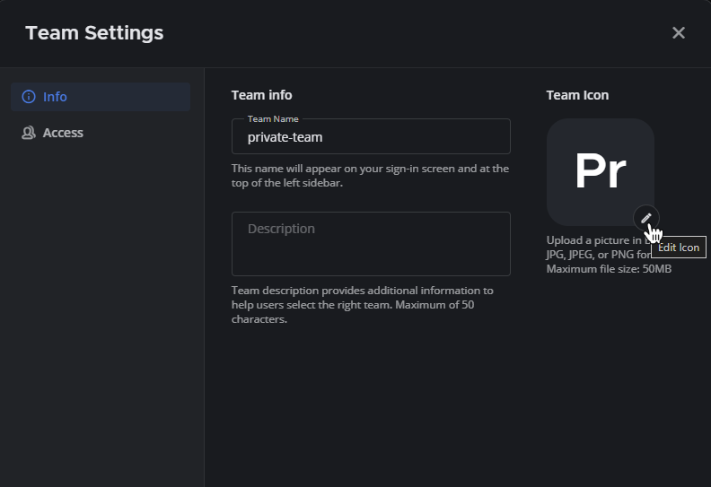

> **متاح في الخطط:** Entry، Professional، Enterprise، و Enterprise Advanced.

تسمح إعدادات الفريق لمسؤولي النظام ومسؤولي الفرق بتعديل التفضيلات الخاصة بفريق معين. للوصول إلى هذه الإعدادات عبر المتصفح أو تطبيق سطح المكتب، اضغط على اسم الفريق ثم اختر **إعدادات الفريق (Team Settings)**.

---

## 1. إعدادات المعلومات (Info Settings)

توفر إعدادات المعلومات خيارات لتهيئة كيفية ظهور الفريق للمستخدمين.

### اسم الفريق (Team Name)
يظهر **اسم الفريق** في شاشة تسجيل الدخول وفي الجزء العلوي من شريط القنوات الجانبي.
* **القيود:** يمكن أن يحتوي الاسم على أي أحرف أو أرقام أو رموز.
* **الطول:** يجب أن يتراوح بين 2 إلى 64 حرفاً.
* **ملاحظة:** الأسماء حساسة لحالة الأحرف (في اللغة الإنجليزية) ولا تدعم [بعض رموز يونيكود](https://www.w3.org/TR/unicode-xml/#Charlist).

### وصف الفريق (Team Description)
يظهر **وصف الفريق** عند عرض قائمة الفرق المتاحة للانضمام، وفي "نص التلميح" (Tooltip) عند تمرير الفأرة فوق اسم الفريق في الشريط الجانبي.
* **الطول:** يمكنك إدخال وصف يصل إلى 50 حرفاً كحد أقصى.

### أيقونة الفريق (Team Icon)
تظهر **أيقونة الفريق** في الشريط الجانبي للفرق. افتراضياً، تحتوي الأيقونة على أول حرفين من اسم الفريق.

**لتخصيص الأيقونة:**
1. انتقل إلى **إعدادات الفريق**.
2. اختر خيار **تعديل (Edit)** بجانب أيقونة الفريق.

3. اختر صورة بصيغة BMP أو JPG أو PNG. (نصح باستخدام صور مربعة بخلفية ملونة ثابتة، حيث تظهر الخلفية الشفافة باللون الأبيض).
4. اضغط على **حفظ (Save)**.

> **نصيحة:** إذا كنت تريد العودة للأيقونة الافتراضية، اختر **إزالة الصورة (Remove image)**.

---

## 2. إعدادات الوصول (Access Settings)

تسمح إعدادات الوصول بالتحكم في من يمكنه الانضمام إلى الفريق.

### المستخدمون بنطاق بريد إلكتروني محدد
يمكن للمسؤولين حصر الانضمام للفريق بناءً على نطاق البريد الإلكتروني (Domain). 
* **كيفية الإعداد:** قم بتفعيل هذا الخيار وأدخل النطاقات المعتمدة (مثال: `company.com`). افصل بين النطاقات المتعددة بمسافة أو فاصلة.
* **ملاحظة هامة:** هذا الإعداد يمنع "الانضمام" فقط. المستخدمون الذين انضموا بالفعل قبل تفعيل هذا الإعداد لن يتم استبعادهم، كما يمكن للأعضاء تغيير بريدهم لاحقاً دون قيود.

> **تنبيه:** لضمان فعالية هذا الخيار، يجب تفعيل  في لوحة تحكم النظام.

### المستخدمون على هذا الخادم
يمكن للمسؤولين إدراج الفريق ضمن قائمة "الفرق التي يمكنك الانضمام إليها".
* عند تفعيل هذا الخيار، سيتمكن أي مستخدم لديه حساب على هذا الخادم من رؤية الفريق والانضمام إليه يدوياً عبر صفحة اختيار الفرق أو بالضغط على أيقونة **(+)** في شريط الفرق.

### كود الدعوة (Invite Code)
يُستخدم **كود الدعوة** كجزء من الرابط الذي ترسلونه لدعوة الأعضاء الجدد. 
* يمكنك الضغط على **إعادة توليد (Regenerate)** لإنشاء رابط دعوة جديد، مما سيؤدي إلى إبطال مفعول أي روابط دعوة قديمة تم إنشاؤها سابقاً.

---

**هل تحتاج للمزيد؟**
راجع دليل [إدارة الأعضاء](/messaging-collaboration/collaborate-within-channels/manage-channel-members/) أو [تنظيم الفرق](/messaging-collaboration/organize-using-teams/organize-using-teams/).